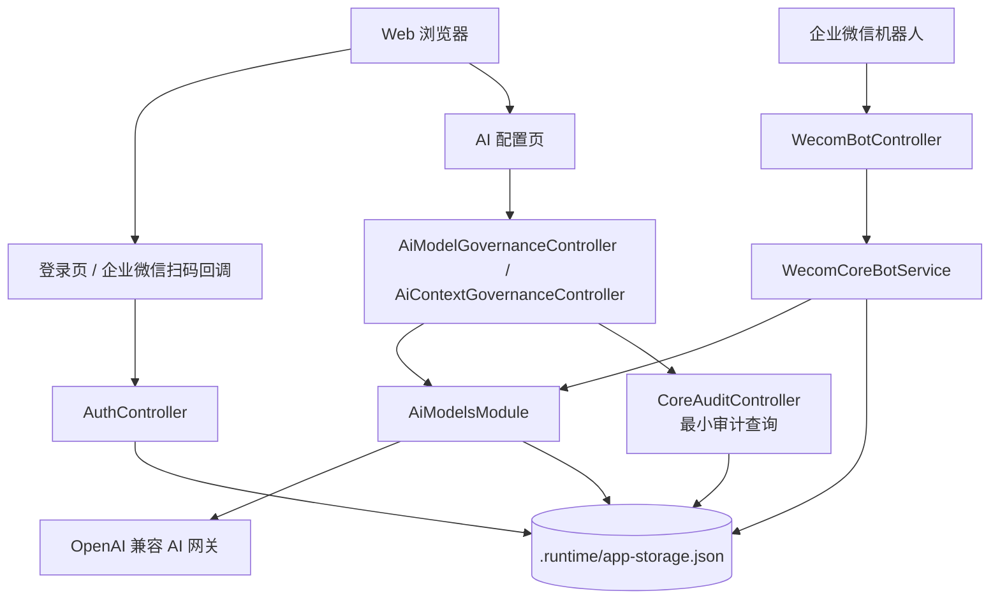

# AI 与企业微信机器人核心

## 项目定位

本仓库当前已按收敛方案调整为“对接 AI + 对接企业微信机器人”的核心项目。

当前默认只保留服务端 AI 配置治理、企业微信机器人消息接入、验签、会话、普通 AI 对话和已关闭业务能力的明确提示。CRM 问数、渠道 CRM 分析、合同评审、日报、主动通知、客户/商机创建、跟进写回、Web 智能分析工作台、治理审计后台等能力已转为暂缓能力，后续需要按独立模块重新评估和开启。

当前仓库保留部分历史业务代码作为回滚和后续恢复参考，但默认路由、导航、企业微信业务动作和后端对外入口已经收敛。后续协作应优先参考 `docs/architecture/AI企微核心收敛后项目说明.md`、`docs/architecture/AI企微核心收敛边界说明.md` 与 `docs/architecture/AI企微核心模块收敛清理方案.md`。

## 当前能力总览

### Web 端能力

- 登录与会话：支持 CRM 账号密码登录、企业微信扫码登录、本地会话 Cookie、受保护路由和退出登录。
- AI 配置：保留 AI Profile 管理、密钥加密、健康检查、激活回滚和上下文策略配置。
- 暂缓页面：智能分析、合同评审、经营报表、权限中心、连接策略、看板模板、语义治理和审计中心默认不再进入路由和导航。

### 企业微信 Web 登录门户回跳说明

2026-05-22 修复过一次门户平台进入系统后的企业微信扫码登录回跳问题：生产门户可能把外层代理上下文隐藏起来，扫码发起请求只能看到内层 `10.10.3.241` 形态的地址，拿不到门户所需的 `GratuitousProxy`。此时企业微信换票和共享 Cookie 写入其实已经成功，如果后端继续直接 `302` 到门户业务页，浏览器会停在门户的 `302 Found` 中间页；用户手动点浏览器返回后又能进入系统。

当前稳定策略在 `backend/src/modules/auth/auth.controller.ts`：共享 Cookie 直登成功后，若成功回跳地址已经带有 `GratuitousProxy`，继续按原逻辑直接跳转；若缺少该门户代理参数，则返回一个轻量“登录完成”页面，自动执行 `window.history.back()` 回到扫码前的门户上下文，并提供兜底链接。后续维护企业微信扫码、登录回调、门户代理、退出登录或路由参数保留时，不要把这个无代理参数场景改回强制直跳业务页；任何调整都必须同步覆盖 `backend/test/auth.controller.spec.ts` 中的门户回跳回归用例。

### 企业微信机器人当前支持能力

以下清单面向企业微信机器人的用户可见稳定能力。以后若新增、下线或调整企业微信机器人能力，必须同步更新本节以及机器人统一能力目录，确保取消提示、帮助提示和主文档口径一致。

- 核心安全门闩：业务动作关闭时，机器人先通过固定安全检查和轻量业务请求识别拦截 CRM、合同、日报、导出、写回等暂缓能力；普通文本进入统一 AI 调用。
- 普通 AI 对话：支持在企业微信机器人中接收普通文本并调用当前激活 AI Profile 回复。
- 未启用能力提示：用户请求 CRM 问数、渠道分析、合同评审、日报、新增客户、商机创建、跟进写回、导出或主动通知时，机器人返回明确的“能力未启用”提示，不查询数据、不写回、不编造业务事实。
- 核心身份兜底：业务动作关闭时，已通过企业微信验签和来源校验的消息可以使用 senderId 临时身份进行普通 AI 对话；该身份不具备 CRM 查询、导出或写回权限。
- 维护期降级：会话存储或 AI 网关不可用时，返回明确降级提示，不伪装成无权限或无数据。

### 后端治理与安全能力

- CRM API-first：新增或改造 CRM 能力默认先评估官方 API，只有官方 API 不满足对象、字段、权限或稳定性要求时，才进入受控自建接口或数据库路径。
- 受控分析执行：当前默认关闭，仅保留历史代码和 capability 快照入口；重新启用时必须恢复白名单、权限范围注入、行数限制、超时限制、结果一致性和审计留痕。
- AI配置治理：保留 OpenAI 兼容 HTTP、Codex SDK、Claude Agent SDK 等适配入口，密钥加密存储，支持平台预设、协议类型、结构化输出模式、推理等级和上下文策略配置，健康检查通过后才能激活，切换失败时回滚到上一条可用配置。
- 合同审核标准包：当前默认关闭，标准包和历史产物仅作为后续恢复参考。
- 本地应用状态：当前本地实现通过 `AppStorageService` 内存态和 `.runtime/app-storage.json` 快照承接 AI 配置、会话和必要审计元数据；历史日报、通知和合同审核数据不在本轮清空。

## 仓库结构

```text
D:\code\CRM\
├── backend\                       # NestJS 后端服务
│   ├── src\modules\               # 业务模块
│   ├── src\database\              # CRM 只读数据源与本地应用状态
│   ├── resources\contract-review-skill-packs\
│   └── test\                      # 后端契约、集成和模块测试
├── frontend\                      # Vue 3 + Vite 前端应用
│   ├── src\pages\                 # 页面入口
│   ├── src\components\            # 业务组件
│   ├── src\services\              # API 客户端
│   ├── src\stores\                # Pinia 状态
│   └── tests\                     # 单元测试和 E2E 测试
├── docs\                          # 架构、测试、数据库梳理、历史原型和需求资料
├── specs\001-crm-intelligent-analytics\
│                                   # 一期主规格、计划、数据模型、契约和快速开始
├── openspec\                      # 已归档和进行中的 OpenSpec 变更
├── scripts\                       # 本地启动、配置加载和企业微信目录同步脚本
├── .runtime\                      # 本地运行态快照与合同审核产物，禁止提交敏感内容
├── 配置\                          # 本地敏感配置目录，通常不提交；缺失时使用环境变量
├── DESIGN.md                      # 当前 UI 设计系统与视觉方向最高入口
├── AGENTS.md                      # 仓库协作规范
└── README.md                      # 仓库入口说明
```

## 后端模块速览

| 模块 | 当前装配状态 | 主要职责 |
|------|--------------|----------|
| `auth` | 默认保留 | CRM 账号密码登录、企业微信扫码登录、本地会话 Cookie、路由鉴权支撑。 |
| `ai-models` | 默认保留 | AI Profile、密钥加密、健康检查、激活回滚、上下文策略和统一 AI 调用。 |
| `wecom` | 默认保留核心链路 | 企业微信消息接入、验签、来源校验、消息归一化、会话、回执、普通 AI 对话和未启用业务提示。 |
| `analysis` | 仅保留能力快照 | `/analysis/capabilities` 可用；查询、报告和保存模板入口固定返回未启用。 |
| `sessions` | 默认保留基础会话 | 支撑企业微信轻量会话和心跳，不再承载 CRM 问数排队。 |
| `governance` | 仅保留 AI 配置相关能力 | AI Profile 管理权限、上下文策略和必要权限判断；权限中心、模板治理等后台页面默认不装配。 |
| `database` | 默认保留基础存储 | 本地运行配置、`.runtime/app-storage.json`、日志和历史基础仓储。 |
| `contract-review`、`daily-report`、`opportunities`、`notifications`、`query-assets`、`export`、`audit`、`management-report`、`analysis-warehouse` | 源码保留，默认不装配 | 仅作为回滚和后续恢复参考；恢复前必须单独评估边界、依赖、权限、审计和测试。 |

## 前端页面速览

| 路由 | 页面 | 当前状态 |
|------|------|----------|
| `/login` | 登录页 | 默认保留，支持账号密码登录、企业微信扫码入口、登录反馈和会话回流。 |
| `/wecom-login/callback` | 企业微信登录回调页 | 默认保留，承接扫码回流。 |
| `/forbidden` | 无权限页 | 默认保留，用户无 AI 配置权限时进入。 |
| `/` | 根路径 | 重定向到 `/governance/ai-models`。 |
| `/governance/ai-models` | AI配置 | 当前唯一业务首页，管理 AI Profile、健康检查、激活和上下文策略。 |
| `/:pathMatch(.*)*` | 未知路径 | 重定向到 `/governance/ai-models`。 |

智能分析、合同评审、权限中心、模板治理、连接策略、审计中心和经营报表等历史页面源码仍在仓库中，但当前路由和导航不再暴露。

## 关键文档导航

### 一期主规格

- `specs/001-crm-intelligent-analytics/spec.md`：功能边界、用户故事、验收口径和范围约束。
- `specs/001-crm-intelligent-analytics/plan.md`：实施计划、模块落点和技术上下文。
- `specs/001-crm-intelligent-analytics/data-model.md`：分析、合同审核、通知、日报和审计核心实体。
- `specs/001-crm-intelligent-analytics/contracts/openapi.yaml`：主接口契约。
- `specs/001-crm-intelligent-analytics/quickstart.md`：本地启动、配置映射和验收场景。
- `specs/001-crm-intelligent-analytics/tasks.md`：一期任务拆解。
- `specs/001-crm-intelligent-analytics/sync-notes.md`：需求同步和增量能力同步记录。

### 架构与测试

- `docs/architecture/AI企微核心收敛后项目交付总文档.md`：收敛后项目交付总入口，包含需求 / 流程、架构图、接口、数据库、部署和资源清单。
- `docs/architecture/AI企微核心收敛后项目说明.md`：收敛后项目的需求 / 流程、架构图、接口清单入口、数据库结构和部署口径。
- `docs/architecture/生产部署指南.md`：生产环境服务器要求、网络开放、环境变量、构建发布、Nginx、systemd、回滚与排障。
- `docs/architecture/deploy-examples/backend.production.env.example`：生产环境 `backend.env` 模板，便于运维按正式环境替换占位值。
- `docs/architecture/deploy-examples/crm-intelligent-analytics.service`：`systemd` 托管示例文件。
- `docs/architecture/deploy-examples/crm-intelligent-analytics.nginx.conf`：`Nginx` 站点配置示例文件。
- `docs/architecture/deploy-examples/install-production-host.sh`：生产机初始化脚本模板，用于安装 Node.js、pnpm、Nginx 和准备目录。
- `docs/architecture/deploy-examples/release-production.sh`：生产发布脚本模板，用于拉取代码、构建产物、切换版本和重启服务。
- `docs/architecture/deploy-examples/生产部署参数清单.md`：上线前参数采集清单，便于研发与运维对齐域名、数据库、企业微信和 AI 配置。
- `docs/architecture/crm-api-first-governance.md`：CRM 官方 API 优先接入评估模板和治理清单。
- `docs/architecture/ai-model-profile-governance.md`：AI配置治理、OpenAI 兼容 HTTP adapter、上下文策略、结构化输出模式、健康检查和新增模型扩展说明。
- `docs/architecture/element-plus-ui-framework-implementation.md`：Element Plus 重构实施记录、组件覆盖和验证记录。
- `docs/architecture/受控分析与企业微信助手统一实施清单.md`：受控分析与企业微信 AI 助手的统一实施顺序。
- `docs/architecture/受控分析与企业微信助手灰度回滚说明.md`：灰度、回滚和排障说明。
- `docs/testing/crm-intelligent-analytics-quickstart-checklist.md`：核心联调验证清单。
- `docs/testing/ai-model-profile-governance-checklist.md`：AI 模型治理测试、激活回滚与排障清单。
- `docs/testing/feature-permission-enforcement-matrix.md`：权限中心菜单包、风险子权限与真实页面 / 接口 / 企业微信工作流的覆盖矩阵。
- `docs/testing/simplified-permission-rollout-checklist.md`：简化权限模型上线前角色样本、新旧映射对比、异常半配置角色处理和回滚步骤。

### 需求、数据与 UI

- `DESIGN.md`：当前 UI 视觉方向、设计系统、组件原则、动效和文案语气最高入口。
- `docs/需求文档/原始需求.md`：业务原始需求。
- `docs/需求文档/企业微信机器人.md`：企业微信接入参考。
- `docs/需求文档/企业微信目录同步运维说明.md`：企业微信官方目录同步运维说明。
- `docs/数据库梳理/CRM数据库结构分析.md`：CRM 数据库总览。
- `docs/数据库梳理/CRM数据库业务模块梳理.md`：CRM 业务模块视角梳理。
- `docs/db/vcooline_ikcrm_production.md`：CRM 主业务库表结构明细。
- `docs/db/ikcrm_cms_production.md`：外围库表结构明细。
- `docs/prototype-ui/UI规范.md` 与 `docs/prototype-ui/crm-intelligent-analytics-ui.pen`：旧版历史原型参考，不再作为新视觉风格和布局强约束。

### OpenSpec 与标准包

- `openspec/specs/`：已归档能力的当前规格快照。
- `openspec/changes/add-ai-model-profile-governance/`：AI 模型治理进行中变更。
- `backend/resources/contract-review-skill-packs/company-commercial-v1/`：合同审核标准包、检查项、提示词和工作流说明。

## 本地开发

### 环境准备

| 工具 | 建议版本 | 说明 |
|------|----------|------|
| Node.js | 20 LTS | 前后端统一运行时。 |
| pnpm | 8.15.9 | 仓库 `packageManager` 当前固定为 `pnpm@8.15.9`。 |
| MySQL | 8.x | 接真实 CRM 查询库、写回库或正式应用库时需要。 |
| PowerShell | 7.x 或 Windows PowerShell | 推荐使用仓库脚本启动本地服务。 |
| Chromium / Playwright 浏览器 | 与 Playwright 匹配 | 运行前端 E2E 测试时需要。 |

### 安装依赖

```bash
pnpm install
```

### 配置方式

推荐按环境拆分配置，不要再让开发配置和生产配置共用同一个 `.env.local`。

```bash
# 本地开发：复制到环境专用文件
cp backend/.env.example backend/.env.development.local
cp frontend/.env.example frontend/.env.development.local

# 编辑 backend/.env.development.local / frontend/.env.development.local
# 填入本机真实配置或占位配置
```

当前约定：

- 本地开发：
  - 后端优先读取 `backend/.env.development.local`
  - 前端开发模式优先读取 `frontend/.env.development.local`
- 生产环境：
  - 后端优先读取进程环境变量或独立环境文件，例如 `/srv/crm-intelligent-analytics/shared/backend.env`
  - 可在仓库内维护 `backend/.env.production.local`，部署时直接复制到服务器作为 `shared/backend.env`
  - 如需本地执行生产构建，可使用 `frontend/.env.production.local`
  - 前端生产构建默认优先走当前站点同源 `/api/v1`，避免误把开发机地址打进线上静态包
- `backend/.env.local` 与 `frontend/.env.local` 仅保留兼容占位，不再作为推荐主配置入口

也可以使用 `配置/` 目录和脚本自动注入本地真实配置。该目录包含敏感资料，不能提交、截图或转抄明文。

### 启动服务

```bash
# 推荐：一键启动前后端，脚本会加载本机配置并打开两个窗口
pnpm dev

# 分别启动。后端 dev 默认开启热更新，修改 backend/src 后会自动重启。
pnpm dev:backend
pnpm dev:frontend

# 不经过配置加载脚本的直接启动方式，适合已手动准备环境变量的场景
pnpm --dir backend dev
pnpm --dir frontend dev

# 如需关闭后端热更新，只启动一次
pnpm --dir backend dev:once
```

默认端口：

- 后端：`http://127.0.0.1:3001`
- 前端：`http://127.0.0.1:5173`
- API 前缀：`/api/v1`

### 常用验证命令

```bash
# 全量构建
pnpm build

# 后端 Jest 测试 + 前端单元测试
pnpm test

# 前后端 lint
pnpm lint

# 后端测试
pnpm --dir backend test

# 前端单元测试
pnpm --dir frontend test:unit

# 前端 E2E 测试
pnpm --dir frontend test:e2e

# 后端运行时配置检查
pnpm --dir backend verify:runtime
```

本地应用状态会写入 `.runtime/app-storage.json`，合同审核原始文件和产物默认写入 `.runtime/contract-review/`。如果需要重置本地联调状态，应先确认没有需要保留的测试数据，再处理 `.runtime/` 下对应文件。

## 运行配置要点

配置完整说明以 `backend/.env.example` 和 `specs/001-crm-intelligent-analytics/quickstart.md` 为准。以下只列出常用分组。

| 分组 | 关键变量 | 用途 |
|------|----------|------|
| 服务与前端 | `PORT`、`APP_WEB_BASE_URL`、`VITE_API_BASE_URL` | 后端监听、扫码回流和前端 API 地址。 |
| CRM Open API | `CRM_OPEN_API_BASE_URL`、`CRM_OPEN_API_CORP_ID`、`CRM_OPEN_API_VERSION_CODE`、`CRM_OPEN_API_DEVICE` | 账号密码登录、扫码登录换票和 CRM 官方 API 调用。 |
| 联软渠道 CRM 标准 OpenAPI | `CRM_STANDARD_OPEN_API_BASE_URL`、`CRM_STANDARD_OPEN_API_APP_KEY`、`CRM_STANDARD_OPEN_API_APP_SECRET`、`CRM_STANDARD_OPEN_API_TIMEOUT_MS`、`CRM_STANDARD_OPEN_API_TOKEN_CACHE_BUFFER_SECONDS` | 历史渠道分析配置，当前核心模式默认不调用。 |
| CRM 受控写入账号 | `CRM_OPEN_API_WRITEBACK_LOGIN`、`CRM_OPEN_API_WRITEBACK_PASSWORD` | 历史写回能力配置，当前核心模式默认不调用。 |
| CRM 数据源 | `CRM_READONLY_DB_*`、`CRM_WRITEBACK_DB_*` | 历史分析、目录同步和写回依赖，当前企业微信普通 AI 对话不依赖。 |
| AI 默认配置 | `ANALYSIS_AI_BASE_URL`、`ANALYSIS_AI_MODEL_PROVIDER`、`ANALYSIS_AI_MODEL`、`ANALYSIS_AI_WIRE_API`、`ANALYSIS_AI_STRUCTURED_OUTPUT_MODE`、`OPENAI_API_KEY`、`ANTHROPIC_BASE_URL`、`ANTHROPIC_MODEL`、`ANTHROPIC_AUTH_TOKEN` | 后台未激活 AI Profile 时的默认 AI 调用配置；系统会优先选择当前可用的 OpenAI 兼容 HTTP 组合生成环境默认档案。 |
| AI配置治理 | `AI_PROFILE_MASTER_KEY` | 后台保存 AI Profile 密钥的加密主密钥，生产环境必须显式配置。 |
| 企业微信机器人 | `WECOM_BOT_ID`、`WECOM_BOT_SECRET`、`WECOM_BOT_SIGNATURE` | 机器人消息接入、验签和消息发送。 |
| 企业微信 Web 登录 | `WECOM_WEB_LOGIN_APP_ID`、`WECOM_WEB_LOGIN_AGENT_ID`、`WECOM_WEB_LOGIN_SECRET`、`WECOM_WEB_LOGIN_CALLBACK_URL` | Web 企业微信扫码登录。 |
| 企业微信目录同步 | `WECOM_DIRECTORY_AGENT_ID`、`WECOM_DIRECTORY_SECRET`、`WECOM_DIRECTORY_ROOT_DEPARTMENT_NAME`、`WECOM_DIRECTORY_PAGE_SIZE` | 历史目录同步能力配置，当前核心机器人普通 AI 对话不依赖。 |
| 主动通知 | `WECOM_NOTIFY_REAL_MESSAGE_ENABLED`、`WECOM_NOTIFY_TEST_USER_ID` | 历史主动通知配置，当前核心模式默认不发送真实业务通知。 |
| 合同审核 | `CONTRACT_REVIEW_STORAGE_DIR`、`CONTRACT_REVIEW_SKILL_PACK_ROOT_DIR`、`CONTRACT_REVIEW_SKILL_PACK_CODE`、`CONTRACT_REVIEW_REVIEWER_ROLE_IDS`、`CONTRACT_REVIEW_DOWNLOADER_ROLE_IDS` | 历史合同审核配置，当前核心模式默认不装配合同审核接口。 |
| 日报与 AI 灰度 | `DAILY_REPORT_ENABLED`、`AI_GUARDED_DIRECT_QUERY_ENABLED`、`WECOM_AI_ENTRY_INTENT_ENABLED`、`WECOM_AI_STRUCTURED_DRAFT_ENABLED`、`WECOM_AI_ENTITY_RERANK_ENABLED`、`WECOM_AI_DAILY_INSIGHT_ENABLED` | 历史日报、问数和业务理解灰度配置，当前核心模式默认不启用业务动作。 |

## AI 配置抽屉填写说明

治理后台的“新增 AI 配置”和“编辑 AI 配置”用于维护 AI Profile。当前主运行时仅保留 `OpenAI 兼容 HTTP`，后端通过 Node.js 内置 `fetch` 直连模型网关，不再依赖本地 Agent CLI、SDK thread、MCP 或工具执行。某条 Profile 被测试通过并激活后，企业微信机器人普通 AI 对话会读取这条配置；CRM 问数、合同审核 AI 审查和日报洞察仍属暂缓能力，不会因激活 Profile 自动恢复。当前页面顶部“当前激活配置”摘要区在桌面端以四块单行展示，在中小屏幕下自动折叠。新增或修改配置时不要把真实密钥、真实代理地址或个人本机路径写入文档、截图和工单。

### 公共字段

| 字段 | 含义 | 配置建议 |
|------|------|----------|
| 配置名称 | 给运维和测试人员识别的中文名称，不参与模型调用。 | 使用能区分环境和用途的名称，例如“内部网关生产”“DeepSeek 预发布”。 |
| 提供方标识 | 当前 AI 服务提供方的稳定标识，用于治理列表、健康检查摘要、审计识别和平台预设联动。 | 使用稳定的英文、数字或中划线标识，例如 `internal-openai-gateway`、`qwen`、`deepseek`、`glm`。不要频繁改名。 |
| 接入类型 | 当前固定为 `OpenAI 兼容 HTTP`。 | 后端统一通过受控 HTTP adapter 调用模型网关，页面不再提供任何 SDK / CLI / MCP 相关配置入口。 |
| 模型名称 | 实际传给模型网关的模型 ID。 | 填供应商或内部网关要求的模型名，必须与服务地址支持的模型一致。 |
| 服务地址 | AI 网关或模型服务的 Base URL。 | 填后端服务器可访问的地址，例如 `https://<网关域名>/v1`。不要把带密钥的 URL 写在这里。 |
| 密钥 | 调用模型服务使用的访问凭证。后端只加密保存，列表和详情不会回显明文。 | 新增配置时必填；编辑已有配置时留空表示保持原密钥不变；需要废弃旧密钥时使用“清空已保存密钥”。 |
| 推理等级 | 控制模型在速度与推理深度之间的取舍。治理页会对所有 Profile 保留该字段并参与审计。 | OpenAI 兼容 HTTP 默认 `low`，可选 `low / medium / high`，优先保障响应速度；再按需要调高。 |

### OpenAI 兼容 HTTP 字段

| 字段 | 含义 | 配置建议 |
|------|------|----------|
| 平台预设 | 为内部 OpenAI 兼容网关、Qwen、DeepSeek、GLM 或手动配置填充建议值。 | 预设只提供建议，不写入任意请求体模板；真实地址、模型名和密钥以实际网关为准。当前环境默认档案会优先选择可通过真实 HTTP smoke test 的组合。 |
| 协议类型 | 后端 adapter 使用的 OpenAI 兼容协议，当前可选 `responses` 和 `chat_completions`。 | 内部网关兼容 Responses 时优先选 `responses`；Qwen、DeepSeek、GLM 等常见兼容平台通常选 `chat_completions`。 |
| 结构化输出模式 | 后端构造结构化请求和本地校验的策略，可选 `json_schema`、`json_object`、`prompt_schema`。 | 完整支持 JSON Schema 的网关选 `json_schema`；只支持 JSON mode 的平台选 `json_object`；仅能靠提示词约束时选 `prompt_schema`。 |
| 禁用响应存储 | 请求中声明不保存模型响应，对应 `disableResponseStorage`。 | 涉及 CRM 数据、合同内容和经营分析结果时建议保持开启；无论是否开启，日志和审计都不得记录密钥。 |
| 代理环境变量 JSON | 后端访问模型网关需要代理时使用，对应 `proxyEnv`。 | 只有后端服务器访问 AI 网关必须走代理时填写，格式必须是 JSON 对象，例如 `{"HTTPS_PROXY":"<代理地址>"}`；不需要代理时留空。 |

补充说明：

- 兼容 OpenAI HTTP 协议的新模型，原则上通过治理页面新增或复制 Profile 接入，不需要修改企业微信普通 AI 对话代码；历史业务模块恢复时再单独评估是否复用该 Profile。
- 不兼容 OpenAI HTTP 协议的新模型，必须先新增后端 adapter 并注册新的受控接入类型，不允许通过页面自定义任意请求体模板、鉴权脚本或响应解析脚本绕过后端边界。
- 应用启动时只会同步 `OpenAI 兼容 HTTP` 类型的环境默认档案，并自动清理已移除的 SDK 类型默认数据；当前本地实现默认只保留一条可通过真实 HTTP smoke test 的环境默认档案。

配置完成后建议按“保存 -> 测试 -> 激活”的顺序操作。只有状态为启用且最近一次测试通过的 Profile 才能被激活；激活时系统会再次验证，验证失败会回滚到上一条可用配置。

## 系统架构



## 核心接口入口

后端统一设置全局前缀 `/api/v1`。主要接口按模块归类如下，完整字段以代码和契约文档为准。

| 能力 | 主要接口 |
|------|----------|
| 登录与会话 | `POST /api/v1/auth/login`、`GET /api/v1/auth/session`、`POST /api/v1/auth/logout`、`GET /api/v1/auth/wecom/initiate`、`GET /api/v1/auth/wecom/callback`、`POST /api/v1/auth/wecom/exchange` |
| 能力快照 | `GET /api/v1/analysis/capabilities`；核心模式下只返回 AI 配置菜单和动作。 |
| 已关闭分析入口 | `POST /api/v1/analysis/queries`、`GET /api/v1/analysis/queries/:queryId`、`POST /api/v1/analysis/queries/:queryId/report`、`POST /api/v1/analysis/queries/:queryId/templates`；固定返回未启用。 |
| AI配置治理 | `GET /api/v1/governance/ai-models`、`GET /api/v1/governance/ai-models/context-policy`、`PUT /api/v1/governance/ai-models/context-policy`、`POST /api/v1/governance/ai-models`、`PUT /api/v1/governance/ai-models/:profileId`、`POST /api/v1/governance/ai-models/:profileId/health-check`、`POST /api/v1/governance/ai-models/:profileId/activate`、`POST /api/v1/governance/ai-models/:profileId/clear-secret` |
| 最小审计 | `GET /api/v1/audit-events`；仅用于 AI 配置等核心治理留痕查询，不恢复审计中心页面。 |
| 企业微信机器人 | `POST /api/v1/wecom/messages`、`GET /api/v1/wecom/sessions/:sessionId`、`GET /api/v1/wecom/messages/:messageId/receipt`、`POST /api/v1/wecom/sessions/:sessionId/heartbeat` |

以下历史接口组当前默认不装配：合同审核、日报、主动通知、客户与商机写回、经营报表、查询模板治理、语义资产治理、导出、分析仓库和公开分析结果。若后续恢复，必须按独立模块重新评估依赖、权限、审计和测试。

## 企业微信目录同步

企业微信身份识别优先复用 CRM 原生映射链：`wx_user_maps`、`wx_users`、`wx_organization_maps`、`wx_departments`、`wx_user_department_maps`。

本地或运维触发同步：

```powershell
powershell -ExecutionPolicy Bypass -File .\scripts\run-wecom-directory-sync.ps1 -ResourceType all
```

可选 `ResourceType`：

- `all`：同步部门和成员。
- `department`：只同步部门。
- `user`：只同步成员。

同步前必须确保 `WECOM_WEB_LOGIN_APP_ID`、`WECOM_DIRECTORY_AGENT_ID`、`WECOM_DIRECTORY_SECRET`、`WECOM_DIRECTORY_ROOT_DEPARTMENT_NAME` 等配置可用。当前项目约束是只同步“联软科技集团”授权范围，不应直接放开 ROOT 全量组织树。

## 合同审核标准包

默认标准包位于：

```text
backend/resources/contract-review-skill-packs/company-commercial-v1/
```

关键文件：

- `profile.yaml`：标准包编码、版本、适用合同类型、默认执行模式、提示词文件和确定性检查项入口。
- `requirements.md`：审核要求说明。
- `workflow.md`：审核工作流说明。
- `checks.json`：确定性检查项。
- `prompts/planner.md`、`prompts/reviewer.md`、`prompts/summarizer.md`：AI 补充审核提示词。

合同审核主流程默认使用 CRM 待 1 级审批合同数据；本地 `.docx` 上传仅作为兼容补录入口保留。对于兼容上传，若文档损坏、正文提取失败、标准包缺失或前置条件不满足，任务必须进入 `BLOCKED` 或 `FAILED`，不能生成误导性的正式风险结论；对于 CRM 来源任务，若缺少原始 `.docx`，系统仍需返回审核报告和结构化结果，但应明确说明暂不支持生成批注稿。

## 部署摘要

详细的生产部署步骤、环境变量口径、`Nginx` / `systemd` 示例、回滚与排障说明请优先查看 `docs/architecture/生产部署指南.md`。本节只保留最小概览。

### 构建

```bash
pnpm install
pnpm build
```

构建产物：

- 后端：`backend/dist/`
- 前端：`frontend/dist/`

### 运行后端

```bash
cd backend
pnpm start
```

生产环境建议通过进程管理器托管 `backend/dist/src/main.js`，并显式配置必要环境变量。当前仓库没有独立健康检查控制器；如生产环境需要 `/health` 探活，应先补充健康检查接口或使用进程级探活。

### Nginx 代理示例

```nginx
upstream crm_analytics_api {
    server 127.0.0.1:3001;
}

server {
    listen 80;
    server_name analytics.company.com;

    location /api/ {
        proxy_pass http://crm_analytics_api;
        proxy_set_header Host $host;
        proxy_set_header X-Real-IP $remote_addr;
        proxy_read_timeout 300s;
    }

    location / {
        root /var/www/crm-analytics/frontend/dist;
        try_files $uri $uri/ /index.html;
    }
}
```

## 开发与协作约束

- 所有新增或修改的文档正文必须使用中文。
- 所有新增或修改的代码注释必须使用中文。
- `配置/`、`.runtime/`、`.env.local` 和合同审核产物可能包含敏感信息，严禁把明文密钥、数据库密码、企业微信密钥、Token、合同正文或客户数据复制到代码、文档、日志、截图或测试数据中。
- 涉及 CRM 的新增功能和既有非认证功能改造，默认先评估并复用 CRM 官方 API；仅在官方 API 无法满足已确认要求时，才允许走受控自建接口或数据库路径。
- 企业微信、Web 工作台和合同审核共享统一 AI 配置解析；后台存在激活 AI Profile 时优先读取 Profile，没有激活 Profile 时才回退环境默认配置。
- UI 视觉、组件、动效和文案语气优先遵循 `DESIGN.md`；旧 `.pen` 原型和旧 UI 规范只用于追溯历史页面范围。
- 前端统一以 `Element Plus` 和 `@element-plus/icons-vue` 作为基础组件与图标来源，但不得直接套用默认后台视觉。
- 页面中的低频说明、字段释义和规则口径默认优先使用 `ElTooltip`、`ElPopover` 等悬浮提示承载；成功、失败、警告类瞬时反馈默认优先使用 `ElMessage`。
- 常用查询、最近查询、导出和审计行为必须遵循当前实时权限，不能复用旧授权快照直接放行。

## 维护要求

- 若调整一期功能边界，至少同步检查 `spec.md`、`plan.md`、`data-model.md`、`quickstart.md` 与 `contracts/openapi.yaml`。
- 若新增、下线或调整企业微信机器人用户可见能力，必须同步更新 README 的“企业微信机器人当前支持能力”、机器人统一能力目录和提示配置。
- 若调整治理、审计、模板、最近查询、AI 模型治理或日报场景，必须同步检查 `tasks.md`、`quickstart.md` 和 `docs/testing/` 下验证清单。
- 若新增或改造 CRM 接入能力，必须补充“官方 API 可用性检查”和“兜底路径说明”，并确认是否触及稳定认证链路。
- 若新增前端页面或重构视觉，必须先确认 `DESIGN.md` 和 Element Plus 主题约束，并补齐关键交互反馈、加载、成功、失败、空状态、无权限和异常提示。
- 若合同审核标准包发生变化，应同步更新标准包版本、检查项、提示词指纹说明和合同审核验证场景。
