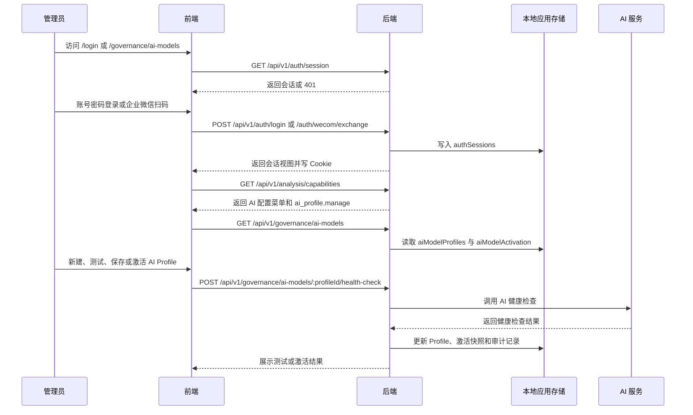
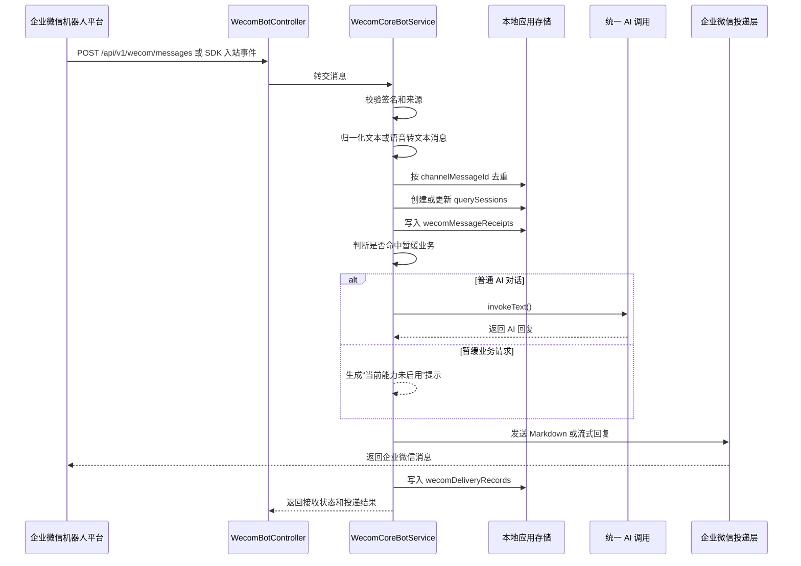
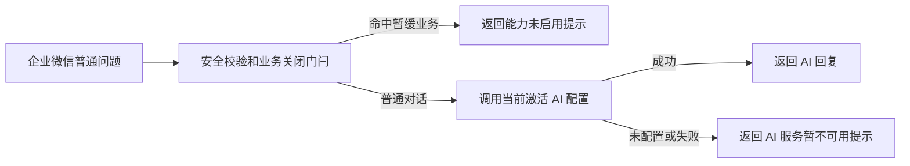
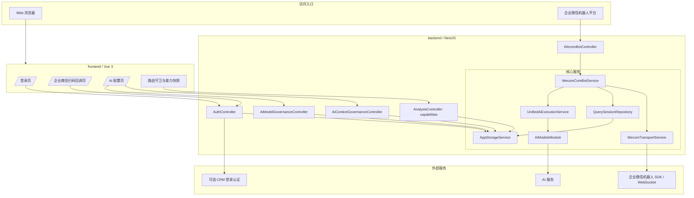
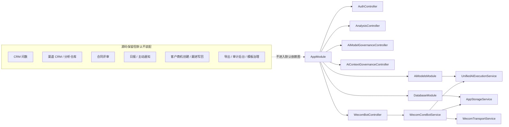

# AI 企微核心收敛后项目交付总文档

更新时间：2026-06-27

本文是当前收敛后项目的交付总入口，覆盖需求/流程、架构图、接口清单入口、数据库结构、部署和资源清单。当前项目已从原 CRM 智能分析全量形态收敛为“AI 对接 + 企业微信机器人对接”核心形态；仓库中保留的 CRM 问数、渠道 CRM、合同评审、日报、导出、审计后台等历史源码，不视为当前默认可用能力。

## 1. 项目目标与边界

### 1.1 当前目标

| 主线 | 目标 | 当前交付状态 |
| --- | --- | --- |
| AI 对接 | 提供 AI 配置、健康检查、激活、上下文策略和统一文本调用能力。 | 已保留 |
| 企业微信机器人对接 | 接收企业微信机器人消息，完成验签、来源校验、消息归一化、会话、回执、普通 AI 回复和暂缓业务提示。 | 已保留 |

### 1.2 当前保留能力

| 能力 | 说明 |
| --- | --- |
| Web 登录与会话 | 支持账号密码登录、企业微信扫码登录、会话 Cookie、退出登录和前端路由守卫。 |
| AI Profile 治理 | 支持 AI 配置列表、创建、更新、复制、删除、清密钥、草稿测试、健康检查和激活。 |
| AI 上下文策略 | 支持上下文保留轮次、摘要长度和会话失活阈值管理。 |
| 企业微信机器人普通 AI 对话 | 非内部业务数据类问题进入统一 AI 调用并回复。 |
| 企业微信机器人业务关闭提示 | CRM 问数、渠道分析、合同评审、日报、导出、写回等请求统一提示当前未启用。 |
| 能力快照 | `/analysis/capabilities` 仅返回 AI 配置菜单与 `ai_profile.manage` 动作权限。 |

### 1.3 当前暂缓能力

| 暂缓模块 | 当前处理 | 恢复要求 |
| --- | --- | --- |
| CRM 问数 / Web 智能分析 | 接口固定关闭，前端不暴露页面。 | 重新确认数据源、白名单、权限、审计和回归测试。 |
| 渠道 CRM / 分析仓库 | 源码保留，默认不装配。 | 重新确认 OpenAPI、SQLite、分析库和权限裁剪。 |
| 合同评审 | 源码和标准包保留，默认不装配。 | 重新确认合同来源、存储、规则、AI 审核和产物权限。 |
| 日报 / 主动通知 | 源码保留，默认不装配。 | 重新确认调度、收件人、灰度、幂等和真实投递开关。 |
| 客户 / 商机 / 跟进写回 | 源码保留，默认不装配。 | 重新确认 CRM 写入账号、确认流、审计和失败回退。 |
| 导出 / 审计后台 / 模板治理 | 源码保留，默认不装配。 | 跟随对应业务模块恢复，不单独打开旧入口。 |

## 2. 业务流程

### 2.1 Web 登录与 AI 配置流程



### 2.2 企业微信机器人普通 AI 对话流程



### 2.3 收敛后的业务请求处理规则

企业微信消息进入后，系统只允许普通 AI 对话继续执行。以下请求会直接返回能力未启用提示，不进入 CRM、合同、日报、导出或写回链路：

1. CRM 问数、销售数据查询、经营看板、数据看板。
2. 渠道 CRM、渠道分析、渠道订单或渠道业绩查询。
3. 合同评审、合同审核、合同上传下载。
4. 日报、周报、月报、催报、团队汇总。
5. 新增客户、新增商机、跟进写回、同步 CRM。
6. 结果导出、文件生成、内部业务对象下载。

### 2.4 降级流程



## 3. 架构图

### 3.1 当前默认运行架构



### 3.2 默认装配与暂缓模块关系



## 4. 接口清单入口

后端全局前缀：`/api/v1`

### 4.1 当前保留接口

| 分类 | 方法 | 路径 | 说明 |
| --- | --- | --- | --- |
| 认证 | `POST` | `/api/v1/auth/login` | 账号密码登录。 |
| 认证 | `GET` | `/api/v1/auth/session` | 获取当前会话。 |
| 认证 | `POST` | `/api/v1/auth/logout` | 退出登录。 |
| 认证 | `GET` | `/api/v1/auth/wecom/initiate` | 发起企业微信扫码登录。 |
| 认证 | `GET` | `/api/v1/auth/wecom/callback` | 企业微信扫码回调。 |
| 认证 | `POST` | `/api/v1/auth/wecom/exchange` | 前端换取本地会话。 |
| 能力快照 | `GET` | `/api/v1/analysis/capabilities` | 返回当前用户核心能力。 |
| AI 配置 | `GET` | `/api/v1/governance/ai-models` | AI Profile 列表和激活快照。 |
| AI 配置 | `GET` | `/api/v1/governance/ai-models/:profileId` | AI Profile 详情。 |
| AI 配置 | `POST` | `/api/v1/governance/ai-models` | 创建 AI Profile。 |
| AI 配置 | `PUT` | `/api/v1/governance/ai-models/:profileId` | 更新 AI Profile。 |
| AI 配置 | `POST` | `/api/v1/governance/ai-models/draft-health-check` | 草稿健康检查。 |
| AI 配置 | `POST` | `/api/v1/governance/ai-models/:profileId/health-check` | 已保存 Profile 健康检查。 |
| AI 配置 | `POST` | `/api/v1/governance/ai-models/:profileId/activate` | 激活 AI Profile。 |
| AI 配置 | `POST` | `/api/v1/governance/ai-models/:profileId/copy` | 复制 AI Profile。 |
| AI 配置 | `POST` | `/api/v1/governance/ai-models/:profileId/clear-secret` | 清空 AI 密钥。 |
| AI 配置 | `DELETE` | `/api/v1/governance/ai-models/:profileId` | 删除 AI Profile。 |
| AI 配置 | `POST` | `/api/v1/governance/ai-models/:profileId/status` | 设置启停状态。 |
| AI 上下文 | `GET` | `/api/v1/governance/ai-models/context-policy` | 读取上下文策略。 |
| AI 上下文 | `PUT` | `/api/v1/governance/ai-models/context-policy` | 更新上下文策略。 |
| 企业微信机器人 | `POST` | `/api/v1/wecom/messages` | 接收企业微信 HTTP 入站消息。 |
| 企业微信机器人 | `GET` | `/api/v1/wecom/sessions/:sessionId` | 查询轻量会话，建议仅内网使用。 |
| 企业微信机器人 | `GET` | `/api/v1/wecom/messages/:messageId/receipt` | 查询消息回执，建议仅内网使用。 |
| 企业微信机器人 | `POST` | `/api/v1/wecom/sessions/:sessionId/heartbeat` | 上报会话心跳。 |

### 4.2 固定关闭接口

| 方法 | 路径 | 当前行为 |
| --- | --- | --- |
| `POST` | `/api/v1/analysis/queries` | 返回 `503`，提示 CRM 智能分析未启用。 |
| `GET` | `/api/v1/analysis/queries/:queryId` | 返回 `503`。 |
| `POST` | `/api/v1/analysis/queries/:queryId/report` | 返回 `503`。 |
| `POST` | `/api/v1/analysis/queries/:queryId/templates` | 返回 `503`。 |

### 4.3 默认未装配接口组

| 历史接口组 | 当前状态 |
| --- | --- |
| `/api/v1/contract-reviews/**` | 默认不装配 |
| `/api/v1/daily-reports/**` | 默认不装配 |
| `/api/v1/analysis/templates/**` | 默认不装配 |
| `/api/v1/analysis/histories/**` | 默认不装配 |
| `/api/v1/analysis/queries/:queryId/exports` | 默认不装配 |
| `/api/v1/audit-events/**` | 默认不装配 |
| `/api/v1/governance/query-templates/**` | 默认不装配 |
| `/api/v1/governance/semantic-knowledge/**` | 默认不装配 |
| `/api/v1/governance/analysis-warehouse/**` | 默认不装配 |
| `/api/v1/dashboard/**` | 默认不装配 |
| `/api/v1/management-report/**` | 默认不装配 |
| `/api/v1/crm/customers`、`/api/v1/crm/opportunities` | 默认不装配 |
| `/api/v1/public/analysis-results/**` | 默认不装配 |

## 5. 数据库与存储结构

### 5.1 当前核心存储

当前核心运行态默认写入：

```text
.runtime/app-storage.json
```

该文件由 `AppStorageService` 管理，在非测试环境中持久化。生产部署时应挂载到持久化目录并纳入备份；打包交付时默认不包含 `.runtime`，避免会话、令牌、密钥状态或本地调试数据外泄。

### 5.2 核心集合

| 集合 | 用途 | 关键字段 |
| --- | --- | --- |
| `aiModelProfiles` | AI Profile 配置。 | `id`、`name`、`providerCode`、`sdkType`、`model`、`baseUrl`、`secretCiphertext`、`secretConfigured`、`status`。 |
| `aiModelActivation` | 当前激活 Profile。 | `activeProfileId`、`activatedAt`、`activatedBy`、`lastVerifiedAt`、`lastVerificationStatus`。 |
| `aiContextPolicy` | AI 上下文治理策略。 | `turnRetentionLimit`、`historySummaryMaxLength`、`latestQuestionMaxLength`、`analysisSessionIdleTimeoutSeconds`。 |
| `authSessions` | Web 登录会话。 | `id`、`requesterId`、`source`、`sessionStatus`、`userSnapshot`、`expiresAt`。 |
| `wecomLoginBindings` | 企业微信扫码登录绑定。 | `wecomUserId`、`crmUserId`、`createdAt`、`updatedAt`。 |
| `pendingWecomBindings` | 待确认扫码绑定。 | `bindToken`、`state`、`wecomUserId`、`mobile`、`email`、`expiresAt`。 |
| `querySessions` | 企业微信轻量会话。 | `channel`、`externalConversationId`、`senderId`、`requesterId`、`contextStatus`、`lastReceiptId`。 |
| `wecomMessageReceipts` | 企业微信入站回执。 | `channelMessageId`、`externalConversationId`、`senderId`、`sessionId`、`status`、`rawPayloadSummary`。 |
| `wecomDeliveryRecords` | 企业微信回复投递记录。 | `receiptId`、`sessionId`、`deliveryTargetId`、`contentPreview`、`status`、`externalMessageId`。 |
| `auditEvents` | AI 配置和部分治理审计。 | `eventType`、`actorId`、`resourceType`、`outcome`、`failureReason`、`createdAt`。 |
| `policy`、`rolePermissions`、`applicationSuperAdminPolicy` | 登录后的菜单和动作权限判断。 | `visibleMenus`、`actionKeys`、`ai_profile.manage`。 |

### 5.3 保留但非核心集合

运行态结构中仍包含 `analysisRequests`、`analysisResults`、`queryTemplates`、`recentQueries`、`exportRequests`、`contractReviewTasks`、`dailyReports`、`proactiveNotificationTasks`、`analysisWarehouseRawRecords` 等历史集合。当前核心流程不依赖这些集合，后续清理或恢复时必须先备份运行态，再按模块边界单独处理。

### 5.4 外部数据源关系

| 外部数据源 | 当前核心是否必需 | 说明 |
| --- | --- | --- |
| AI 服务 | 必需 | 普通 AI 对话和健康检查依赖模型、服务地址和密钥。 |
| 企业微信机器人平台 | 必需 | 真实入站监听和投递依赖 Bot ID、Secret、签名、来源和 WebSocket 地址。 |
| CRM OpenAPI 登录 | 可选 | 仅真实账号密码登录需要；普通企业微信 AI 对话不依赖。 |
| CRM 只读库 | 非必需 | 当前不查 CRM 数据。 |
| CRM 写回库 / 写回 OpenAPI | 非必需 | 当前不写回客户、商机或跟进。 |
| 渠道 CRM / 分析仓库 | 非必需 | 当前不启用渠道分析或 Text-to-SQL。 |

## 6. 部署说明

### 6.1 环境要求

| 项目 | 建议值 |
| --- | --- |
| Node.js | 20 LTS。当前本机为 Node 24，可用于开发联调，但生产建议统一 Node 20。 |
| pnpm | 8.15.9 |
| 后端默认端口 | `3001` |
| 前端开发端口 | `5173` |
| API 前缀 | `/api/v1` |

### 6.2 核心环境变量

| 分类 | 变量 |
| --- | --- |
| 服务 | `PORT` |
| Web 地址 | `APP_WEB_BASE_URL`、`APP_WEB_ALLOWED_BASE_URLS` |
| 共享 Cookie | `APP_WEB_SHARED_COOKIE_DOMAIN`、`CRM_AUTH_COOKIE_SECURE` |
| AI 默认配置 | `OPENAI_API_KEY`、`ANALYSIS_AI_BASE_URL`、`ANALYSIS_AI_MODEL_PROVIDER`、`ANALYSIS_AI_MODEL` |
| AI 协议参数 | `ANALYSIS_AI_WIRE_API`、`ANALYSIS_AI_STRUCTURED_OUTPUT_MODE`、`ANALYSIS_AI_REASONING_EFFORT`、`ANALYSIS_AI_SERVICE_TIER` |
| AI 密钥加密 | `AI_PROFILE_MASTER_KEY` |
| 企业微信机器人 | `WECOM_BOT_ID`、`WECOM_BOT_SECRET`、`WECOM_BOT_SIGNATURE`、`WECOM_BOT_SOURCE`、`WECOM_BOT_WS_URL` |
| 企业微信扫码登录 | `WECOM_WEB_LOGIN_AUTHORIZE_URL`、`WECOM_WEB_LOGIN_CALLBACK_URL`、`WECOM_WEB_LOGIN_APP_ID`、`WECOM_WEB_LOGIN_AGENT_ID`、`WECOM_WEB_LOGIN_SECRET` |
| 账号密码登录 | `CRM_OPEN_API_BASE_URL`、`CRM_OPEN_API_LOGIN_PATH`、`CRM_OPEN_API_CORP_ID`、`CRM_AUTH_MOCK_ENABLED` |
| 前端 | `VITE_API_BASE_URL`、`VITE_APP_BASE_PATH`、`VITE_REQUEST_TIMEOUT_MS` |
| 收敛开关 | `WECOM_BUSINESS_ACTIONS_ENABLED` 默认不得设置为 `true` |

真实密钥、数据库密码、企业微信 Secret 和 API Token 只能写入安全环境变量或本地敏感配置，不得写入文档、提交到仓库或打入交付包。

### 6.3 本地启动

```bash
pnpm install
pnpm dev
```

分别启动：

```bash
pnpm dev:backend
pnpm dev:frontend
```

当前本机已验证开发服务可启动：

| 服务 | 地址 | 状态 |
| --- | --- | --- |
| 前端 | `http://127.0.0.1:5173/` | 可访问 |
| 后端 | `http://127.0.0.1:3001/api/v1` | 可访问 |
| 未登录会话检查 | `GET /api/v1/auth/session` | 返回 `401`，属正常未登录状态 |

### 6.4 生产构建与启动

目标命令：

```bash
pnpm --dir backend build
pnpm --dir frontend build
pnpm --dir backend start
```

说明：上轮收敛验证中，核心 `AppModule` 编译和核心测试已通过；全量后端构建曾受历史类型问题影响。正式上线前应以生产构建通过作为发布门槛，或先修复历史类型问题。

### 6.5 反向代理建议

1. 前端静态资源部署在根路径或 `/insight` 等固定子路径。
2. `/api/` 统一代理到后端 `127.0.0.1:3001`。
3. 企业微信扫码回调配置到外部可访问的 `/api/v1/auth/wecom/callback`。
4. 企业微信机器人 HTTP 入站配置到 `/api/v1/wecom/messages`。
5. `/api/v1/wecom/sessions/**` 和 `/api/v1/wecom/messages/**/receipt` 建议仅内网或管理员网络访问。
6. 生产必须持久化 `.runtime/app-storage.json` 和 AI 密钥加密主密钥。

## 7. 资源清单

### 7.1 核心源码资源

| 路径 | 用途 |
| --- | --- |
| `backend/src/app.module.ts` | 当前默认装配边界。 |
| `backend/src/main.ts` | 后端启动、CORS、日志和 `/api/v1` 前缀。 |
| `backend/src/modules/ai-models/` | AI Profile、健康检查、激活、统一调用和适配器。 |
| `backend/src/modules/governance/ai-model-governance.controller.ts` | AI Profile 治理接口。 |
| `backend/src/modules/governance/ai-context-governance.controller.ts` | AI 上下文策略接口。 |
| `backend/src/modules/wecom/wecom-core-bot.service.ts` | 收敛后的企业微信机器人核心服务。 |
| `backend/src/modules/wecom/wecom-bot.controller.ts` | 企业微信机器人 HTTP 入口。 |
| `backend/src/modules/wecom/wecom-transport.service.ts` | 企业微信 SDK / WebSocket 传输层。 |
| `backend/src/modules/analysis/analysis.controller.ts` | 能力快照和固定关闭的分析入口。 |
| `backend/src/modules/auth/` | 登录、会话和企业微信扫码登录。 |
| `frontend/src/router/index.ts` | 收敛后的前端路由。 |
| `frontend/src/layouts/AppShell.vue` | 当前只保留 AI 配置导航。 |
| `frontend/src/pages/governance/AiModelProfilePage.vue` | 当前唯一业务首页。 |
| `frontend/src/services/http-client.ts` | 前端 API 基址和请求封装。 |
| `frontend/src/stores/auth.store.ts` | 会话和能力快照状态。 |

### 7.2 关键文档资源

| 路径 | 用途 |
| --- | --- |
| `README.md` | 仓库入口说明。 |
| `AGENTS.md` | 协作规范和安全约束。 |
| `DESIGN.md` | 前端设计系统约束。 |
| `docs/architecture/AI企微核心收敛后项目交付总文档.md` | 本交付总文档。 |
| `docs/architecture/AI企微核心收敛后项目说明.md` | 更偏技术说明的收敛后项目文档。 |
| `docs/architecture/AI企微核心收敛边界说明.md` | 收敛边界说明。 |
| `docs/architecture/AI企微核心模块收敛清理方案.md` | 模块收敛清理方案。 |
| `docs/architecture/AI企微核心收敛清理执行记录.md` | 收敛清理执行记录。 |
| `docs/architecture/AI企微核心依赖拆分与业务链测试记录.md` | 依赖拆分和业务链验证记录。 |
| `docs/architecture/ai-model-profile-governance.md` | AI 配置治理设计说明。 |
| `docs/architecture/生产部署指南.md` | 历史生产部署参考，当前部署需按本文收敛边界裁剪。 |

### 7.3 配置与模板资源

| 路径 | 用途 | 打包状态 |
| --- | --- | --- |
| `backend/.env.example` | 后端环境变量模板。 | 保留 |
| `frontend/.env.example` | 前端环境变量模板。 | 保留 |
| `docs/architecture/deploy-examples/` | Nginx、systemd、生产参数清单等部署参考。 | 保留 |
| `配置/` | 本地敏感配置来源。 | 交付 zip 默认排除 |
| `backend/.env*.local`、`frontend/.env*.local` | 本地环境配置。 | 交付 zip 默认排除 |

### 7.4 测试与验证资源

| 路径或命令 | 用途 |
| --- | --- |
| `backend/test/modules/wecom/wecom-core-bot.service.spec.ts` | 企业微信核心机器人测试。 |
| `backend/test/modules/wecom/wecom-transport.service.spec.ts` | 企业微信传输层测试。 |
| `backend/test/auth.controller.spec.ts` | 登录和企业微信门户回跳测试。 |
| `pnpm --dir backend test -- --runTestsByPath test/auth.controller.spec.ts test/modules/wecom/wecom-core-bot.service.spec.ts test/modules/wecom/wecom-transport.service.spec.ts` | 推荐核心回归命令。 |
| `pnpm --dir frontend test:unit` | 修改前端登录、路由或 AI 配置页后的推荐回归。 |

### 7.5 运行态和备份资源

| 路径 | 用途 | 注意事项 |
| --- | --- | --- |
| `.runtime/app-storage.json` | 本地应用运行态。 | 可能包含会话和密钥状态，交付 zip 默认排除。 |
| `.runtime/logs/` | 本地启动日志。 | 交付 zip 默认排除。 |
| `.tmp/backups/crm-agent-base-before-dependency-split-20260627-152855.zip` | 依赖拆分前完整备份。 | 不重复打入本次交付 zip。 |
| `.tmp/backups/ai-wecom-core-dependency-split-changed-files-20260627-155813.zip` | 依赖拆分变更包。 | 不重复打入本次交付 zip。 |
| `.tmp/backups/` | 本次交付 zip 输出目录。 | 仅保存本地交付包。 |

## 8. 打包交付口径

本次交付包建议保留：

1. `backend/`、`frontend/`、`docs/`、`scripts/`、`specs/`、`openspec/`。
2. `README.md`、`AGENTS.md`、`DESIGN.md`、`package.json`、`pnpm-lock.yaml`、`pnpm-workspace.yaml`。
3. `.codex/`、`.specify/` 等协作与规格辅助目录。

本次交付包默认排除：

1. `node_modules/`：依赖可通过 `pnpm install` 恢复。
2. `.git/`：避免打包仓库历史和本地状态。
3. `.runtime/`：避免运行态、会话、日志和密钥状态外泄。
4. `.tmp/`、`tmp/`：避免重复打包历史压缩包和临时文件。
5. `配置/`：避免敏感配置外泄。
6. `*.env.local`、`*.env.development.local`、`*.env.production.local`：避免本地环境变量外泄。
7. 构建产物和缓存目录，例如 `dist/`、`.vite/`、`coverage/`、`test-results/`、`playwright-report/`。

收到交付包后的恢复步骤：

```bash
pnpm install
pnpm dev
```

生产部署前再按本文第 6 节补齐环境变量、持久化目录、反向代理和回归测试。
