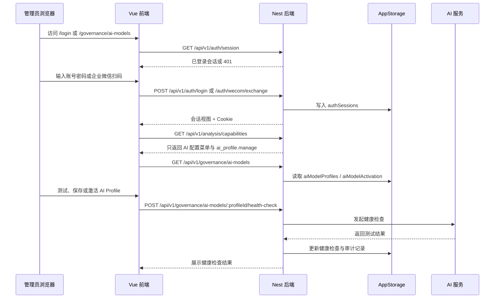
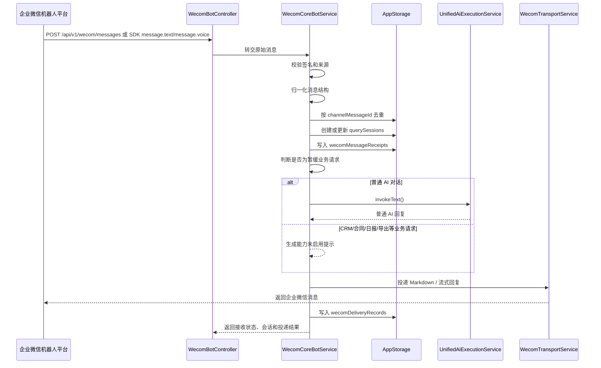
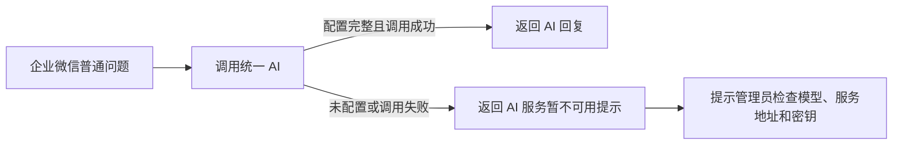
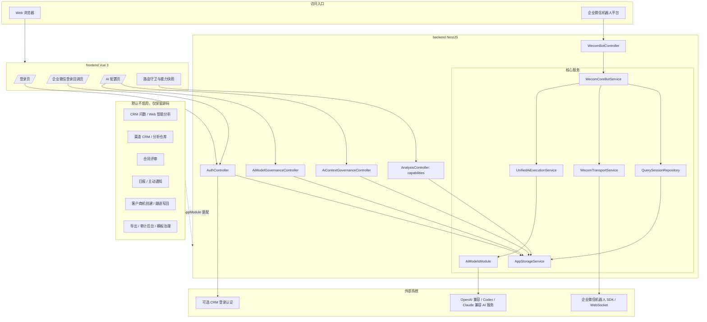
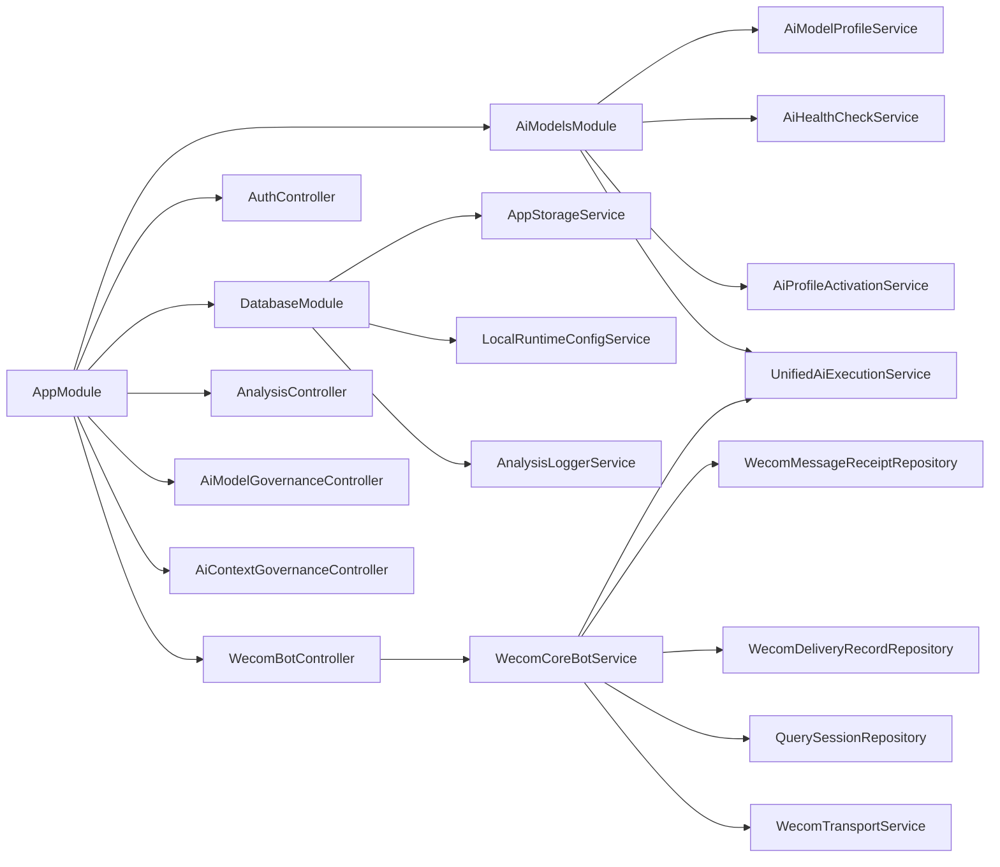

# AI 企微核心收敛后项目说明

更新时间：2026-06-27

本文面向收敛后的交付、运维和后续二次开发，整理当前项目的需求边界、业务流程、架构图、接口入口、数据结构和部署方式。当前判断以 `backend/src/app.module.ts`、`frontend/src/router/index.ts` 和已完成的收敛测试记录为准；仓库中未装配到默认入口的历史源码不视为当前可用业务能力。

## 1. 当前定位

收敛后的项目只保留两条核心主线：

| 主线 | 当前目标 | 当前状态 |
| --- | --- | --- |
| 对接 AI | 管理 AI 配置、健康检查、激活配置、统一调用 AI 生成普通对话回复。 | 默认保留 |
| 对接企业微信机器人 | 接收企业微信机器人消息，完成验签、来源校验、消息归一化、会话、回执、普通 AI 对话和未启用业务提示。 | 默认保留 |

以下能力当前转为暂缓能力：CRM 问数、渠道 CRM 分析、合同评审、日报、经营报表、主动通知、客户/商机创建、跟进写回、导出、审计后台、模板治理、语义资产治理、数据仓库同步和分析结果公开页。

暂缓能力的源码和历史文档仍在仓库中，主要用于回滚、比对和后续恢复；但默认后端 `AppModule` 不再装配这些 Controller 和业务服务，前端路由和导航也不再暴露这些页面。

## 2. 需求与边界

### 2.1 保留能力

| 模块 | 保留范围 | 明确边界 |
| --- | --- | --- |
| 登录与会话 | CRM 账号密码登录、企业微信扫码登录、会话 Cookie、前端路由守卫。 | 登录只作为后台 AI 配置入口的基础能力，不代表恢复 Web 智能分析工作台。 |
| AI 配置治理 | AI Profile 列表、创建、更新、复制、删除、清密钥、健康检查、激活、上下文策略。 | 只管理 AI 运行时配置；不恢复问数语义层、SQL 执行、合同审核或日报 AI 审查。 |
| 统一 AI 调用 | `UnifiedAiExecutionService.invokeText()` 支撑普通文本回复。 | AI 只能生成通用回复，不允许编造 CRM、渠道、合同、日报等内部业务数据。 |
| 企业微信机器人接入 | HTTP 回调和 SDK 入站监听、签名/来源校验、文本/语音转文本接收、去重、会话、回执、投递记录。 | 当前不做 CRM 身份映射，不查 CRM 数据，不写回 CRM，不推送日报或主动通知。 |
| 企业微信普通 AI 对话 | 非业务类问题进入 AI 回复。 | 业务请求会被统一拦截为“能力未启用”提示。 |
| 能力快照 | `/analysis/capabilities` 只返回核心菜单和动作权限。 | 不再暴露分析指标、模板、历史、导出、合同、日报等旧能力。 |

### 2.2 暂缓能力

| 能力 | 当前处理方式 | 后续恢复要求 |
| --- | --- | --- |
| CRM 问数 / Web 智能分析 | 接口固定返回未启用，前端不再路由到分析页。 | 必须重新评估数据源、白名单、权限、审计和回归测试后单独恢复。 |
| 渠道 CRM / 分析仓库 | 源码保留，默认不装配。 | 必须重新确认 OpenAPI、SQLite、分析仓库和权限边界。 |
| 合同评审 | 源码和 skill pack 保留，默认不装配。 | 必须重新确认合同来源、文件存储、审核规则、权限和产物下载边界。 |
| 日报 / 主动通知 | 源码保留，默认不装配。 | 必须重新确认调度、收件人、灰度、幂等和真实投递开关。 |
| 客户 / 商机 / 跟进写回 | 源码保留，默认不装配。 | 必须重新确认 CRM OpenAPI 写入账号、确认流、审计和失败回退。 |
| 导出 / 审计后台 / 模板治理 | 源码保留，默认不装配。 | 必须跟随对应业务恢复，不能单独打开旧入口。 |

### 2.3 不影响核心链路的关键原则

1. 企业微信普通 AI 对话不依赖 CRM 数据库、CRM OpenAPI、渠道 CRM、合同评审或日报模块。
2. `WECOM_BUSINESS_ACTIONS_ENABLED` 默认不得开启；开启前必须恢复完整业务依赖和测试。
3. `WecomCoreBotService` 当前按 `senderId` 建立轻量会话，不把企业微信用户写成 CRM 授权主体。
4. 后台 AI 配置只需要登录会话和 `ai_profile.manage` 权限，不需要分析工作台或 CRM 问数服务。
5. 生产网关应只暴露当前有效入口，历史源码中的未装配接口不应作为可用接口对外承诺。

## 3. 业务流程

### 3.1 Web 登录与 AI 配置流程



### 3.2 企业微信普通 AI 对话流程



### 3.3 业务请求收敛流程

企业微信消息进入后，会先按轻量规则识别是否明显属于暂缓业务能力。命中后不进入 CRM、合同、日报、导出或写回链路，而是直接回复统一提示：

1. CRM 问数、渠道分析、经营看板、数据看板。
2. 合同评审、合同审核、上传下载合同产物。
3. 日报、周报、月报、主动推送。
4. 新增客户、新增商机、跟进写回。
5. 结果导出或内部业务数据查询。

这样做的目的不是把规则重新作为长期语义理解层，而是在核心收敛模式下为已关闭业务能力加一道固定安全门闩，防止普通 AI 对话误编造内部数据。

### 3.4 未配置 AI 时的降级流程



## 4. 架构图

### 4.1 当前默认运行架构



### 4.2 后端默认装配图



## 5. 前端入口

| 路由 | 当前状态 | 说明 |
| --- | --- | --- |
| `/login` | 保留 | 账号密码登录、企业微信扫码入口、登录反馈和会话回流。 |
| `/wecom-login/callback` | 保留 | 企业微信扫码回调的前端承接页。 |
| `/forbidden` | 保留 | 已登录但无 `ai_profile.manage` 或无 AI 配置菜单时的落点。 |
| `/` | 重定向 | 重定向到 `/governance/ai-models`。 |
| `/governance/ai-models` | 保留 | 当前唯一业务首页，管理 AI Profile 和上下文策略。 |
| `/:pathMatch(.*)*` | 重定向 | 未知路径统一回到 `/governance/ai-models`。 |

前端导航当前只保留“AI配置”。`frontend/src/services/analysis.service.ts` 中仍有历史方法声明，但当前路由不会进入这些页面；后端默认也没有装配对应 Controller。

## 6. 接口清单入口

全局后端前缀为 `/api/v1`，前端统一通过 `VITE_API_BASE_URL + /api/v1` 访问。生产环境建议让前端与 API 走同源反向代理，避免 Cookie、跨域和门户代理参数丢失。

### 6.1 认证与会话

| 方法 | 路径 | 当前状态 | 用途 |
| --- | --- | --- | --- |
| `POST` | `/api/v1/auth/login` | 保留 | CRM 账号密码登录，写入会话 Cookie。 |
| `GET` | `/api/v1/auth/session` | 保留 | 读取当前登录会话并刷新会话 Cookie。 |
| `POST` | `/api/v1/auth/logout` | 保留 | 关闭会话并清理 Cookie。 |
| `GET` | `/api/v1/auth/wecom/initiate` | 保留 | 生成企业微信扫码登录地址和 state。 |
| `GET` | `/api/v1/auth/wecom/callback` | 保留 | 企业微信扫码回调，支持门户 `GratuitousProxy` 兜底。 |
| `POST` | `/api/v1/auth/wecom/exchange` | 保留 | 前端拿扫码 code 换取本地登录会话。 |

### 6.2 能力快照与关闭的分析入口

| 方法 | 路径 | 当前状态 | 用途 |
| --- | --- | --- | --- |
| `GET` | `/api/v1/analysis/capabilities` | 保留 | 返回当前用户可见菜单和动作，核心模式下只保留 AI 配置能力。 |
| `POST` | `/api/v1/analysis/queries` | 固定关闭 | 返回 `503`，提示 CRM 智能分析未启用。 |
| `GET` | `/api/v1/analysis/queries/:queryId` | 固定关闭 | 返回 `503`。 |
| `POST` | `/api/v1/analysis/queries/:queryId/report` | 固定关闭 | 返回 `503`。 |
| `POST` | `/api/v1/analysis/queries/:queryId/templates` | 固定关闭 | 返回 `503`。 |

### 6.3 AI 配置治理

这些接口需要登录会话，并需要 `ai_profile.manage` 动作权限。

| 方法 | 路径 | 当前状态 | 用途 |
| --- | --- | --- | --- |
| `GET` | `/api/v1/governance/ai-models` | 保留 | AI Profile 列表和当前激活快照。 |
| `GET` | `/api/v1/governance/ai-models/:profileId` | 保留 | 单个 AI Profile 脱敏详情。 |
| `POST` | `/api/v1/governance/ai-models` | 保留 | 创建 AI Profile。 |
| `PUT` | `/api/v1/governance/ai-models/:profileId` | 保留 | 更新 AI Profile。 |
| `POST` | `/api/v1/governance/ai-models/draft-health-check` | 保留 | 对未保存草稿执行健康检查。 |
| `POST` | `/api/v1/governance/ai-models/:profileId/health-check` | 保留 | 对已保存 Profile 执行健康检查。 |
| `POST` | `/api/v1/governance/ai-models/:profileId/activate` | 保留 | 健康检查通过后激活 Profile。 |
| `POST` | `/api/v1/governance/ai-models/:profileId/copy` | 保留 | 复制 Profile。 |
| `POST` | `/api/v1/governance/ai-models/:profileId/clear-secret` | 保留 | 清空 Profile 密钥。 |
| `DELETE` | `/api/v1/governance/ai-models/:profileId` | 保留 | 删除手工维护的 Profile。 |
| `POST` | `/api/v1/governance/ai-models/:profileId/status` | 保留 | 设置 Profile 启停状态。 |

### 6.4 AI 上下文策略

| 方法 | 路径 | 当前状态 | 用途 |
| --- | --- | --- | --- |
| `GET` | `/api/v1/governance/ai-models/context-policy` | 保留 | 读取上下文保留轮次、摘要长度和会话超时策略。 |
| `PUT` | `/api/v1/governance/ai-models/context-policy` | 保留 | 更新上下文策略。 |

### 6.5 企业微信机器人

| 方法 | 路径 | 当前状态 | 用途 |
| --- | --- | --- | --- |
| `POST` | `/api/v1/wecom/messages` | 保留 | 企业微信 HTTP 入站消息，使用 `x-wecom-signature` 和 `x-wecom-source` 校验。 |
| `GET` | `/api/v1/wecom/sessions/:sessionId` | 保留，建议内网访问 | 查询机器人轻量会话。生产环境建议通过网关限制访问。 |
| `GET` | `/api/v1/wecom/messages/:messageId/receipt` | 保留，建议内网访问 | 查询单条消息回执和投递记录。 |
| `POST` | `/api/v1/wecom/sessions/:sessionId/heartbeat` | 保留，建议内网访问 | 上报会话心跳。 |

### 6.6 默认未装配接口

源码中仍可搜索到以下历史 Controller，但当前默认 `AppModule` 不装配，不能作为当前可用接口：

| 历史接口组 | 当前状态 |
| --- | --- |
| `/api/v1/contract-reviews/**` | 未装配 |
| `/api/v1/daily-reports/**` | 未装配 |
| `/api/v1/analysis/templates/**`、`/api/v1/analysis/histories/**` | 未装配 |
| `/api/v1/analysis/queries/:queryId/exports` | 未装配 |
| `/api/v1/audit-events` | 已装配最小查询，仅用于 AI 配置等核心治理留痕，不恢复审计中心页面。 |
| `/api/v1/audit-events/sql/**` | 未装配 |
| `/api/v1/governance/query-templates/**`、`/api/v1/governance/semantic-knowledge/**` | 未装配 |
| `/api/v1/governance/analysis-warehouse/**` | 未装配 |
| `/api/v1/dashboard/**`、`/api/v1/management-report/**` | 未装配 |
| `/api/v1/crm/customers`、`/api/v1/crm/opportunities` | 未装配 |
| `/api/v1/public/analysis-results/**` | 未装配 |

## 7. 数据库与存储结构

### 7.1 当前核心存储

当前核心运行态主要由 `AppStorageService` 管理，默认文件为：

```text
.runtime/app-storage.json
```

该文件在 `NODE_ENV !== 'test'` 时启用持久化，采用整包 JSON 快照方式保存。多个进程读取时会通过文件签名做懒刷新。生产部署时必须把 `.runtime` 放在持久化目录，并纳入备份；不要提交到 Git，也不要把其中的密钥、令牌或会话快照贴到文档中。

### 7.2 核心集合

| 集合 | 当前用途 | 关键字段 |
| --- | --- | --- |
| `aiModelProfiles` | AI Profile 配置。 | `id`、`name`、`providerCode`、`sdkType`、`model`、`baseUrl`、`secretCiphertext`、`secretConfigured`、`status`、`lastHealthCheckStatus`。 |
| `aiModelActivation` | 当前激活 AI Profile 快照。 | `activeProfileId`、`activatedAt`、`activatedBy`、`lastVerifiedAt`、`lastVerificationStatus`。 |
| `aiContextPolicy` | AI 上下文治理策略。 | `turnRetentionLimit`、`historySummaryMaxLength`、`latestQuestionMaxLength`、`analysisSessionIdleTimeoutSeconds`、`taskSessionIdleTimeoutSeconds`。 |
| `authSessions` | Web 登录会话。 | `id`、`requesterId`、`source`、`sessionStatus`、`crmAccessToken`、`userSnapshot`、`expiresAt`。 |
| `wecomLoginBindings` | 企业微信扫码登录绑定关系。 | `wecomUserId`、`crmUserId`、`createdAt`、`updatedAt`。 |
| `pendingWecomBindings` | 待确认扫码绑定。 | `bindToken`、`state`、`wecomUserId`、`mobile`、`email`、`expiresAt`。 |
| `querySessions` | 企业微信机器人轻量会话。 | `channel`、`externalConversationId`、`senderId`、`requesterId`、`contextStatus`、`lastReceiptId`。 |
| `wecomMessageReceipts` | 企业微信入站消息回执。 | `channelMessageId`、`externalConversationId`、`senderId`、`sessionId`、`status`、`rawPayloadSummary`。 |
| `wecomDeliveryRecords` | 企业微信回复投递记录。 | `receiptId`、`sessionId`、`deliveryTargetId`、`blockType`、`contentPreview`、`status`、`externalMessageId`。 |
| `auditEvents` | AI 配置和部分治理动作审计。 | `eventType`、`actorId`、`channel`、`resourceType`、`outcome`、`failureReason`、`createdAt`。 |
| `policy`、`rolePermissions`、`applicationSuperAdminPolicy` | 登录后权限与菜单快照。 | `visibleMenus`、`actionKeys`、`ai_profile.manage` 等。 |

### 7.3 保留但非核心集合

`AppStorageState` 仍包含历史集合，例如 `analysisRequests`、`analysisResults`、`queryTemplates`、`recentQueries`、`exportRequests`、`contractReviewTasks`、`dailyReports`、`proactiveNotificationTasks`、`analysisWarehouseRawRecords` 等。它们用于历史数据保留、回滚和后续恢复，不属于当前核心业务链路。

清理或迁移这些历史集合时，应先备份 `.runtime/app-storage.json`，再按模块恢复计划处理；不能因为当前核心不使用就直接删除整个运行态文件，否则会影响 AI Profile、登录会话和企业微信消息回执。

### 7.4 外部数据库关系

| 外部数据源 | 当前核心是否必需 | 说明 |
| --- | --- | --- |
| CRM OpenAPI 登录认证 | 可选 | 如果启用真实账号密码登录，需要配置 CRM 登录地址；如仅本地联调可用 mock 登录。 |
| CRM 只读 MySQL | 非必需 | 企业微信普通 AI 对话和 AI 配置不依赖该库。 |
| CRM 写回库 / 写回 OpenAPI | 非必需 | 当前不启用客户、商机、跟进写回。 |
| 渠道 CRM / 分析仓库 | 非必需 | 当前不启用渠道分析和 Text-to-SQL。 |
| 企业微信机器人平台 | 生产必需 | 真实消息接入和回复需要 Bot ID、Secret、签名、来源和 WebSocket 地址。 |
| AI 服务 | 生产必需 | 普通 AI 对话需要可用模型、服务地址和密钥；未配置时机器人会降级提示。 |

## 8. 部署说明

### 8.1 环境要求

| 项目 | 建议值 |
| --- | --- |
| Node.js | 20 LTS |
| pnpm | 8.15.9 |
| 后端框架 | NestJS |
| 前端框架 | Vue 3 + Vite + Element Plus |
| 默认后端端口 | `3001` |
| 默认前端开发端口 | `5173` |
| 默认 API 前缀 | `/api/v1` |

### 8.2 核心环境变量

以下只列变量名和用途，不填写真实值。

| 分类 | 变量 | 用途 |
| --- | --- | --- |
| 服务 | `PORT` | 后端监听端口，默认 `3001`。 |
| Web 地址 | `APP_WEB_BASE_URL`、`APP_WEB_ALLOWED_BASE_URLS` | 前端访问基址和扫码回跳白名单。 |
| 共享 Cookie | `APP_WEB_SHARED_COOKIE_DOMAIN`、`CRM_AUTH_COOKIE_SECURE` | 门户或跨子域扫码登录时使用。 |
| AI | `OPENAI_API_KEY`、`ANALYSIS_AI_BASE_URL`、`ANALYSIS_AI_MODEL_PROVIDER`、`ANALYSIS_AI_MODEL` | 默认 AI 配置；后台已激活 Profile 时优先读后台配置。 |
| AI 协议 | `ANALYSIS_AI_WIRE_API`、`ANALYSIS_AI_STRUCTURED_OUTPUT_MODE`、`ANALYSIS_AI_REASONING_EFFORT`、`ANALYSIS_AI_SERVICE_TIER` | AI 兼容协议、结构化输出和模型参数。 |
| AI 密钥加密 | `AI_PROFILE_MASTER_KEY` | 加密后台保存的 AI 密钥；生产必须显式配置并妥善保管。 |
| 企业微信机器人 | `WECOM_BOT_ID`、`WECOM_BOT_SECRET`、`WECOM_BOT_SIGNATURE`、`WECOM_BOT_SOURCE`、`WECOM_BOT_WS_URL` | 机器人入站和投递核心配置。 |
| 企业微信登录 | `WECOM_WEB_LOGIN_AUTHORIZE_URL`、`WECOM_WEB_LOGIN_CALLBACK_URL`、`WECOM_WEB_LOGIN_APP_ID`、`WECOM_WEB_LOGIN_AGENT_ID`、`WECOM_WEB_LOGIN_SECRET` | Web 扫码登录。 |
| 登录认证 | `CRM_OPEN_API_BASE_URL`、`CRM_OPEN_API_LOGIN_PATH`、`CRM_OPEN_API_CORP_ID`、`CRM_OPEN_API_TIMEOUT_MS`、`CRM_AUTH_MOCK_ENABLED` | 账号密码登录；核心机器人普通 AI 对话不依赖这些变量。 |
| 前端 | `VITE_API_BASE_URL`、`VITE_APP_BASE_PATH`、`VITE_REQUEST_TIMEOUT_MS` | API 基址、前端部署子路径和请求超时。 |
| 收敛开关 | `WECOM_BUSINESS_ACTIONS_ENABLED` | 默认不设置或保持非 `true`；开启前必须恢复业务模块。 |

`backend/.env.example` 中仍包含历史 CRM、日报、通知、合同等变量，当前核心部署不需要全部配置。生产环境优先使用进程环境变量或独立环境文件，不建议把本地 `.env.local` 直接带入生产。

### 8.3 本地启动

```bash
pnpm install
pnpm dev
```

分别启动：

```bash
pnpm dev:backend
pnpm dev:frontend
```

后端直启：

```bash
pnpm --dir backend dev
```

前端直启：

```bash
pnpm --dir frontend dev
```

### 8.4 生产构建目标

目标构建命令：

```bash
pnpm --dir backend build
pnpm --dir frontend build
```

构建产物启动：

```bash
pnpm --dir backend start
```

当前收敛验证中，核心模块编译和核心测试已通过；但全量 `pnpm --dir backend build` 仍受历史 Express、Fetch、Supertest 类型问题影响。正式上线前应以生产构建通过为发布门槛，或先单独修复这些历史类型问题。

### 8.5 反向代理建议

生产建议采用同源部署：

1. 前端静态资源部署在根路径或 `/insight` 等固定子路径。
2. API 请求代理到后端 `127.0.0.1:3001`。
3. 企业微信回调地址配置为外部可访问的 `/api/v1/auth/wecom/callback`。
4. 企业微信机器人 HTTP 入站配置为 `/api/v1/wecom/messages`，并通过 `x-wecom-signature`、`x-wecom-source` 做来源校验。
5. 诊断类的 `/wecom/sessions/:sessionId` 和 `/wecom/messages/:messageId/receipt` 建议只允许内网或管理员网络访问。

### 8.6 持久化和备份

生产至少备份：

1. `.runtime/app-storage.json`：AI Profile、激活快照、上下文策略、会话、企业微信回执。
2. `.runtime/ai-profile-master.key` 或 `AI_PROFILE_MASTER_KEY` 的安全管理材料：用于解密 AI Profile 密钥。
3. 生产环境变量文件：只在安全环境备份，不进入仓库。
4. 前端构建包和后端发布包：用于快速回滚。

本轮收敛前已有项目备份：

```text
.tmp/backups/crm-agent-base-before-dependency-split-20260627-152855.zip
```

依赖拆分变更包：

```text
.tmp/backups/ai-wecom-core-dependency-split-changed-files-20260627-155813.zip
```

## 9. 验证口径

### 9.1 已完成验证摘要

上轮收敛验证结果：

| 验证项 | 结果 |
| --- | --- |
| Nest `AppModule` 通过 `@nestjs/testing` 编译 | 通过 |
| 核心测试套件 | 7 个套件、24 个用例通过 |
| 企业微信业务请求冒烟 | 返回 `BUSINESS_DISABLED`，投递状态 `SENT` |
| AI 未配置冒烟 | 返回 `AI_UNAVAILABLE`，投递状态 `SENT` |
| `/analysis` 执行入口冒烟 | 固定抛出 `ServiceUnavailableException` |
| 验证时 AI 配置 | 当时环境未配置可用模型、服务地址和密钥 |
| 验证时企业微信配置 | 当时环境未配置 Bot ID、Bot Secret、签名，WebSocket 地址和 Web 基址存在默认值 |

### 9.2 推荐回归命令

```bash
pnpm --dir backend test -- --runTestsByPath test/auth.controller.spec.ts test/modules/wecom/wecom-core-bot.service.spec.ts test/modules/wecom/wecom-transport.service.spec.ts
```

如修改前端登录、路由或 AI 配置页，应补充：

```bash
pnpm --dir frontend test:unit
```

如修改生产构建或发布脚本，应补充：

```bash
pnpm --dir frontend build
pnpm --dir backend build
```

## 10. 后续恢复模块的约束

任何暂缓模块恢复，都应按独立变更处理，不能直接把旧模块重新塞回默认 `AppModule`。建议流程：

1. 先写恢复边界：恢复哪个入口、依赖哪些外部系统、是否读写 CRM、是否需要审计。
2. 再拆依赖：新增模块必须只依赖明确的核心服务，不得反向影响 `WecomCoreBotService` 普通 AI 对话。
3. 再补测试：至少覆盖 AI 配置、企业微信普通 AI 对话、业务请求关闭提示和新增模块主链路。
4. 最后开放入口：前端路由、导航、后端 Controller、网关路径和 README 能力清单必须同步更新。

在恢复前，AI 对接和企业微信机器人对接仍按本文边界运行。
