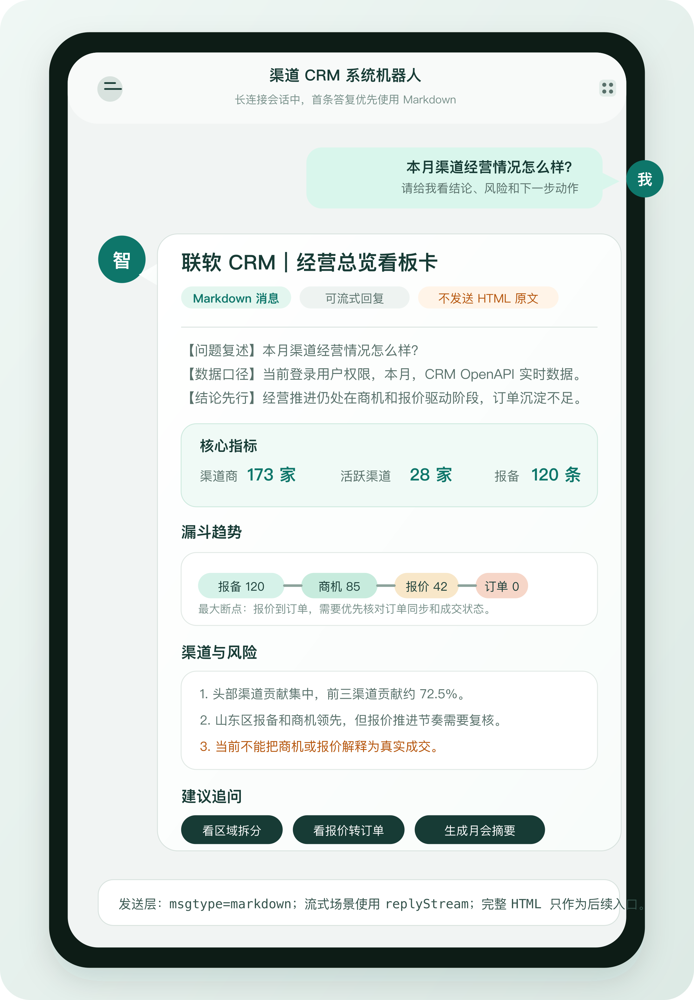
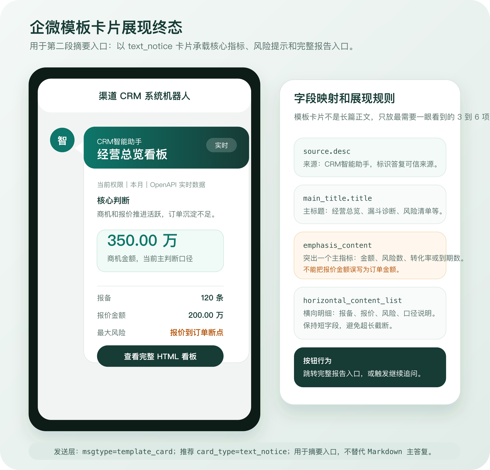
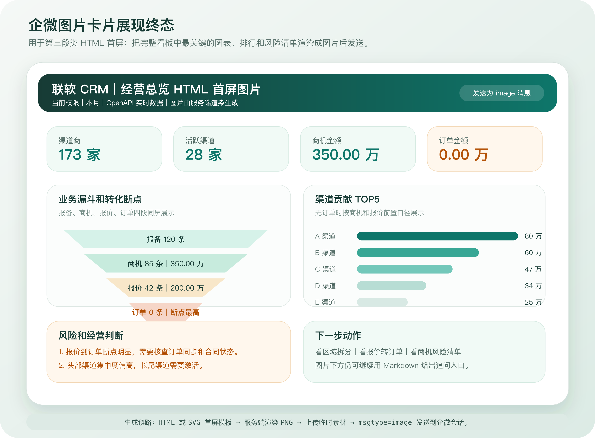
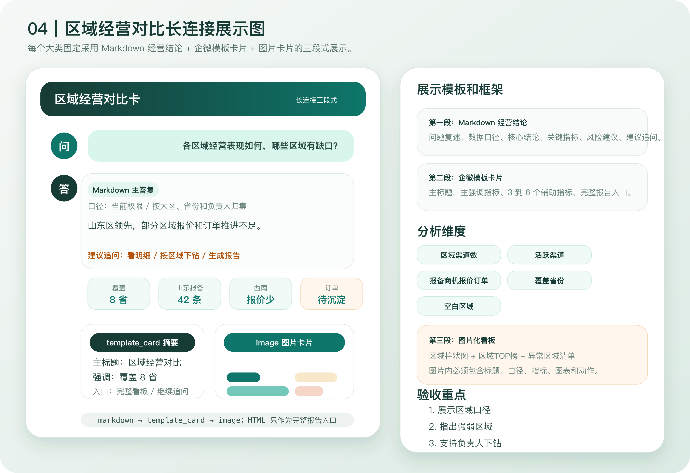
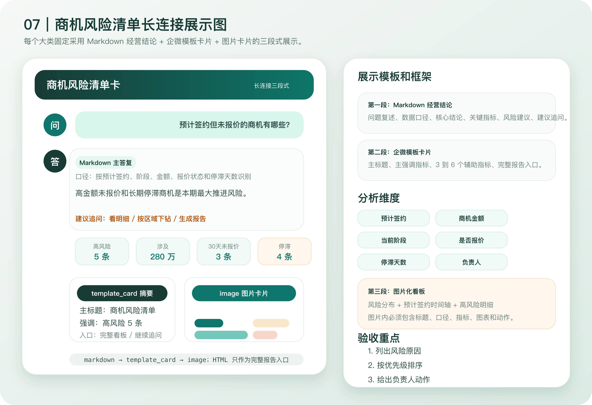
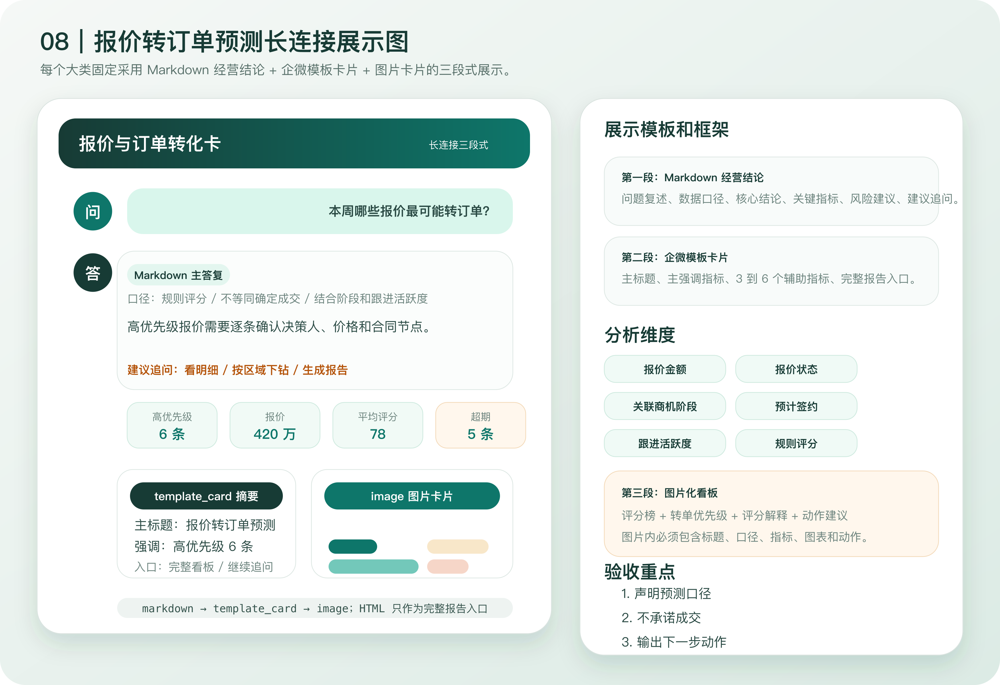
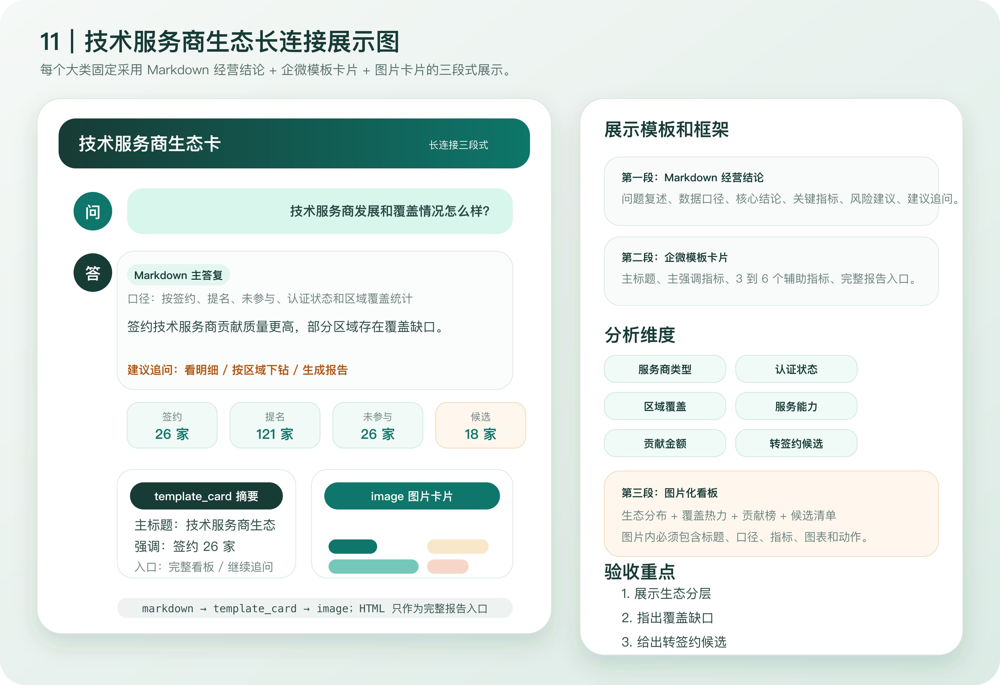
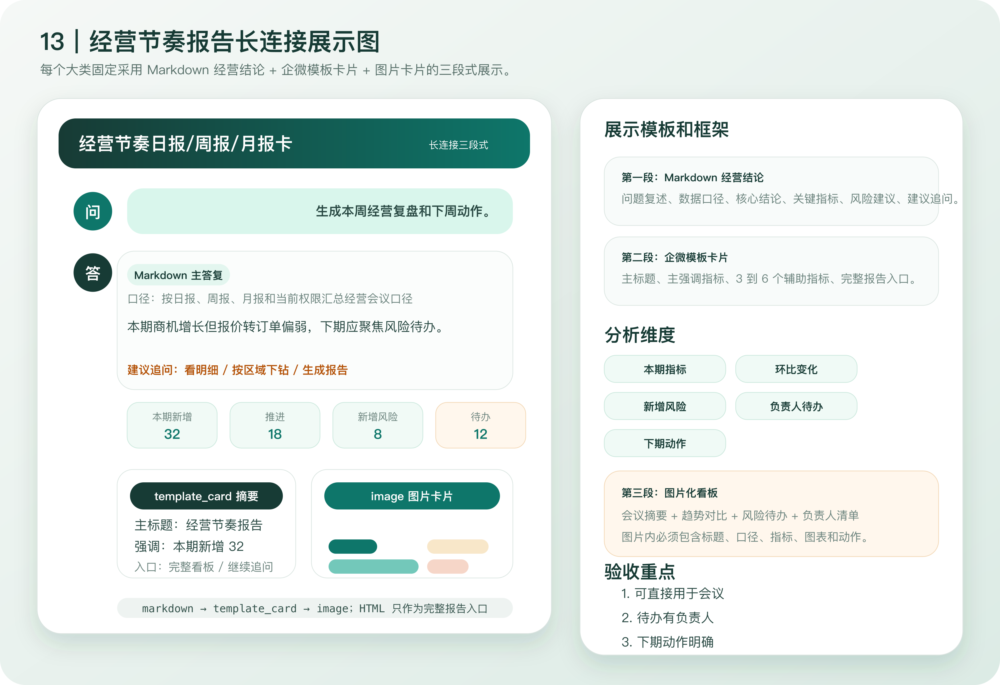

# CRM 智能分析问答结构模板与分析维度大类方案

生成时间：2026-06-30

## 一、设计目标

本方案用于先定义 CRM 智能分析的“大类问答结构模板”和“大类分析维度”，后续再细化到每一个具体问题。

设计原则：

- 先结论，再证据，再风险，再动作。
- 企微机器人回复必须短、直观、可追问。
- 企业微信长连接侧不假设可直接发送 HTML；首屏用 Markdown、模板卡片和图片卡片模拟 HTML 看板效果。
- HTML 看板负责承载完整图表、明细和导出入口，通过链接或后续 Web 入口查看。
- 订单不足时不能把报价、商机解释成真实成交。
- 每类问题都必须说明数据口径、权限范围和时间范围。

## 二、行业参考口径

网络与终端安全行业的渠道运营通常围绕以下能力展开：

- 伙伴分层、认证与能力建设。
- 线索、报备、商机、报价、订单、续费的全漏斗管理。
- 报备保护、价格保护、渠道冲突治理。
- 区域、行业、产品方案和托管安全服务能力覆盖。
- 市场活动资金、联合营销、培训认证、客户成功和续费留存。

本项目结合联软 CRM 当前问题清单，优先落到“渠道经营、业务漏斗、风险预警、区域覆盖、技术服务生态、数据治理”这些可用 CRM 数据支撑的维度。

## 三、大类模板总览

| 大类 | 适用提问 | 核心分析维度 | 推荐展示方式 |
| --- | --- | --- | --- |
| 经营总览看板 | 本月经营总览、当前经营情况、渠道整体表现 | 核心指标、漏斗、趋势、区域、渠道贡献、风险、建议 | 企微经营看板卡 + HTML 总览看板 |
| 业务漏斗诊断 | 报备到商机、商机到报价、报价到订单转化如何 | 报备、商机、报价、订单、转化率、断点、阶段金额 | 企微漏斗摘要 + HTML 漏斗图 |
| 渠道贡献排行 | 哪些渠道贡献最大、前十渠道、渠道集中度 | 报备数、商机金额、报价金额、订单金额、集中度 | 企微排行摘要 + HTML 排行表 |
| 区域经营对比 | 各区域情况、山东区/华南区表现、区域缺口 | 区域渠道数、报备、商机、报价、订单、覆盖省份 | 企微区域对比卡 + HTML 地图/柱状图 |
| 渠道画像与生命周期 | 活跃渠道、沉睡渠道、低贡献渠道、待激活渠道 | 首次业务时间、最近业务时间、业务频次、贡献结构 | 企微分层摘要 + HTML 画像表 |
| 报备保护与渠道冲突 | 哪些客户报备快到期、重复报备、报备保护情况 | 报备状态、保护期、重复客户、负责人、渠道归属 | 企微风险清单 + HTML 明细表 |
| 商机风险清单 | 预计签约未报价、停滞商机、高金额风险商机 | 预计签约时间、阶段、金额、未报价、停滞天数、负责人 | 企微风险清单卡 + HTML 明细清单 |
| 报价转订单预测 | 哪些报价本周最可能转订单、报价待推进 | 报价状态、报价金额、报价时间、关联商机阶段、跟进活跃度 | 企微优先级清单 + HTML 评分表 |
| 续费与客户成功 | 哪些客户快到期、续费风险、存量经营 | 到期时间、历史订单、续费金额、服务状态、风险原因 | 企微续费预警卡 + HTML 续费看板 |
| 产品与解决方案结构 | 终端安全、零信任、数据安全等产品线表现 | 产品线、行业场景、商机金额、报价金额、订单金额、转化率 | 企微产品结构摘要 + HTML 堆叠图 |
| 技术服务商生态 | 技术服务商覆盖、签约技术服务商、交付能力 | 技术服务商类型、认证状态、区域覆盖、商机/订单贡献 | 企微生态摘要 + HTML 生态看板 |
| 分销层级健康 | 一级/二级渠道协同、订单归属、上级渠道确认 | 一级渠道、二级渠道、归属关系、报备/报价/订单链路 | 企微异常摘要 + HTML 层级表 |
| 经营节奏报告 | 周会、月会、晨会、复盘摘要 | 本期指标、环比变化、风险待办、负责人动作、追问建议 | 企微会议摘要 + HTML 周/月报 |
| 数据质量与权限口径 | 为什么看不到、数据是否完整、字段缺失 | 权限范围、数据源、缺失字段、异常接口、替代口径 | 企微口径说明卡 + HTML 治理表 |

## 四、大类回复结构模板

### 1. 经营总览看板

适用场景：用户问“本月经营总览”“当前渠道经营情况”“整体业务怎么样”。

分析维度：

- 核心指标：渠道商、活跃渠道、报备、商机、报价、订单。
- 漏斗转化：报备到商机、商机到报价、报价到订单。
- 经营趋势：近三期或本月同比、环比。
- 区域分布：重点区域、覆盖区域、异常集中区域。
- 渠道贡献：头部渠道、集中度、长尾渠道。
- 数据风险：订单不足、字段缺失、区域过度集中。

企微结构：

```text
【展示模板】经营总览看板卡
【回复结构】问题复述 / 数据口径 / 核心结论 / 核心指标 / 漏斗趋势 / 区域渠道 / 风险建议 / 建议追问
【核心结论】
1. 当前经营状态判断
2. 最大增长点或最大风险
3. 数据口径提醒
【核心指标】
【漏斗趋势】
【区域渠道】
【风险建议】
【建议追问】
```

HTML 结构：顶部指标卡、经营判断、漏斗图、趋势图、区域图、渠道排行、风险清单、治理建议。

### 2. 业务漏斗诊断

适用场景：用户问“转化率如何”“漏斗断点在哪里”“报备到订单怎么样”。

分析维度：

- 阶段数量：报备、商机、报价、订单。
- 阶段金额：商机金额、报价金额、订单金额。
- 阶段转化率：报备到商机、商机到报价、报价到订单。
- 最大断点：数量断点、金额断点、时间断点。
- 下钻维度：区域、渠道、负责人、产品线。

企微结构：

```text
【展示模板】业务漏斗诊断卡
【回复结构】问题复述 / 数据口径 / 漏斗指标 / 最大断点 / 优先动作 / 建议追问
【漏斗指标】
【最大断点】
【优先动作】
```

HTML 结构：漏斗图、阶段明细表、断点排行、区域/渠道拆分图。

### 3. 渠道贡献排行

适用场景：用户问“哪些渠道贡献最大”“渠道排行”“渠道集中度”。

分析维度：

- 报备贡献：报备数、有效报备数。
- 商机贡献：商机数、商机金额。
- 报价贡献：报价数、报价金额。
- 订单贡献：订单数、订单金额。
- 集中度：前一、前三、前五占比。
- 渠道结构：合作级别、技术服务类型、区域归属。

企微结构：

```text
【展示模板】渠道贡献排行卡
【回复结构】问题复述 / 数据口径 / 排行摘要 / 多口径榜单 / 集中度判断 / 运营动作
【排行摘要】
【多口径榜单】
【集中度判断】
【运营动作】
```

HTML 结构：多口径排行表、集中度卡、渠道明细、头部长尾分布。

### 4. 区域经营对比

适用场景：用户问“各区域渠道发展情况”“山东区怎么样”“区域排名”。

分析维度：

- 区域渠道数、活跃渠道数。
- 报备、商机、报价、订单四段指标。
- 区域覆盖省份、重点城市。
- 区域集中度和空白区域。
- 区域负责人或团队贡献。

企微结构：

```text
【展示模板】区域经营对比卡
【回复结构】问题复述 / 数据口径 / 区域分层 / 重点区域 / 异常区域 / 管理建议
【区域分层】
【重点区域】
【异常区域】
【管理建议】
```

HTML 结构：地图、区域柱状图、区域排行表、区域明细清单。

### 5. 渠道画像与生命周期

适用场景：用户问“哪些渠道活跃”“哪些渠道沉睡”“哪些渠道应激活或淘汰”。

分析维度：

- 渠道状态：新增、活跃、沉睡、流失。
- 最近业务时间：最近报备、最近商机、最近报价、最近订单。
- 贡献质量：高报备低转化、高商机低报价、高报价低订单。
- 渠道能力：合作级别、技术服务能力、覆盖区域。
- 建议动作：激活、培育、升级、淘汰。

企微结构：

```text
【展示模板】渠道画像诊断卡
【回复结构】问题复述 / 数据口径 / 渠道分层 / 代表渠道 / 激活动作 / 建议追问
【渠道分层】
【代表渠道】
【激活动作】
```

HTML 结构：渠道分层矩阵、渠道画像表、待激活清单。

### 6. 报备保护与渠道冲突

适用场景：用户问“哪些报备快到期”“有没有重复报备”“报备保护情况”。

分析维度：

- 报备状态、报备时间、保护期到期时间。
- 客户重复报备、渠道冲突、归属不清。
- 待审批、被驳回、即将过期。
- 负责人、渠道、区域。

企微结构：

```text
【展示模板】客户报备与保护期卡
【回复结构】问题复述 / 数据口径 / 到期统计 / 冲突清单 / 处理建议
【到期统计】
【冲突清单】
【处理建议】
```

HTML 结构：到期日历、冲突清单、渠道归属明细。

### 7. 商机风险清单

适用场景：用户问“预计签约但未报价”“哪些商机推进慢”“高金额风险商机”。

分析维度：

- 预计签约时间、剩余天数。
- 商机阶段、商机金额、负责人。
- 是否已报价、报价状态。
- 停滞天数、最近跟进时间。
- 风险等级：高、中、低。

企微结构：

```text
【展示模板】商机风险清单卡
【回复结构】问题复述 / 数据口径 / 核心风险 / 商机清单 / 管理动作
【核心风险】
【商机清单】
【管理动作】
```

HTML 结构：风险统计卡、风险明细表、负责人待办表。

### 8. 报价转订单预测

适用场景：用户问“哪些报价最可能本周转订单”“报价转订单机会”。

分析维度：

- 报价金额、报价状态、报价时间。
- 关联商机阶段、预计签约时间。
- 最近跟进、负责人、渠道。
- 规则评分：时间紧迫度、金额权重、阶段成熟度、跟进活跃度。
- 预测等级：高优先级、中优先级、低优先级。

企微结构：

```text
【展示模板】报价与订单转化卡
【回复结构】问题复述 / 数据口径 / 转化指标 / 优先级清单 / 下一步动作
【转化指标】
【优先级清单】
【下一步动作】
```

HTML 结构：转化评分表、报价明细、订单推进看板。

### 9. 续费与客户成功

适用场景：用户问“哪些客户快续费”“续费风险”“存量客户经营”。

分析维度：

- 合同或订单到期时间。
- 续费金额、历史订单金额。
- 客户状态、服务状态、产品线。
- 跟进记录、风险原因。
- 续费优先级和负责人。

企微结构：

```text
【展示模板】续费与客户成功卡
【回复结构】问题复述 / 数据口径 / 续费概览 / 风险客户 / 客户成功动作
【续费概览】
【风险客户】
【客户成功动作】
```

HTML 结构：续费日历、风险客户表、客户成功看板。

### 10. 产品与解决方案结构

适用场景：用户问“哪些产品线表现好”“终端安全相关商机”“不同方案贡献”。

分析维度：

- 产品线或解决方案：终端安全、网络准入、零信任、数据安全、托管安全服务。
- 商机数、商机金额、报价金额、订单金额。
- 行业场景、区域、渠道。
- 产品线转化率和组合销售情况。

企微结构：

```text
【展示模板】产品与解决方案结构卡
【回复结构】问题复述 / 数据口径 / 产品结构 / 高潜方案 / 经营建议
【产品结构】
【高潜方案】
【经营建议】
```

HTML 结构：产品结构图、产品线排行、行业场景矩阵。

### 11. 技术服务商生态

适用场景：用户问“技术服务商发展情况”“签约技术服务商贡献”“交付生态覆盖”。

分析维度：

- 技术服务商类型：签约、提名、未参与。
- 区域覆盖、认证状态、服务能力。
- 报备、商机、报价、订单贡献。
- 可转签约候选、能力缺口区域。

企微结构：

```text
【展示模板】技术服务商生态卡
【回复结构】问题复述 / 数据口径 / 生态覆盖 / 贡献对比 / 发展建议
【生态覆盖】
【贡献对比】
【发展建议】
```

HTML 结构：生态分布图、技术服务商排行、能力缺口表。

### 12. 分销层级健康

适用场景：用户问“一级二级渠道协同”“订单归属”“上级渠道确认”。

分析维度：

- 一级渠道、二级渠道、客户归属。
- 报备链路、报价链路、订单链路。
- 上级确认状态、异常归属、跨区协同。
- 层级贡献和冲突风险。

企微结构：

```text
【展示模板】分销层级健康卡
【回复结构】问题复述 / 数据口径 / 层级结构 / 异常清单 / 处理建议
【层级结构】
【异常清单】
【处理建议】
```

HTML 结构：分销层级表、异常清单、渠道链路图。

### 13. 经营节奏报告

适用场景：用户问“生成周会摘要”“本周经营复盘”“晨会重点”。

分析维度：

- 本期核心指标、环比变化。
- 本期新增风险、本期推进成果。
- 负责人待办、区域待办、渠道待办。
- 下期重点动作。

企微结构：

```text
【展示模板】经营节奏日报/周报/月报卡
【回复结构】问题复述 / 数据口径 / 会议摘要 / 风险待办 / 下步动作
【会议摘要】
【风险待办】
【下步动作】
```

HTML 结构：会议摘要页、待办清单、风险列表。

### 14. 数据质量与权限口径

适用场景：用户问“为什么看不到”“数据准不准”“字段缺失”“全平台口径”。

分析维度：

- 当前用户权限范围。
- 数据源、时间范围、统计口径。
- 接口异常、字段缺失、分页缺口。
- 替代口径和可追问范围。

企微结构：

```text
【展示模板】数据质量与权限口径卡
【回复结构】问题复述 / 数据口径 / 可见范围 / 限制说明 / 替代问题
【可见范围】
【限制说明】
【替代问题】
```

HTML 结构：权限说明卡、数据质量表、字段缺失表。

## 五、展示载体规范

| 载体 | 用途 | 要求 |
| --- | --- | --- |
| 企微 Markdown 文本 | 第一时间答复 | 必须有模板名、口径、结论、关键指标、建议追问；适合长连接流式回复 |
| 企微模板卡片 | 摘要入口 | 展示 3 到 6 个核心指标；受字段长度限制，适合做“指标卡 + 入口” |
| 企微图片卡片 | 类 HTML 视觉呈现 | 适合渠道排行、风险清单、区域对比、漏斗摘要；用图片模拟 HTML 看板首屏 |
| HTML 看板 | 完整分析承载 | 不直接假设可通过长连接发送；用于 Web 查看完整图表、明细、筛选、排序、导出入口 |
| 后续追问 | 分层下钻 | 支持按区域、渠道、负责人、产品线、状态继续拆分 |

### 长连接发送约束与替代方案

当前项目长连接发送层已实现的能力是：

- Markdown 文本：用于主答复和流式回复。
- 模板卡片：用于 3 到 6 个核心指标、完整报告入口和动作按钮。
- 图片消息：用于把表格、排行、漏斗、风险清单渲染成图片后发送。
- HTML 文件或完整 HTML 内容：不作为长连接直接发送的默认方案。

因此后续落地时统一采用“三段式类 HTML 展示”：

```text
第一段：Markdown 经营结论
- 模板名、口径、核心结论、关键指标、建议追问

第二段：模板卡片
- 3 到 6 个核心指标
- 可选完整报告入口

第三段：图片卡片
- 将 HTML 首屏中最重要的图表或表格渲染为图片
- 渠道排行、风险清单、区域对比、漏斗摘要优先图片化
```

完整 HTML 看板仍保留，但作为“完整报告入口”或 Web 端查看方式，不要求机器人长连接直接发送 HTML。

## 六、长连接终态展示详图

### 1. 总体发送顺序

最终企微机器人答复不把 HTML 代码或 HTML 文件内容直接塞进长连接消息体，而是按固定顺序组合三种可落地载体：

| 顺序 | 展示载体 | 承载内容 | 使用边界 |
| --- | --- | --- | --- |
| 第一段 | Markdown 经营结论 | 问题复述、数据口径、核心结论、关键指标、风险建议、建议追问 | 所有问题必发，保证用户不用打开附件也能读懂结论 |
| 第二段 | 企微模板卡片 | 3 到 6 个核心指标、一个主强调指标、完整报告入口或追问动作 | 适合摘要入口，不承载长篇分析 |
| 第三段 | 图片卡片 | 将 HTML 首屏、表格、排行、漏斗、风险清单渲染成图片 | 需要类 HTML 效果时发送，不能替代完整 Web 看板 |

大类问题默认展示组合：

| 大类 | 默认组合 | 说明 |
| --- | --- | --- |
| 经营总览、业务漏斗、渠道排行、区域对比 | Markdown + 模板卡片 + 图片卡片 | 需要结论、核心指标和图表首屏同时出现 |
| 商机风险、报价转订单、报备保护、续费客户成功 | Markdown + 模板卡片 + 图片卡片 | 风险清单和优先级列表优先图片化 |
| 产品结构、技术服务商生态、分销层级健康 | Markdown + 模板卡片 + 图片卡片 | 结构图、矩阵、排行适合图片展示 |
| 经营节奏报告 | Markdown + 模板卡片，可选图片卡片 | 周报/月报可图片化，晨会摘要保持轻量 |
| 数据质量与权限口径 | Markdown + 模板卡片 | 原则上不需要复杂图表，除非要展示字段缺失表 |

### 2. Markdown 经营结论消息



源图文件：`assets/wecom-markdown-final-render-20260630.svg`。PNG 用于文档评审预览，SVG 用于后续维护和二次调整。

定位：这是每次回答的主答复，用户只看这一段也必须能知道“问了什么、按什么口径查、结论是什么、风险在哪里、下一步问什么”。

长连接消息类型：

| 场景 | 消息方式 |
| --- | --- |
| 一次性答复 | `msgtype: markdown` |
| 流式答复 | `replyStream` |

项目对应实现：

| 能力 | 项目位置 |
| --- | --- |
| Markdown 消息发送 | `backend/src/modules/wecom/wecom-transport.service.ts` 的 `sendMarkdownMessage` |
| 流式文本回复 | `backend/src/modules/wecom/wecom-transport.service.ts` 的 `replyStreamMessage` |
| 分块分发 | `backend/src/modules/wecom/wecom-stream-dispatcher.service.ts` 的 `deliverBlock` |
| 看板文本构造 | `backend/src/modules/wecom/wecom-bot.service.ts` 的 `buildDashboardWecomTemplateReport` |

内容结构必须固定：

| 区块 | 必填内容 | 展示要求 |
| --- | --- | --- |
| 展示模板 | 经营总览看板卡、业务漏斗诊断卡、渠道贡献排行卡等 | 第一行出现，避免泛泛回答 |
| 问题复述 | 用户原问题的业务化复述 | 不能省略，避免答非所问 |
| 数据口径 | 时间范围、权限范围、数据源、统计口径 | 必须说明订单不足、字段缺失等限制 |
| 核心结论 | 1 到 3 条经营判断 | 先结论，不先堆数据 |
| 核心指标 | 3 到 6 个关键指标 | 只放最能支撑结论的指标 |
| 重点分析 | 漏斗、排行、区域、风险中的重点 | 按问题大类选择，不机械罗列 |
| 风险建议 | 风险、原因、动作 | 必须能落到下一步运营动作 |
| 建议追问 | 2 到 4 个可继续追问的问题 | 引导下钻，不放无关推荐 |

Markdown 脱敏载荷骨架：

```json
{
  "msgtype": "markdown",
  "markdown": {
    "content": "【展示模板】经营总览看板卡\n【问题复述】本月渠道经营情况怎么样？\n【数据口径】当前权限 / 本月 / CRM OpenAPI 实时数据\n【核心结论】当前经营处于商机和报价驱动阶段，订单沉淀不足。\n【核心指标】渠道商 173 家，活跃渠道 28 家，报备 120 条，商机金额 350.00 万。\n【重点分析】报价到订单断点明显，头部渠道贡献集中。\n【风险建议】不要把报价金额解释为真实成交，优先核对订单同步和合同状态。\n【建议追问】看区域拆分 / 看报价转订单 / 生成月会摘要"
  }
}
```

验收标准：

| 检查项 | 合格标准 |
| --- | --- |
| 模板匹配 | 用户问经营总览时必须出现经营总览看板卡，问漏斗时必须出现业务漏斗诊断卡 |
| 口径明确 | 必须说明时间、权限、数据源，订单不足时必须提醒 |
| 结论先行 | 第一屏内能看到核心经营判断 |
| 可追问 | 末尾给出与当前问题相关的追问入口 |

### 3. 企微模板卡片



源图文件：`assets/wecom-template-card-final-render-20260630.svg`。PNG 用于文档评审预览，SVG 用于后续维护和二次调整。

定位：这是第二段摘要入口，用来把最重要的一个主指标和几个辅助指标做成“经营看板卡”。它不是长篇正文，也不是完整报表。

长连接消息类型：

| 场景 | 消息方式 |
| --- | --- |
| 指标摘要卡 | `msgtype: template_card` |
| 推荐卡片类型 | `card_type: text_notice` |

项目对应实现：

| 能力 | 项目位置 |
| --- | --- |
| 模板卡片发送 | `backend/src/modules/wecom/wecom-transport.service.ts` 的 `sendTemplateCardMessage` |
| 模板卡片分发 | `backend/src/modules/wecom/wecom-stream-dispatcher.service.ts` 的 `deliverTemplateCard` |
| 分析卡片构造 | `backend/src/modules/wecom/wecom-bot.service.ts` 的 `buildAnalysisTemplateCards` |
| 看板结果转企微格式 | `backend/src/modules/wecom/wecom-bot.service.ts` 的 `convertDashboardResultToWecomFormat` |

模板卡片字段规范：

| 字段 | 展示内容 | 经营含义 |
| --- | --- | --- |
| `source.desc` | CRM智能助手 | 标识来源 |
| `main_title.title` | 经营总览看板、业务漏斗诊断、商机风险清单等 | 标识当前问题大类 |
| `main_title.desc` | 当前权限、本月、实时数据等 | 标识数据口径 |
| `emphasis_content.title` | 一个主指标 | 经营总览用商机金额，风险类用风险数，续费类用到期金额 |
| `emphasis_content.desc` | 主指标解释 | 避免数值脱离含义 |
| `horizontal_content_list` | 3 到 6 个辅助指标 | 展示报备、报价、订单、风险、转化率等 |
| `jump_list` 或按钮 | 完整看板入口或追问动作 | 进入 HTML 看板或触发下钻 |

模板卡片脱敏载荷骨架：

```json
{
  "msgtype": "template_card",
  "template_card": {
    "card_type": "text_notice",
    "source": {
      "desc": "CRM智能助手"
    },
    "main_title": {
      "title": "经营总览看板",
      "desc": "当前权限 / 本月 / CRM OpenAPI 实时数据"
    },
    "emphasis_content": {
      "title": "350.00万",
      "desc": "商机金额，当前主判断口径"
    },
    "horizontal_content_list": [
      {
        "keyname": "报备",
        "value": "120条"
      },
      {
        "keyname": "报价金额",
        "value": "200.00万"
      },
      {
        "keyname": "最大风险",
        "value": "报价到订单断点"
      }
    ],
    "jump_list": [
      {
        "type": 1,
        "title": "查看完整HTML看板",
        "url": "https://example.invalid/report"
      }
    ]
  }
}
```

验收标准：

| 检查项 | 合格标准 |
| --- | --- |
| 指标数量 | 横向指标控制在 3 到 6 个 |
| 主指标准确 | 不把商机金额、报价金额误标成订单金额 |
| 卡片短句 | 字段短、清楚、可在企微卡片中完整显示 |
| 入口明确 | 有完整报告入口或继续追问动作 |

### 4. 图片卡片



源图文件：`assets/wecom-image-card-final-render-20260630.svg`。PNG 用于文档评审预览，SVG 用于后续维护和二次调整。

定位：这是第三段类 HTML 视觉展示。企微长连接不直接发送完整 HTML 时，就把 HTML 首屏、排行表、漏斗图、风险清单渲染成图片，作为图片消息发送。

长连接消息类型：

| 场景 | 消息方式 |
| --- | --- |
| 图片化首屏 | `msgtype: image` |
| 素材处理 | 先生成图片，再上传素材或使用项目发送层封装 |

项目对应实现：

| 能力 | 项目位置 |
| --- | --- |
| 图片消息发送 | `backend/src/modules/wecom/wecom-transport.service.ts` 的 `sendImageMessage` |
| 图片附件分发 | `backend/src/modules/wecom/wecom-stream-dispatcher.service.ts` 的 `deliverImageAttachment` |
| 表格图片渲染 | `backend/src/modules/wecom/wecom-analysis-table-image.service.ts` 的 `renderTableImage` |

图片内容结构必须固定：

| 区块 | 必填内容 | 展示要求 |
| --- | --- | --- |
| 标题和口径 | 看板名、时间、权限、数据源 | 图片顶部展示，避免截图脱离上下文 |
| KPI 卡 | 3 到 6 个核心指标 | 数值要大，单位明确 |
| 主图 | 漏斗、趋势、排行、地图、矩阵中的一个或两个 | 根据问题大类选择 |
| 明细区 | TOP 清单、风险清单、负责人待办 | 只放最关键的 5 到 10 行 |
| 风险建议 | 1 到 3 条风险和动作 | 放在底部或右侧，保证能读到 |
| 追问提示 | 可继续问的方向 | 图片下方仍由 Markdown 补充 |

图片化规则：

| 问题大类 | 图片优先展示 |
| --- | --- |
| 经营总览 | KPI 卡、漏斗、渠道 TOP5、风险建议 |
| 业务漏斗 | 漏斗图、阶段转化率、最大断点、断点明细 |
| 渠道排行 | 多口径 TOP 榜、集中度、头部长尾分布 |
| 区域对比 | 区域柱状图、区域 TOP 榜、异常区域 |
| 商机风险 | 风险分布、预计签约时间轴、高风险清单 |
| 报价转订单 | 评分榜、报价金额、转单优先级、动作建议 |
| 数据质量 | 字段缺失表、接口状态、权限范围 |

图片消息脱敏载荷骨架：

```json
{
  "msgtype": "image",
  "image": {
    "media_id": "临时素材ID，由上传接口返回"
  }
}
```

生成链路：

```text
HTML 或 SVG 首屏模板
→ 服务端渲染为 PNG 图片
→ 上传企微临时素材或交给现有发送层处理
→ 通过 image 消息发送
→ Markdown 补充解释和追问入口
```

验收标准：

| 检查项 | 合格标准 |
| --- | --- |
| 可读性 | 手机端打开后标题、指标、排行、风险都能看清 |
| 上下文 | 图片内必须包含口径和时间范围 |
| 视觉一致 | 与完整 HTML 看板保持同一配色、指标顺序和字段命名 |
| 可降级 | 图片发送失败时，Markdown 仍能给出完整文字结论 |

### 5. 不允许的展示方式

| 不允许项 | 原因 | 替代方式 |
| --- | --- | --- |
| 直接把完整 HTML 内容作为长连接消息正文发送 | 企微消息侧不适合承载完整页面，移动端体验不可控 | 图片化首屏 + 完整报告入口 |
| 只回复一段自然语言，不给模板名和口径 | 无法验收是否匹配问题大类 | 固定 Markdown 结构 |
| 模板卡片塞长篇分析 | 字段长度有限，容易截断 | 长分析放 Markdown，图表放图片 |
| 图片只放漂亮图，不放数据口径 | 截图脱离上下文后不可审计 | 图片顶部固定展示口径 |
| 订单为空时仍按成交分析 | 会造成经营误判 | 使用商机和报价前置口径，并明确提醒 |

## 七、全大类长连接展示图与模板框架

本章节把 14 个大类逐一落实到企业微信机器人长连接展示层。每个大类都必须有对应展示图、提问入口、分析维度、三段式展示框架和验收重点，避免出现“所有问题都用同一套泛化回复”的情况。

统一约束：

| 约束项 | 要求 |
| --- | --- |
| 首段 | 必须发送 Markdown 经营结论，包含展示模板、问题复述、数据口径、核心结论、关键指标、风险建议、建议追问 |
| 第二段 | 优先发送企微模板卡片，承载一个主指标、3 到 6 个辅助指标和完整报告入口 |
| 第三段 | 需要类 HTML 展示时发送图片卡片，图片内必须有标题、口径、指标、图表和动作 |
| HTML | 不通过长连接直接发送 HTML 原文，完整 HTML 只作为报告入口或 Web 端查看 |
| 口径 | 订单不足时必须使用商机、报价等前置口径，并明确不能等同真实成交 |

### 1. 经营总览看板


源图文件：`assets/wecom-category-01-overview-20260630.svg`。

| 项 | 内容 |
| --- | --- |
| 适用提问 | 本月渠道经营情况怎么样？当前经营总览如何？整体业务有没有风险？ |
| 展示模板 | 经营总览看板卡 |
| 分析维度 | 核心指标、漏斗转化、趋势环比、区域渠道、风险建议 |
| Markdown 主答复框架 | 问题复述 / 数据口径 / 核心经营判断 / 核心指标 / 漏斗趋势 / 区域渠道 / 风险建议 / 建议追问 |
| 企微模板卡片框架 | 主标题：经营总览看板；强调指标：商机金额或综合经营指标；横向指标：渠道商、活跃渠道、报备、报价金额、订单金额、最大风险 |
| 图片卡片框架 | KPI 卡、业务漏斗、渠道贡献 TOP5、风险和经营判断、下一步动作 |
| 验收重点 | 必须说明订单沉淀不足；必须先给结论再给指标；必须能继续追问区域拆分和报价转订单 |

### 2. 业务漏斗诊断


源图文件：`assets/wecom-category-02-funnel-20260630.svg`。

| 项 | 内容 |
| --- | --- |
| 适用提问 | 报备到订单转化如何？漏斗断点在哪里？哪个阶段掉得最多？ |
| 展示模板 | 业务漏斗诊断卡 |
| 分析维度 | 阶段数量、阶段金额、转化率、断点排行、区域负责人 |
| Markdown 主答复框架 | 问题复述 / 数据口径 / 漏斗总览 / 三段转化率 / 最大断点 / 影响判断 / 优先动作 / 建议追问 |
| 企微模板卡片框架 | 主标题：业务漏斗诊断；强调指标：最大断点或关键转化率；横向指标：报备、商机、报价、订单、断点阶段 |
| 图片卡片框架 | 漏斗图、阶段转化率、阶段金额、断点排行、断点明细 |
| 验收重点 | 必须展示报备、商机、报价、订单四段；必须标注最大断点；订单为 0 时不能解释为成交 |

### 3. 渠道贡献排行


源图文件：`assets/wecom-category-03-channel-rank-20260630.svg`。

| 项 | 内容 |
| --- | --- |
| 适用提问 | 哪些渠道贡献最大？前十渠道是谁？渠道集中度高不高？ |
| 展示模板 | 渠道贡献排行卡 |
| 分析维度 | 报备贡献、商机金额、报价金额、订单金额、集中度、合作级别 |
| Markdown 主答复框架 | 问题复述 / 数据口径 / 排行摘要 / 多口径榜单 / 集中度判断 / 头部长尾判断 / 运营动作 |
| 企微模板卡片框架 | 主标题：渠道贡献排行；强调指标：TOP3 占比或头部渠道金额；横向指标：TOP1、TOP3 占比、商机金额、报价金额、长尾渠道 |
| 图片卡片框架 | 多口径 TOP 榜、集中度条形图、渠道结构、渠道明细表 |
| 验收重点 | 必须说明排序口径；必须区分商机金额、报价金额和订单金额；必须输出头部维护和长尾激活动作 |

### 4. 区域经营对比



源图文件：`assets/wecom-category-04-region-20260630.svg`。

| 项 | 内容 |
| --- | --- |
| 适用提问 | 各区域经营表现如何？山东区怎么样？哪些区域有缺口？ |
| 展示模板 | 区域经营对比卡 |
| 分析维度 | 区域渠道数、活跃渠道、报备商机报价订单、覆盖省份、空白区域 |
| Markdown 主答复框架 | 问题复述 / 数据口径 / 区域分层 / 重点区域 / 异常区域 / 负责人动作 / 建议追问 |
| 企微模板卡片框架 | 主标题：区域经营对比；强调指标：领先区域或异常区域；横向指标：覆盖省份、活跃渠道、商机金额、报价金额、订单金额 |
| 图片卡片框架 | 区域柱状图、区域 TOP 榜、异常区域清单、负责人拆分 |
| 验收重点 | 必须展示区域归集口径；必须指出强弱区域；必须支持按区域负责人继续下钻 |

### 5. 渠道画像与生命周期


源图文件：`assets/wecom-category-05-channel-profile-20260630.svg`。

| 项 | 内容 |
| --- | --- |
| 适用提问 | 哪些渠道活跃？哪些渠道沉睡？哪些渠道应该激活或淘汰？ |
| 展示模板 | 渠道画像诊断卡 |
| 分析维度 | 新增活跃沉睡流失、最近业务时间、贡献质量、渠道能力、激活动作 |
| Markdown 主答复框架 | 问题复述 / 数据口径 / 渠道分层 / 代表渠道 / 高潜低转化判断 / 激活动作 / 建议追问 |
| 企微模板卡片框架 | 主标题：渠道画像诊断；强调指标：活跃渠道或沉睡渠道；横向指标：新增、活跃、沉睡、待激活、高潜低转化 |
| 图片卡片框架 | 生命周期矩阵、渠道画像表、待激活清单、动作建议 |
| 验收重点 | 必须展示渠道分层；必须给出代表渠道；激活动作必须能落到负责人和下一步任务 |

### 6. 报备保护与渠道冲突


源图文件：`assets/wecom-category-06-registration-protection-20260630.svg`。

| 项 | 内容 |
| --- | --- |
| 适用提问 | 哪些报备快到期？有没有重复报备？客户归属有没有冲突？ |
| 展示模板 | 客户报备与保护期卡 |
| 分析维度 | 报备状态、保护期、重复客户、渠道归属、负责人区域 |
| Markdown 主答复框架 | 问题复述 / 数据口径 / 到期统计 / 冲突清单 / 归属风险 / 处理建议 / 建议追问 |
| 企微模板卡片框架 | 主标题：报备保护与渠道冲突；强调指标：即将到期或重复报备数；横向指标：即将到期、重复报备、待审批、驳回、归属风险 |
| 图片卡片框架 | 到期日历、冲突清单、客户归属关系、处理优先级 |
| 验收重点 | 必须展示到期窗口；必须标注冲突对象；必须给出先处理到期和重复报备的顺序 |

### 7. 商机风险清单



源图文件：`assets/wecom-category-07-opportunity-risk-20260630.svg`。

| 项 | 内容 |
| --- | --- |
| 适用提问 | 预计签约但未报价的商机有哪些？哪些商机推进慢？高金额风险商机有哪些？ |
| 展示模板 | 商机风险清单卡 |
| 分析维度 | 预计签约、商机金额、当前阶段、是否报价、停滞天数、负责人 |
| Markdown 主答复框架 | 问题复述 / 数据口径 / 核心风险 / 风险分层 / 商机清单 / 负责人动作 / 建议追问 |
| 企微模板卡片框架 | 主标题：商机风险清单；强调指标：高风险商机数或风险金额；横向指标：未报价数、停滞数、30 天内预计签约、负责人 |
| 图片卡片框架 | 风险分布、预计签约时间轴、高风险明细、负责人待办 |
| 验收重点 | 必须列出风险原因；必须按优先级排序；必须给出负责人跟进动作 |

### 8. 报价转订单预测



源图文件：`assets/wecom-category-08-quote-to-order-20260630.svg`。

| 项 | 内容 |
| --- | --- |
| 适用提问 | 本周哪些报价最可能转订单？报价转订单机会在哪里？哪些报价要优先推进？ |
| 展示模板 | 报价与订单转化卡 |
| 分析维度 | 报价金额、报价状态、关联商机阶段、预计签约、跟进活跃度、规则评分 |
| Markdown 主答复框架 | 问题复述 / 数据口径 / 预测声明 / 转化指标 / 优先级清单 / 评分解释 / 下一步动作 |
| 企微模板卡片框架 | 主标题：报价转订单预测；强调指标：高优先级报价数或报价金额；横向指标：平均评分、超期报价、本周预计、负责人 |
| 图片卡片框架 | 评分榜、转单优先级、评分解释、报价明细、动作建议 |
| 验收重点 | 必须声明预测口径；不能承诺一定成交；必须输出逐条确认决策人、价格和合同节点的动作 |

### 9. 续费与客户成功


源图文件：`assets/wecom-category-09-renewal-success-20260630.svg`。

| 项 | 内容 |
| --- | --- |
| 适用提问 | 哪些客户快续费？续费风险在哪里？存量客户经营情况如何？ |
| 展示模板 | 续费与客户成功卡 |
| 分析维度 | 到期时间、历史订单、续费金额、服务状态、风险原因、负责人 |
| Markdown 主答复框架 | 问题复述 / 数据口径 / 续费概览 / 风险客户 / 客户成功动作 / 建议追问 |
| 企微模板卡片框架 | 主标题：续费与客户成功；强调指标：30 天到期客户或预计续费金额；横向指标：高风险客户、已报价续费、已续费订单、负责人 |
| 图片卡片框架 | 续费日历、风险客户表、风险原因分布、客户成功动作看板 |
| 验收重点 | 必须按到期窗口展示；必须标明风险原因；动作必须落到客户成功回访和续费报价 |

### 10. 产品与解决方案结构


源图文件：`assets/wecom-category-10-product-solution-20260630.svg`。

| 项 | 内容 |
| --- | --- |
| 适用提问 | 哪些产品线表现好？终端安全相关商机怎么样？哪些方案需要重点推进？ |
| 展示模板 | 产品与解决方案结构卡 |
| 分析维度 | 产品线、行业场景、商机金额、报价金额、订单金额、转化率 |
| Markdown 主答复框架 | 问题复述 / 数据口径 / 产品结构 / 高潜方案 / 转化断点 / 经营建议 / 建议追问 |
| 企微模板卡片框架 | 主标题：产品与解决方案结构；强调指标：高潜产品线或商机金额；横向指标：产品线数、商机金额、报价金额、订单金额、转化率 |
| 图片卡片框架 | 产品堆叠图、行业场景矩阵、产品线漏斗、高潜客户清单 |
| 验收重点 | 必须区分产品线口径；必须展示商机到报价的转化；必须给出高潜方案和薄弱方案 |

### 11. 技术服务商生态



源图文件：`assets/wecom-category-11-service-ecosystem-20260630.svg`。

| 项 | 内容 |
| --- | --- |
| 适用提问 | 技术服务商发展情况怎么样？签约技术服务商贡献如何？交付生态覆盖如何？ |
| 展示模板 | 技术服务商生态卡 |
| 分析维度 | 服务商类型、认证状态、区域覆盖、服务能力、贡献金额、转签约候选 |
| Markdown 主答复框架 | 问题复述 / 数据口径 / 生态覆盖 / 贡献对比 / 覆盖缺口 / 发展建议 / 建议追问 |
| 企微模板卡片框架 | 主标题：技术服务商生态；强调指标：签约技术服务商数或候选数；横向指标：签约、提名、未参与、覆盖区域、贡献金额 |
| 图片卡片框架 | 生态分布、区域覆盖热力、技术服务商贡献榜、转签约候选清单 |
| 验收重点 | 必须展示生态分层；必须指出覆盖缺口；必须给出转签约候选和补齐区域建议 |

### 12. 分销层级健康


源图文件：`assets/wecom-category-12-distribution-health-20260630.svg`。

| 项 | 内容 |
| --- | --- |
| 适用提问 | 一级二级渠道协同是否正常？订单归属有没有问题？上级渠道确认情况如何？ |
| 展示模板 | 分销层级健康卡 |
| 分析维度 | 一级渠道、二级渠道、归属关系、报备链路、报价订单链路、异常状态 |
| Markdown 主答复框架 | 问题复述 / 数据口径 / 层级结构 / 链路健康 / 异常清单 / 处理建议 / 建议追问 |
| 企微模板卡片框架 | 主标题：分销层级健康；强调指标：异常归属数或待确认订单数；横向指标：一级渠道、二级渠道、跨区协同、待确认订单 |
| 图片卡片框架 | 层级关系图、报备报价订单链路、异常归属清单、一级渠道贡献排行 |
| 验收重点 | 必须展示层级链路；必须标注异常类型；必须给出确认上级渠道和处理归属的动作 |

### 13. 经营节奏报告



源图文件：`assets/wecom-category-13-cadence-report-20260630.svg`。

| 项 | 内容 |
| --- | --- |
| 适用提问 | 生成本周经营复盘。本月经营会议摘要是什么？明天晨会重点讲什么？ |
| 展示模板 | 经营节奏日报/周报/月报卡 |
| 分析维度 | 本期指标、环比变化、新增风险、负责人待办、下期动作 |
| Markdown 主答复框架 | 问题复述 / 数据口径 / 会议摘要 / 本期变化 / 风险待办 / 负责人动作 / 下步动作 |
| 企微模板卡片框架 | 主标题：经营节奏报告；强调指标：新增风险或完成待办；横向指标：本期新增、本期推进、本期成交、新增风险、完成待办 |
| 图片卡片框架 | 会议摘要页、趋势对比、风险待办看板、负责人行动清单 |
| 验收重点 | 必须能直接用于会议；待办必须有负责人；下期动作必须明确 |

### 14. 数据质量与权限口径


源图文件：`assets/wecom-category-14-data-quality-20260630.svg`。

| 项 | 内容 |
| --- | --- |
| 适用提问 | 为什么我看不到某些数据？当前数据准吗？字段缺失会不会影响结论？ |
| 展示模板 | 数据质量与权限口径卡 |
| 分析维度 | 权限范围、数据源、字段完整率、接口异常、分页完整性、替代口径 |
| Markdown 主答复框架 | 问题复述 / 数据口径 / 可见范围 / 限制说明 / 影响分析 / 替代问题 / 建议追问 |
| 企微模板卡片框架 | 主标题：数据质量与权限口径；强调指标：字段完整率或接口成功率；横向指标：可见范围、缺失字段、异常接口、替代口径 |
| 图片卡片框架 | 权限说明卡、字段缺失表、接口状态、分页完整性、替代口径 |
| 验收重点 | 必须说明看不到数据的原因；不能越权推断；必须给出当前可见范围内的替代问题 |

## 八、大类展示结构说明

### 统一展示规范

企微机器人侧优先使用“短文本 + 模板卡片 + 必要时图片卡片”的组合。每次首屏只保留最关键的结论、指标和动作；需要接近 HTML 的视觉效果时，优先把对应区块渲染成图片发送。

HTML 看板侧优先使用“顶部筛选 + 指标卡 + 主图 + 排行/明细 + 风险建议”的结构。所有 HTML 看板都需要保留数据口径、权限范围、统计时间和导出或追问入口。

### 1. 经营总览看板

企微经营看板卡结构说明：

```text
+------------------------------------------------+
| 联软 CRM｜经营总览看板                         |
| 口径：当前权限 / 本月 / OpenAPI 实时数据        |
+-------------------+----------------------------+
| 渠道商 173家      | 活跃渠道 28家              |
| 报备 120条        | 商机金额 350.00万          |
| 报价金额 200.00万 | 订单金额 0.00万            |
+------------------------------------------------+
| 核心结论：订单沉淀不足，当前以报价/商机判断推进 |
| 最大风险：报价到订单断点明显                    |
| 建议动作：看区域拆分 / 看报价转订单 / 生成月会  |
+------------------------------------------------+
```

HTML 总览看板结构说明：

```text
+--------------------------------------------------------------------------------+
| 标题区：经营总览看板  筛选：时间 / 区域 / 渠道 / 产品 / 负责人                 |
+--------------------------------------------------------------------------------+
| KPI 指标卡：渠道商 | 活跃渠道 | 报备 | 商机金额 | 报价金额 | 订单金额          |
+----------------------------------+---------------------------------------------+
| 漏斗图：报备 -> 商机 -> 报价 -> 订单 | 趋势图：近 6 个月报备/商机/报价/订单       |
+----------------------------------+---------------------------------------------+
| 区域分布地图 / 区域柱状图          | 渠道贡献 TOP10 / 集中度 TOP1/TOP3/TOP5      |
+--------------------------------------------------------------------------------+
| 风险清单：订单不足 / 区域集中 / 字段缺失 / 高金额未推进                         |
+--------------------------------------------------------------------------------+
| 明细区：渠道、区域、负责人、商机、报价、订单多标签表                            |
+--------------------------------------------------------------------------------+
```

### 2. 业务漏斗诊断

企微经营看板卡结构说明：

```text
+------------------------------------------------+
| 联软 CRM｜业务漏斗诊断卡                       |
| 口径：当前权限 / 指定时间 / 按记录数粗算        |
+------------------------------------------------+
| 报备 120 -> 商机 85 -> 报价 42 -> 订单 0        |
| 转化率：70.8% / 49.4% / 0.0%                   |
+------------------------------------------------+
| 最大断点：报价 -> 订单                         |
| 影响判断：成交沉淀不足，需优先推进有效报价      |
| 建议追问：按区域拆分 / 看断点明细 / 看负责人    |
+------------------------------------------------+
```

HTML 总览看板结构说明：

```text
+--------------------------------------------------------------------------------+
| 标题区：业务漏斗诊断  筛选：时间 / 区域 / 渠道 / 产品 / 负责人                 |
+--------------------------------------------------------------------------------+
| 漏斗主图：报备、商机、报价、订单数量与金额                                      |
+----------------------------------+---------------------------------------------+
| 阶段转化率卡：三段转化率          | 阶段金额卡：商机/报价/订单金额              |
+----------------------------------+---------------------------------------------+
| 断点排行：区域断点 / 渠道断点     | 阶段分布：商机阶段 / 报价状态 / 订单状态    |
+--------------------------------------------------------------------------------+
| 明细区：断点对象清单，字段含客户、渠道、负责人、阶段、金额、停滞天数             |
+--------------------------------------------------------------------------------+
```

### 3. 渠道贡献排行

企微经营看板卡结构说明：

```text
+------------------------------------------------+
| 联软 CRM｜渠道贡献排行卡                       |
| 口径：订单优先；无订单时用报价/商机前置口径    |
+------------------------------------------------+
| 报备 TOP3：A渠道 15条 / B渠道 10条 / C渠道 8条 |
| 商机金额 TOP3：A渠道 80万 / B渠道 60万 / C渠道 |
| 报价金额 TOP3：A渠道 50万 / B渠道 30万 / C渠道 |
+------------------------------------------------+
| 集中度：TOP3 贡献 72.5%，头部渠道依赖较高       |
| 建议动作：维护头部 / 激活长尾 / 下钻区域        |
+------------------------------------------------+
```

HTML 总览看板结构说明：

```text
+--------------------------------------------------------------------------------+
| 标题区：渠道贡献排行  筛选：时间 / 区域 / 合作级别 / 技术服务类型              |
+--------------------------------------------------------------------------------+
| KPI：渠道总数 | 活跃渠道 | TOP1 占比 | TOP3 占比 | 长尾渠道数                 |
+----------------------------------+---------------------------------------------+
| 多口径排行表：报备 / 商机金额 / 报价金额 / 订单金额 可切换                    |
+----------------------------------+---------------------------------------------+
| 集中度图：TOP1/TOP3/TOP5          | 渠道结构：合作级别 / 技术服务商             |
+--------------------------------------------------------------------------------+
| 明细区：渠道、区域、合作级别、报备、商机、报价、订单、负责人                   |
+--------------------------------------------------------------------------------+
```

### 4. 区域经营对比

企微经营看板卡结构说明：

```text
+------------------------------------------------+
| 联软 CRM｜区域经营对比卡                       |
| 口径：当前权限 / 按大区与省份归集              |
+------------------------------------------------+
| 覆盖区域：8个省份 / 4个大区                    |
| TOP 区域：山东区，报备 42，商机金额 120万      |
| 异常区域：西南区报价少，订单为空               |
+------------------------------------------------+
| 建议动作：看区域明细 / 看缺口区域 / 看负责人    |
+------------------------------------------------+
```

HTML 总览看板结构说明：

```text
+--------------------------------------------------------------------------------+
| 标题区：区域经营对比  筛选：时间 / 大区 / 省份 / 负责人                       |
+--------------------------------------------------------------------------------+
| KPI：区域数 | 覆盖省份 | 活跃渠道 | 商机金额 | 报价金额 | 订单金额             |
+----------------------------------+---------------------------------------------+
| 中国地图：省份覆盖与业务热度      | 大区柱状图：报备/商机/报价/订单             |
+----------------------------------+---------------------------------------------+
| 区域 TOP 榜                       | 异常区域：低转化 / 无报价 / 无订单          |
+--------------------------------------------------------------------------------+
| 明细区：区域、渠道数、报备、商机金额、报价金额、订单金额、负责人               |
+--------------------------------------------------------------------------------+
```

### 5. 渠道画像与生命周期

企微经营看板卡结构说明：

```text
+------------------------------------------------+
| 联软 CRM｜渠道画像诊断卡                       |
| 口径：按最近业务时间与贡献质量分层             |
+------------------------------------------------+
| 活跃渠道 28家 | 沉睡渠道 42家 | 待激活 16家   |
| 高潜低转化：商机多但报价少                     |
| 低贡献长尾：近 90 天无报备/商机/报价           |
+------------------------------------------------+
| 建议动作：激活沉睡 / 培育高潜 / 淘汰低贡献      |
+------------------------------------------------+
```

HTML 总览看板结构说明：

```text
+--------------------------------------------------------------------------------+
| 标题区：渠道画像与生命周期  筛选：时间 / 区域 / 合作级别 / 活跃状态            |
+--------------------------------------------------------------------------------+
| 生命周期卡：新增 | 活跃 | 沉睡 | 流失 | 高潜 | 待淘汰                          |
+----------------------------------+---------------------------------------------+
| 画像矩阵：贡献金额 x 最近活跃度   | 业务频次图：报备/商机/报价/订单次数         |
+----------------------------------+---------------------------------------------+
| 代表渠道清单：高潜、沉睡、低贡献  | 激活动作建议：负责人、动作、截止时间        |
+--------------------------------------------------------------------------------+
| 明细区：渠道画像表，含最近业务时间、贡献金额、状态、建议动作                   |
+--------------------------------------------------------------------------------+
```

### 6. 报备保护与渠道冲突

企微经营看板卡结构说明：

```text
+------------------------------------------------+
| 联软 CRM｜报备保护与渠道冲突卡                 |
| 口径：报备状态 / 保护期 / 客户归属             |
+------------------------------------------------+
| 即将到期报备 12条 | 重复报备 3条 | 待审批 8条 |
| 高风险：客户归属冲突影响渠道推进               |
+------------------------------------------------+
| 处理建议：先处理到期与重复，再确认渠道归属      |
| 建议追问：看 7 天到期 / 看重复客户 / 按渠道拆分 |
+------------------------------------------------+
```

HTML 总览看板结构说明：

```text
+--------------------------------------------------------------------------------+
| 标题区：报备保护与冲突治理  筛选：到期时间 / 状态 / 区域 / 渠道               |
+--------------------------------------------------------------------------------+
| KPI：报备总数 | 即将到期 | 已过期 | 重复报备 | 待审批 | 驳回                  |
+----------------------------------+---------------------------------------------+
| 到期日历：未来 7/15/30 天         | 冲突关系图：客户 - 渠道 - 负责人            |
+----------------------------------+---------------------------------------------+
| 冲突清单 TOP                      | 处理优先级：高 / 中 / 低                    |
+--------------------------------------------------------------------------------+
| 明细区：客户、渠道、报备时间、到期时间、状态、冲突原因、处理建议               |
+--------------------------------------------------------------------------------+
```

### 7. 商机风险清单

企微经营看板卡结构说明：

```text
+------------------------------------------------+
| 联软 CRM｜商机风险清单卡                       |
| 口径：预计签约 / 未报价 / 停滞天数 / 金额       |
+------------------------------------------------+
| 高风险商机 5条 | 涉及金额 280万                |
| 30天内预计签约但未报价 3条                     |
| 停滞超过 14 天 4条                             |
+------------------------------------------------+
| TOP 风险：客户A / 80万 / 预计 7天内签约 / 未报价 |
| 建议动作：提醒负责人报价 / 按区域拆分 / 导出清单 |
+------------------------------------------------+
```

HTML 总览看板结构说明：

```text
+--------------------------------------------------------------------------------+
| 标题区：商机风险清单  筛选：预计签约时间 / 阶段 / 金额 / 负责人 / 区域        |
+--------------------------------------------------------------------------------+
| KPI：风险商机数 | 涉及金额 | 未报价数 | 停滞数 | 高风险负责人                 |
+----------------------------------+---------------------------------------------+
| 风险分布：高/中/低                | 时间轴：未来 7/15/30 天预计签约             |
+----------------------------------+---------------------------------------------+
| 负责人风险榜                      | 渠道风险榜                                  |
+--------------------------------------------------------------------------------+
| 明细区：客户、商机、金额、阶段、预计签约、是否报价、停滞天数、负责人           |
+--------------------------------------------------------------------------------+
```

### 8. 报价转订单预测

企微经营看板卡结构说明：

```text
+------------------------------------------------+
| 联软 CRM｜报价转订单预测卡                     |
| 口径：规则评分，不等同确定成交                 |
+------------------------------------------------+
| 高优先级报价 6条 | 涉及报价金额 420万          |
| 评分因素：金额、阶段、预计签约、最近跟进、状态 |
+------------------------------------------------+
| 本周最可能转订单 TOP3：                         |
| 1. 客户A 120万 评分 86                          |
| 2. 客户B 90万 评分 79                           |
| 3. 客户C 60万 评分 72                           |
+------------------------------------------------+
| 建议动作：逐条确认决策人 / 价格 / 合同节点      |
+------------------------------------------------+
```

HTML 总览看板结构说明：

```text
+--------------------------------------------------------------------------------+
| 标题区：报价转订单预测  筛选：本周/本月 / 状态 / 金额 / 负责人                |
+--------------------------------------------------------------------------------+
| KPI：高优先级数 | 报价金额 | 本周预计转单 | 平均评分 | 超期报价               |
+----------------------------------+---------------------------------------------+
| 评分分布：高/中/低                | 转单趋势：报价创建到订单周期                |
+----------------------------------+---------------------------------------------+
| TOP 预测清单                      | 评分解释：金额/阶段/跟进/时间               |
+--------------------------------------------------------------------------------+
| 明细区：报价、客户、渠道、金额、状态、关联商机、评分、建议动作                 |
+--------------------------------------------------------------------------------+
```

### 9. 续费与客户成功

企微经营看板卡结构说明：

```text
+------------------------------------------------+
| 联软 CRM｜续费与客户成功卡                     |
| 口径：到期时间 / 历史订单 / 服务状态            |
+------------------------------------------------+
| 30天内到期客户 9家 | 预计续费金额 180万        |
| 高风险客户 3家：未跟进 / 服务异常 / 决策变化    |
+------------------------------------------------+
| 建议动作：客户成功回访 / 续费报价 / 风险升级    |
| 建议追问：看本月续费 / 看高风险客户 / 按产品线  |
+------------------------------------------------+
```

HTML 总览看板结构说明：

```text
+--------------------------------------------------------------------------------+
| 标题区：续费与客户成功  筛选：到期时间 / 产品线 / 区域 / 负责人               |
+--------------------------------------------------------------------------------+
| KPI：到期客户 | 预计续费金额 | 高风险客户 | 已报价续费 | 已续费订单            |
+----------------------------------+---------------------------------------------+
| 续费日历：7/30/60/90 天           | 风险原因分布：未跟进/服务/预算/竞品          |
+----------------------------------+---------------------------------------------+
| 客户成功动作看板                  | 产品线续费结构                              |
+--------------------------------------------------------------------------------+
| 明细区：客户、产品、到期时间、历史金额、续费状态、风险原因、负责人             |
+--------------------------------------------------------------------------------+
```

### 10. 产品与解决方案结构

企微经营看板卡结构说明：

```text
+------------------------------------------------+
| 联软 CRM｜产品与解决方案结构卡                 |
| 口径：产品线 / 方案场景 / 行业                 |
+------------------------------------------------+
| 高潜产品线：终端安全，商机金额 300万           |
| 高转化方案：网络准入，报价到订单转化较好        |
| 薄弱方案：零信任商机多但报价少                 |
+------------------------------------------------+
| 建议动作：按行业拆分 / 看产品线漏斗 / 看高潜客户 |
+------------------------------------------------+
```

HTML 总览看板结构说明：

```text
+--------------------------------------------------------------------------------+
| 标题区：产品与解决方案结构  筛选：产品线 / 行业 / 区域 / 渠道                 |
+--------------------------------------------------------------------------------+
| KPI：产品线数 | 商机金额 | 报价金额 | 订单金额 | 高潜方案                    |
+----------------------------------+---------------------------------------------+
| 产品线堆叠图：商机/报价/订单      | 行业场景矩阵：行业 x 产品线                 |
+----------------------------------+---------------------------------------------+
| 产品转化漏斗                      | 高潜客户清单                                |
+--------------------------------------------------------------------------------+
| 明细区：产品线、行业、客户、渠道、商机金额、报价金额、订单金额、转化率         |
+--------------------------------------------------------------------------------+
```

### 11. 技术服务商生态

企微经营看板卡结构说明：

```text
+------------------------------------------------+
| 联软 CRM｜技术服务商生态卡                     |
| 口径：签约 / 提名 / 未参与技术服务商            |
+------------------------------------------------+
| 签约技术服务商 26家 | 提名 121家 | 未参与 26家 |
| 覆盖缺口：部分区域缺少签约技术服务商            |
+------------------------------------------------+
| 贡献判断：签约技术服务商商机质量更高            |
| 建议动作：转签约候选 / 补齐空白区域 / 看贡献榜  |
+------------------------------------------------+
```

HTML 总览看板结构说明：

```text
+--------------------------------------------------------------------------------+
| 标题区：技术服务商生态  筛选：区域 / 技术服务类型 / 合作级别                  |
+--------------------------------------------------------------------------------+
| KPI：签约技术服务商 | 提名技术服务商 | 覆盖区域 | 贡献金额 | 候选数           |
+----------------------------------+---------------------------------------------+
| 生态分布图：签约/提名/未参与      | 区域覆盖地图：技术服务能力热度              |
+----------------------------------+---------------------------------------------+
| 技术服务商贡献榜                  | 转签约候选清单                              |
+--------------------------------------------------------------------------------+
| 明细区：渠道、技术服务类型、区域、商机、报价、订单、认证状态、建议             |
+--------------------------------------------------------------------------------+
```

### 12. 分销层级健康

企微经营看板卡结构说明：

```text
+------------------------------------------------+
| 联软 CRM｜分销层级健康卡                       |
| 口径：一级/二级渠道关系与业务链路              |
+------------------------------------------------+
| 一级渠道 18家 | 二级渠道 64家 | 异常归属 5条  |
| 风险：报价/订单归属不清会影响结算与协同         |
+------------------------------------------------+
| 建议动作：确认上级渠道 / 处理异常归属 / 看链路  |
+------------------------------------------------+
```

HTML 总览看板结构说明：

```text
+--------------------------------------------------------------------------------+
| 标题区：分销层级健康  筛选：一级渠道 / 二级渠道 / 区域 / 状态                 |
+--------------------------------------------------------------------------------+
| KPI：一级渠道 | 二级渠道 | 异常归属 | 待确认订单 | 跨区协同                  |
+----------------------------------+---------------------------------------------+
| 层级关系图：一级 -> 二级 -> 客户  | 链路漏斗：报备 -> 报价 -> 订单              |
+----------------------------------+---------------------------------------------+
| 异常清单：归属缺失/跨区/待确认    | 一级渠道贡献排行                            |
+--------------------------------------------------------------------------------+
| 明细区：一级渠道、二级渠道、客户、报备、报价、订单、归属状态、处理建议         |
+--------------------------------------------------------------------------------+
```

### 13. 经营节奏报告

企微经营看板卡结构说明：

```text
+------------------------------------------------+
| 联软 CRM｜经营节奏周报/月报卡                  |
| 口径：本周/本月 / 当前权限 / 经营会议口径       |
+------------------------------------------------+
| 本期摘要：商机增长，报价转订单偏弱             |
| 风险待办：高金额未报价 3条，超期报价 5条        |
| 负责人动作：张三跟进客户A，李四确认报价B        |
+------------------------------------------------+
| 建议动作：生成会议纪要 / 推送待办 / 下钻风险    |
+------------------------------------------------+
```

HTML 总览看板结构说明：

```text
+--------------------------------------------------------------------------------+
| 标题区：经营节奏报告  筛选：日报/周报/月报 / 团队 / 区域 / 负责人             |
+--------------------------------------------------------------------------------+
| KPI：本期新增 | 本期推进 | 本期成交 | 新增风险 | 完成待办                    |
+----------------------------------+---------------------------------------------+
| 会议摘要区：本期结论、变化、风险  | 趋势对比：本期 vs 上期                      |
+----------------------------------+---------------------------------------------+
| 风险待办看板                      | 负责人行动清单                              |
+--------------------------------------------------------------------------------+
| 明细区：待办事项、客户/商机/报价、负责人、截止时间、状态                       |
+--------------------------------------------------------------------------------+
```

### 14. 数据质量与权限口径

企微经营看板卡结构说明：

```text
+------------------------------------------------+
| 联软 CRM｜数据质量与权限口径卡                 |
| 口径：当前用户权限 / 当前数据源 / 本次查询范围  |
+------------------------------------------------+
| 可见范围：当前用户绑定 CRM 权限范围             |
| 数据源：CRM OpenAPI 实时数据                    |
| 限制说明：部分字段缺失或接口异常会影响结论      |
+------------------------------------------------+
| 替代问题：改问当前可见范围 / 按区域 / 按负责人  |
+------------------------------------------------+
```

HTML 总览看板结构说明：

```text
+--------------------------------------------------------------------------------+
| 标题区：数据质量与权限口径  筛选：数据源 / 资源 / 时间 / 用户                 |
+--------------------------------------------------------------------------------+
| KPI：接口成功率 | 字段完整率 | 缺失字段数 | 异常记录数 | 权限范围             |
+----------------------------------+---------------------------------------------+
| 权限说明卡：用户、角色、可见范围  | 数据源状态：OpenAPI / 快照 / 本地缓存       |
+----------------------------------+---------------------------------------------+
| 字段缺失表                        | 接口异常与分页完整性                        |
+--------------------------------------------------------------------------------+
| 明细区：资源、字段、缺失率、影响分析、替代口径、修复建议                       |
+--------------------------------------------------------------------------------+
```

## 九、优先级建议

第一批优先落地：

- 经营总览看板。
- 业务漏斗诊断。
- 渠道贡献排行。
- 区域经营对比。
- 商机风险清单。
- 报价转订单预测。
- 数据质量与权限口径。

第二批补齐：

- 渠道画像与生命周期。
- 报备保护与渠道冲突。
- 技术服务商生态。
- 分销层级健康。
- 经营节奏报告。

第三批增强：

- 续费与客户成功。
- 产品与解决方案结构。

## 十、参考资料

企业微信机器人长连接和消息能力参考：

- 企业微信开发者中心，路径 101039：https://developer.work.weixin.qq.com/document/path/101039
- 企业微信开发者中心，路径 100719：https://developer.work.weixin.qq.com/document/path/100719
- 企业微信开发者中心，路径 101027：https://developer.work.weixin.qq.com/document/path/101027
- 企业微信开发者中心，路径 101031：https://developer.work.weixin.qq.com/document/path/101031
- 企业微信开发者中心，路径 101032：https://developer.work.weixin.qq.com/document/path/101032
- 企业微信开发者中心，路径 101033：https://developer.work.weixin.qq.com/document/path/101033
- 企业微信开发者中心，路径 101138：https://developer.work.weixin.qq.com/document/path/101138
- 企业微信开发者中心，路径 101463：https://developer.work.weixin.qq.com/document/path/101463
- 企业微信开发者中心，路径 101468：https://developer.work.weixin.qq.com/document/path/101468

渠道运营和安全行业参考：

- Fortinet Engage Partner Program：https://www.fortinet.com/partners/partner-program/become-a-fortinet-partner
- Fortinet Partner Portal：https://partnerportal.fortinet.com/
- Sophos Partners：https://www.sophos.com/en-us/partners
- Sophos Partner Portal：https://www.sophos.com/en-us/partners/partner-portal
- Trend Partner Program：https://www.trendmicro.com/en_us/partners/program.html
- Channeltivity 渠道门户能力说明：https://help.channeltivity.com/support/solutions/articles/100317-what-to-look-for-in-channel-partner-portal-software
