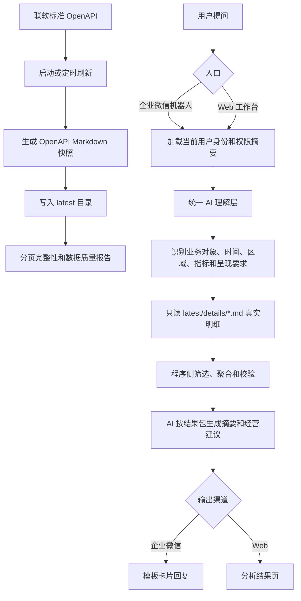

# 当前智能分析业务流程

## 1. 当前主链

当前智能分析只保留一条正式业务主链：OpenAPI 定时刷新 Markdown 快照，企微或 Web 问答阶段只读本地 Markdown 快照明细，不实时请求 OpenAPI，不进入 SQLite/MySQL/受控 SQL 历史兜底。



## 2. 两段职责

| 阶段 | 职责 | 是否访问 OpenAPI |
| --- | --- | --- |
| 数据刷新链 | 用 OpenAPI 拉取当前绑定账号权限内的真实数据，生成 Markdown 快照、manifest 和数据质量报告 | 是 |
| 正式分析主链 | 解析用户问题，只读本地 Markdown 明细，做筛选、聚合、结果校验和报告生成 | 否 |

## 3. 快照文件

| 文件 | 主要内容 |
| --- | --- |
| `00-snapshot-meta.md` / `00-快照说明.md` | 快照时间、绑定用户、权限范围、记录数、分页完整性和数据质量问题 |
| `01-auth-scope.md` | 当前 OpenAPI client、绑定 CRM 用户和权限范围 |
| `02-dictionaries.md` / `07-字段口径与枚举.md` | 商机阶段、订单状态、区域、大区、渠道类型等中文枚举 |
| `03-users.md` | 用户明细 |
| `04-partners.md` / `02-合作伙伴开拓.md` | 合作伙伴开拓与运营摘要 |
| `05-registrations.md` / `03-客户报备.md` | 客户报备摘要 |
| `06-opportunities.md` / `04-商机分析.md` | 商机规模、阶段分布、渠道商维度和重点商机 |
| `07-quotes.md` | 报价摘要 |
| `08-orders.md` / `05-订单分析.md` | 订单规模、状态分布、渠道贡献和重点订单 |
| `09-products.md` / `08-产品目录.md` | 产品、模块、功能、硬件和套餐目录 |
| `10-analytics-overview.md` / `01-经营总览.md` | 经营总览、漏斗、渠道贡献和单对象摘要统计 |
| `11-data-quality.md` / `09-数据质量.md` | 分页 total/returnedCount、字段缺失、链路断链和刷新告警 |
| `12-index.md` | 快照文件索引 |
| `details/*.md` | 全量真实明细，正式分析主链读取这里的数据 |

## 4. 业务问题默认理解

| 用户问法 | 默认分析结构 |
| --- | --- |
| 问“商机” | 商机整体情况 + 渠道商维度，包括商机数、金额、阶段分布、对应渠道商、重点商机明细 |
| 问“渠道商/合作伙伴” | 渠道商经营贡献，包括关联客户报备、商机、报价、订单和渠道商类型 |
| 问“客户报备” | 客户报备整体 + 渠道商维度，包括报备数、关联商机、未关联商机报备 |
| 问“订单” | 订单整体 + 渠道商维度，包括订单数、订单金额、状态分布、渠道商贡献 |
| 问“合作伙伴开拓、客户商机报备、订单情况和建议” | 拆成合作伙伴开拓、客户报备、商机、订单、渠道贡献和经营建议 |

## 5. 关键约束

- 明细必须来自 `details/*.md` 中的真实 OpenAPI 快照数据，不能生成“渠道商001”这类占位名称。
- 问答阶段不得实时调用 OpenAPI；OpenAPI 只用于启动刷新、定时刷新或手动刷新 Markdown 文件。
- SQLite 只读库、MySQL 分析库、受控 SQL 和历史 OpenAPI 单对象兜底暂不进入正式主链。
- 核心资源分页未拉齐时，正式分析必须阻断并提示刷新快照，不能基于截断数据继续分析。
- 区域、大区、渠道、客户、报备、商机、报价和订单链路优先使用快照中的标准字段与真实展示名。

## 6. 相关配置

```env
CRM_OPENAPI_MARKDOWN_SNAPSHOT_ENABLED=true
CRM_OPENAPI_MARKDOWN_SNAPSHOT_DIR=replace_with_local_analysis_snapshot_dir
CRM_OPENAPI_MARKDOWN_SNAPSHOT_REFRESH_ENABLED=true
CRM_OPENAPI_MARKDOWN_SNAPSHOT_REFRESH_ON_STARTUP=true
CRM_OPENAPI_MARKDOWN_SNAPSHOT_REFRESH_INTERVAL_MINUTES=30
```

手动刷新命令：

```powershell
pnpm --dir backend snapshot:openapi-markdown
```
