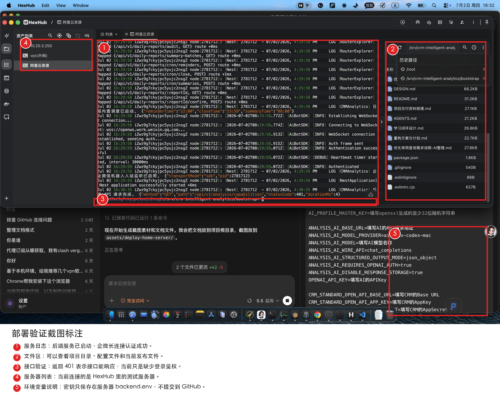

# CRM 智能分析项目生产路径部署安装手册

版本：2026-07-02
适用路径：`/home/liulonghai/crm-intelligent-analytics`
适用方式：通过 GitHub 拉取代码，使用服务器本地环境变量运行服务
适合读者：没有 Linux、GitHub、Nginx、systemd 经验的新手

> 重要安全提醒：本文不会写入任何真实密钥。真实密钥只允许保存在服务器的 `backend.env` 文件中，禁止提交到 GitHub，禁止写进截图、文档、聊天记录和脚本。

## 目录

- [一、最终部署结果](#一最终部署结果)
- [二、部署思路先看懂](#二部署思路先看懂)
- [三、服务器目录规划](#三服务器目录规划)
- [四、权限设计](#四权限设计)
- [五、部署前准备](#五部署前准备)
- [六、首次部署步骤](#六首次部署步骤)
- [七、环境变量怎么填写](#七环境变量怎么填写)
- [八、配置 GitHub 只读部署密钥](#八配置-github-只读部署密钥)
- [九、从 GitHub 发布项目](#九从-github-发布项目)
- [十、验证服务是否可用](#十验证服务是否可用)
- [十一、日常升级流程](#十一日常升级流程)
- [十二、回滚流程](#十二回滚流程)
- [十三、升级包安全要求](#十三升级包安全要求)
- [十四、常见问题](#十四常见问题)
- [十五、完整命令清单](#十五完整命令清单)
- [十六、参考资料](#十六参考资料)

## 一、最终部署结果

本次 HexHub 测试服务器已重新按生产路径完成部署，当前可按这个结构复制到生产环境：

| 项目 | 当前配置 |
| --- | --- |
| 应用根目录 | `/home/liulonghai/crm-intelligent-analytics` |
| 当前运行版本 | `/home/liulonghai/crm-intelligent-analytics/current` |
| 历史版本目录 | `/home/liulonghai/crm-intelligent-analytics/releases` |
| 共享配置目录 | `/home/liulonghai/crm-intelligent-analytics/shared` |
| 环境变量文件 | `/home/liulonghai/crm-intelligent-analytics/shared/backend.env` |
| 运行态数据目录 | `/home/liulonghai/crm-intelligent-analytics/shared/.runtime` |
| 后端服务名 | `crm-intelligent-analytics` |
| 前端访问入口 | `http://服务器IP/insight/` |
| 后端监听端口 | `3001` |

验收截图如下。红框和数字是后期标注，用来说明应该看哪里。



图中重点：

1. 服务日志能看到后端服务已启动，企微长连接已认证成功。
2. 文件区能看到项目目录和当前发布文件。
3. 接口返回 `401` 不代表服务坏了，而是接口已响应、当前请求缺少登录鉴权。
4. 左侧是当前 HexHub 测试服务器。
5. 环境变量说明只展示字段名，不展示真实密钥。

原始截图也保留在：

```text
assets/deploy-home-server/01-hexhub-home-deploy-verify.png
```

## 二、部署思路先看懂

这个项目部署时分成三类文件：

| 类型 | 放在哪里 | 是否提交 GitHub | 说明 |
| --- | --- | --- | --- |
| 项目代码 | GitHub 仓库 | 是 | 前端、后端、脚本、文档 |
| 真实配置和密钥 | 服务器 `shared/backend.env` | 否 | CRM、AI、企业微信密钥 |
| 运行中产生的数据 | 服务器 `shared/.runtime` | 否 | 本地运行状态、缓存、临时文件 |

每次发布都会生成一个新的版本目录：

```text
/home/liulonghai/crm-intelligent-analytics/releases/20260702-162837
```

然后用 `current` 软链接指向当前版本：

```text
/home/liulonghai/crm-intelligent-analytics/current -> releases/某个版本
```

这样做的好处是：

- 升级时不覆盖旧版本。
- 出问题可以切回上一个版本。
- 环境变量和运行态数据不会被代码升级覆盖。
- 服务器只需要从 GitHub 拉代码，不需要把密钥传到 GitHub。

## 三、服务器目录规划

生产环境统一使用这个根目录：

```text
/home/liulonghai/crm-intelligent-analytics
```

目录结构如下：

```text
/home/liulonghai/crm-intelligent-analytics
├── current                       # 当前正在运行的版本软链接
├── releases                      # 每次发布生成一个新版本目录
│   └── 20260702-162837
├── shared                        # 多个版本共用的配置和运行数据
│   ├── backend.env               # 真实环境变量，必须严格保密
│   ├── .runtime                  # 运行态数据
│   └── logs                      # 预留日志目录
├── backups                       # 发布前备份
└── .ssh                          # GitHub 部署密钥
```

首次引导脚本固定放在：

```text
/home/liulonghai/bootstrap/scripts/deploy-test-server
```

注意：这个目录不会自动存在，首次部署前必须先手工创建，并把部署脚本上传进去。`bootstrap` 只用于首次部署和后续执行部署命令，不是应用运行目录。

## 四、权限设计

生产环境不要用 `root` 直接跑项目服务。本文使用专门的系统用户：

```text
crmapp
```

权限规则如下：

| 文件或目录 | 推荐权限 | 说明 |
| --- | --- | --- |
| `/home/liulonghai/crm-intelligent-analytics` | `crmapp:crmapp` | 应用目录归属应用用户 |
| `shared/backend.env` | `600` | 只有文件所有者可读写，保护密钥 |
| `.ssh` | `700` | 只有应用用户可进入 |
| `.ssh/id_ed25519` | `600` | GitHub 私钥必须严格保密 |
| `.ssh/id_ed25519.pub` | `644` | 公钥可以复制到 GitHub |
| `frontend/dist` 目录 | `755` | Nginx 需要读取前端静态文件 |
| `frontend/dist` 文件 | `644` | Nginx 需要读取前端静态文件 |

为什么 `/home` 路径还要开放“穿透权限”：

- Nginx 默认用 `www-data` 用户读取前端静态文件。
- 静态文件位于 `/home/liulonghai/.../frontend/dist`。
- 如果父目录没有执行权限，Nginx 即使知道文件路径也进不去。
- 脚本只开放必要目录的读取和穿透，不开放 `shared/backend.env`。

## 五、部署前准备

你需要准备以下内容：

| 准备项 | 说明 |
| --- | --- |
| 服务器 | Ubuntu 服务器，能用 HexHub 或 SSH 登录 |
| root 权限 | 能执行 `sudo` 或直接使用 `root` |
| GitHub 仓库 | 例如 `git@github.com:你的用户名/crm-intelligent-analytics.git` |
| GitHub 账号权限 | 你需要能进入仓库设置并添加部署密钥 |
| 域名或服务器 IP | 没有域名时直接用 `http://服务器IP/insight/` |
| CRM 参数 | Base URL、AppKey、AppSecret |
| 企业微信机器人参数 | Bot ID、Secret |
| AI 参数 | API 地址、模型名、APIKey |

服务器建议先确认系统版本：

```bash
cat /etc/os-release
```

确认当前用户：

```bash
whoami
```

如果不是 `root`，后续命令前面保留 `sudo`。

## 六、首次部署步骤

### 6.1 把部署脚本放到服务器

第一次部署时服务器还没有项目，所以必须先创建脚本目录，再把三个部署脚本放到服务器。

先在服务器创建脚本目录：

```bash
sudo mkdir -p /home/liulonghai/bootstrap/scripts/deploy-test-server
sudo chmod 755 /home/liulonghai/bootstrap
sudo chmod 755 /home/liulonghai/bootstrap/scripts
sudo chmod 755 /home/liulonghai/bootstrap/scripts/deploy-test-server
```

本地电脑上的三个脚本路径是：

```text
/Users/liu/Documents/Codex/crm-agent/_extract_ditto/crm-agent-base-ai-wecom-core-converged-project-20260627-183206/scripts/deploy-test-server/init-ubuntu-github.sh
/Users/liu/Documents/Codex/crm-agent/_extract_ditto/crm-agent-base-ai-wecom-core-converged-project-20260627-183206/scripts/deploy-test-server/deploy-from-github.sh
/Users/liu/Documents/Codex/crm-agent/_extract_ditto/crm-agent-base-ai-wecom-core-converged-project-20260627-183206/scripts/deploy-test-server/deploy-home-liulonghai.sh
```

服务器上最终要放到：

```text
/home/liulonghai/bootstrap/scripts/deploy-test-server
```

可以用 HexHub 的文件上传功能上传，也可以用 `scp` 上传。上传完成后，服务器目录里应该能看到这三个文件：

```bash
ls -l /home/liulonghai/bootstrap/scripts/deploy-test-server
```

正确结果里应该包含：

```text
init-ubuntu-github.sh
deploy-from-github.sh
deploy-home-liulonghai.sh
```

然后在服务器执行：

```bash
cd /home/liulonghai/bootstrap/scripts/deploy-test-server
chmod +x init-ubuntu-github.sh deploy-from-github.sh deploy-home-liulonghai.sh
```

如果 `cd` 提示 `No such file or directory`，说明脚本目录还没有创建，回到本小节第一条 `sudo mkdir -p ...` 重新执行。

### 6.2 初始化服务器

执行：

```bash
cd /home/liulonghai/bootstrap/scripts/deploy-test-server
sudo bash deploy-home-liulonghai.sh init
```

这一步会自动完成：

- 安装基础软件。
- 安装 Node.js。
- 启用 pnpm。
- 创建 `crmapp` 应用用户。
- 创建 `/home/liulonghai/crm-intelligent-analytics` 目录。
- 创建 `shared/backend.env` 模板。
- 写入 systemd 服务配置。
- 写入 Nginx 配置。
- 启动 Nginx。

看到类似下面内容，说明初始化成功：

```text
初始化完成。
下一步请编辑环境变量：sudo nano /home/liulonghai/crm-intelligent-analytics/shared/backend.env
```

### 6.3 编辑环境变量

执行：

```bash
sudo nano /home/liulonghai/crm-intelligent-analytics/shared/backend.env
```

把里面的 `请替换` 和 `测试服务器IP` 全部替换成真实值。

编辑完成后按：

```text
Ctrl + O 保存
Enter 确认
Ctrl + X 退出
```

保存后检查权限：

```bash
sudo chmod 600 /home/liulonghai/crm-intelligent-analytics/shared/backend.env
sudo chown crmapp:crmapp /home/liulonghai/crm-intelligent-analytics/shared/backend.env
sudo ls -l /home/liulonghai/crm-intelligent-analytics/shared/backend.env
```

正确结果类似：

```text
-rw------- 1 crmapp crmapp ... backend.env
```

## 七、环境变量怎么填写

下面只写字段含义，不写真实密钥。

```bash
NODE_ENV=production
PORT=3001

APP_WEB_BASE_URL=http://服务器IP/insight
VITE_API_BASE_URL=http://服务器IP/insight
VITE_APP_BASE_PATH=/insight/

AI_PROFILE_MASTER_KEY=至少32位随机字符串

ANALYSIS_AI_BASE_URL=AI接口基础地址
ANALYSIS_AI_MODEL_PROVIDER=AI供应商标识
ANALYSIS_AI_MODEL=AI模型名称
ANALYSIS_AI_WIRE_API=chat_completions
ANALYSIS_AI_STRUCTURED_OUTPUT_MODE=json_object
ANALYSIS_AI_REQUIRES_OPENAI_AUTH=true
ANALYSIS_AI_DISABLE_RESPONSE_STORAGE=true
OPENAI_API_KEY=AI接口密钥

CRM_STANDARD_OPEN_API_BASE_URL=CRM的Base URL
CRM_STANDARD_OPEN_API_APP_KEY=CRM的AppKey
CRM_STANDARD_OPEN_API_APP_SECRET=CRM的AppSecret
CRM_STANDARD_OPEN_API_TIMEOUT_MS=12000
CRM_STANDARD_OPEN_API_TOKEN_CACHE_BUFFER_SECONDS=60
CRM_STANDARD_OPEN_API_ACCESS_MODE=bound-user

WECOM_BOT_ID=企业微信机器人Bot ID
WECOM_BOT_SECRET=企业微信机器人Secret
WECOM_ENABLE_SDK_TRANSPORT=true
WECOM_BOT_WS_URL=wss://openws.work.weixin.qq.com
```

字段填写对照表：

| 你手里的参数 | 填到哪个字段 |
| --- | --- |
| CRM Base URL | `CRM_STANDARD_OPEN_API_BASE_URL` |
| CRM token 地址 | 不单独填写，系统会在 Base URL 后拼接 `/auth/token` |
| CRM AppKey | `CRM_STANDARD_OPEN_API_APP_KEY` |
| CRM AppSecret | `CRM_STANDARD_OPEN_API_APP_SECRET` |
| 企业微信 Bot ID | `WECOM_BOT_ID` |
| 企业微信 Secret | `WECOM_BOT_SECRET` |
| AI API 请求地址 | `ANALYSIS_AI_BASE_URL` |
| AI 模型 | `ANALYSIS_AI_MODEL` |
| AI APIKey | `OPENAI_API_KEY` |

生成 `AI_PROFILE_MASTER_KEY` 的命令：

```bash
openssl rand -base64 48
```

把输出的一整串字符填到：

```bash
AI_PROFILE_MASTER_KEY=这里填刚才生成的随机字符串
```

说明：

- 长连接企业微信机器人使用 `WECOM_BOT_ID` 和 `WECOM_BOT_SECRET`。
- 只有 HTTP 回调模式才需要企业微信回调签名。
- 当前按长连接 SDK 模式部署，不需要填写 `WECOM_BOT_SIGNATURE`。

## 八、配置 GitHub 只读部署密钥

部署密钥的作用：服务器用这个 SSH 密钥从 GitHub 拉代码。建议只给读取权限，不给写入权限。

### 8.1 在服务器生成部署密钥

执行：

```bash
sudo -H -u crmapp ssh-keygen -t ed25519 -C "crm-intelligent-analytics-deploy" -f /home/liulonghai/crm-intelligent-analytics/.ssh/id_ed25519 -N ""
```

修复权限：

```bash
sudo chown -R crmapp:crmapp /home/liulonghai/crm-intelligent-analytics/.ssh
sudo chmod 700 /home/liulonghai/crm-intelligent-analytics/.ssh
sudo chmod 600 /home/liulonghai/crm-intelligent-analytics/.ssh/id_ed25519
sudo chmod 644 /home/liulonghai/crm-intelligent-analytics/.ssh/id_ed25519.pub
```

显示公钥：

```bash
sudo cat /home/liulonghai/crm-intelligent-analytics/.ssh/id_ed25519.pub
```

复制输出内容。注意只复制 `.pub` 公钥，不要复制没有 `.pub` 的私钥。

### 8.2 在 GitHub 仓库添加部署密钥

进入你的 GitHub 仓库页面：

```text
https://github.com/你的用户名/crm-intelligent-analytics
```

按这个顺序点：

```text
Settings -> Deploy keys -> Add deploy key
```

填写：

| GitHub 页面字段 | 填写内容 |
| --- | --- |
| Title | `crm-test-server-home-liulonghai` |
| Key | 粘贴刚才服务器输出的 `.pub` 公钥 |
| Allow write access | 不勾选 |

保存后回到服务器测试：

```bash
sudo -H -u crmapp ssh -T git@github.com
```

第一次连接可能会询问是否继续，输入：

```text
yes
```

如果看到类似下面的提示，说明 SSH 能连接 GitHub：

```text
Hi 用户名/仓库名! You've successfully authenticated...
```

如果看到 `Permission denied (publickey)`，说明部署密钥没有配置好，优先检查：

- GitHub 是否加的是 `.pub` 公钥。
- 是否加在正确仓库的 `Deploy keys`。
- 私钥权限是否是 `600`。
- 是否用 `crmapp` 用户测试。

## 九、从 GitHub 发布项目

进入脚本目录：

```bash
cd /home/liulonghai/bootstrap/scripts/deploy-test-server
```

执行发布：

```bash
sudo REPO_URL=git@github.com:你的用户名/crm-intelligent-analytics.git \
GIT_REF=main \
bash deploy-home-liulonghai.sh deploy
```

如果使用当前项目仓库，可以写成：

```bash
sudo REPO_URL=git@github.com:Liu12138-oss/crm-intelligent-analytics.git \
GIT_REF=main \
bash deploy-home-liulonghai.sh deploy
```

发布脚本会自动完成：

- 记录升级前状态。
- 备份环境变量和运行态目录。
- 从 GitHub 拉取 `main` 分支。
- 安装依赖。
- 构建前端和后端。
- 挂载共享运行态目录。
- 修复前端静态资源读取权限。
- 切换 `current` 到新版本。
- 重启后端服务。
- 重载 Nginx。
- 验证前端入口。

成功后会看到类似：

```text
发布完成
当前版本目录：/home/liulonghai/crm-intelligent-analytics/releases/20260702-162837
查看日志：journalctl -u crm-intelligent-analytics -n 100 --no-pager
```

## 十、验证服务是否可用

### 10.1 一键查看状态

先确认脚本目录存在：

```bash
ls -l /home/liulonghai/bootstrap/scripts/deploy-test-server
```

如果提示目录不存在，说明首次部署时没有把脚本上传到 `bootstrap` 目录。请回到 [6.1 把部署脚本放到服务器](#61-把部署脚本放到服务器) 先创建目录并上传脚本。

```bash
cd /home/liulonghai/bootstrap/scripts/deploy-test-server
sudo bash deploy-home-liulonghai.sh status
```

### 10.2 手工验证命令

查看当前版本：

```bash
readlink -f /home/liulonghai/crm-intelligent-analytics/current
```

查看服务状态：

```bash
systemctl status crm-intelligent-analytics --no-pager
```

检查 Nginx 配置：

```bash
nginx -t
```

访问前端入口：

```bash
curl -I http://127.0.0.1/insight/index.html
```

如果返回 `200 OK`，说明前端静态页面可访问。

验证接口是否有响应：

```bash
curl -i http://127.0.0.1/api/v1/analysis/capabilities
```

如果返回 `401`，说明接口已经响应，只是当前请求没有登录鉴权。这是正常现象。

查看后端日志：

```bash
journalctl -u crm-intelligent-analytics -n 100 --no-pager
```

看到下面这类关键词，说明后端和企业微信长连接正常：

```text
Nest application successfully started
WebSocket connection established
Authentication successful
```

浏览器访问：

```text
http://服务器IP/insight/
```

## 十一、日常升级流程

日常升级分两步：先在本地把代码推到 GitHub，再到服务器拉取发布。

### 11.1 本地提交并推送到 GitHub

在本地项目仓库执行：

```bash
git status
git add .
git commit -m "本次升级说明"
git push origin main
```

注意：

- 不要把 `backend.env` 提交到 GitHub。
- 不要把 `.ssh` 私钥提交到 GitHub。
- 不要把真实 APIKey、AppSecret、机器人 Secret 写进代码。

### 11.2 服务器执行升级

在服务器执行：

```bash
cd /home/liulonghai/bootstrap/scripts/deploy-test-server
sudo REPO_URL=git@github.com:你的用户名/crm-intelligent-analytics.git \
GIT_REF=main \
bash deploy-home-liulonghai.sh deploy
```

升级后检查：

```bash
sudo bash deploy-home-liulonghai.sh status
```

再查看日志：

```bash
journalctl -u crm-intelligent-analytics -n 100 --no-pager
```

## 十二、回滚流程

如果升级后发现问题，先查看有哪些版本：

```bash
ls -lt /home/liulonghai/crm-intelligent-analytics/releases
```

假设要回滚到：

```text
/home/liulonghai/crm-intelligent-analytics/releases/20260702-162837
```

执行：

```bash
sudo ln -sfn /home/liulonghai/crm-intelligent-analytics/releases/20260702-162837 /home/liulonghai/crm-intelligent-analytics/current
sudo chown -h crmapp:crmapp /home/liulonghai/crm-intelligent-analytics/current
sudo systemctl restart crm-intelligent-analytics
sudo systemctl reload nginx
```

回滚后验证：

```bash
readlink -f /home/liulonghai/crm-intelligent-analytics/current
systemctl status crm-intelligent-analytics --no-pager
curl -I http://127.0.0.1/insight/index.html
```

## 十三、升级包安全要求

虽然当前推荐用 GitHub 发布，但每一次发布都可以理解成一次“升级包”：

```text
GitHub 某次提交 + releases/版本目录 + backups/发布前备份
```

如果以后需要离线升级包，必须遵守这些要求：

| 要求 | 说明 |
| --- | --- |
| 不含真实密钥 | 包里不能有 `backend.env`、私钥、Token、APIKey |
| 有版本号 | 文件名包含日期和提交号，例如 `20260702-162837` |
| 有校验值 | 用 `sha256sum` 生成校验值，防止包被篡改 |
| 可回滚 | 发布前保留上一版本路径 |
| 可审计 | 记录谁在什么时候发布了哪个版本 |

生成校验值示例：

```bash
sha256sum 升级包文件名.tar.gz > 升级包文件名.tar.gz.sha256
```

校验示例：

```bash
sha256sum -c 升级包文件名.tar.gz.sha256
```

## 十四、常见问题

### 14.1 GitHub 拉代码失败

报错：

```text
Permission denied (publickey)
```

处理：

```bash
sudo -H -u crmapp ssh -T git@github.com
sudo ls -l /home/liulonghai/crm-intelligent-analytics/.ssh
```

重点检查：

- GitHub 部署密钥是否添加到正确仓库。
- 私钥是否是 `600`。
- `.ssh` 目录是否是 `700`。
- 是否用 `crmapp` 用户测试。

### 14.2 前端访问 403 或 404

先检查：

```bash
namei -l /home/liulonghai/crm-intelligent-analytics/current/frontend/dist/index.html
curl -I http://127.0.0.1/insight/index.html
```

通常原因是 Nginx 没有权限穿透 `/home/liulonghai` 或读取 `frontend/dist`。重新执行一次发布脚本通常会修复：

```bash
cd /home/liulonghai/bootstrap/scripts/deploy-test-server
sudo REPO_URL=git@github.com:你的用户名/crm-intelligent-analytics.git bash deploy-home-liulonghai.sh deploy
```

### 14.3 接口返回 401

`401` 通常代表接口活着，但请求没有登录凭证。这不是部署失败。

如果要确认服务是否启动，看：

```bash
systemctl status crm-intelligent-analytics --no-pager
journalctl -u crm-intelligent-analytics -n 100 --no-pager
```

### 14.4 页面返回 502

`502` 多数是后端没启动或端口不通。

检查：

```bash
systemctl status crm-intelligent-analytics --no-pager
journalctl -u crm-intelligent-analytics -n 200 --no-pager
curl -I http://127.0.0.1:3001
```

### 14.5 构建时报 `tsc: not found`

说明构建工具没有安装。当前脚本已经使用：

```bash
pnpm install --frozen-lockfile --prod=false
```

请确认服务器上的脚本已经更新到本文版本。

### 14.6 环境变量仍有占位符

脚本会阻止继续发布，并提示：

```text
环境变量文件仍包含占位内容
```

处理：

```bash
sudo nano /home/liulonghai/crm-intelligent-analytics/shared/backend.env
```

把所有 `请替换` 和 `测试服务器IP` 改成真实值。

## 十五、完整命令清单

以下命令按顺序执行即可。真实仓库地址和服务器 IP 请替换成你自己的。

### 15.1 首次部署

```bash
sudo mkdir -p /home/liulonghai/bootstrap/scripts/deploy-test-server
sudo chmod 755 /home/liulonghai/bootstrap
sudo chmod 755 /home/liulonghai/bootstrap/scripts
sudo chmod 755 /home/liulonghai/bootstrap/scripts/deploy-test-server

# 这一步不是命令：请用 HexHub 上传下面三个本地脚本到服务器目录：
# /home/liulonghai/bootstrap/scripts/deploy-test-server
# 本地脚本位置：
# /Users/liu/Documents/Codex/crm-agent/_extract_ditto/crm-agent-base-ai-wecom-core-converged-project-20260627-183206/scripts/deploy-test-server/init-ubuntu-github.sh
# /Users/liu/Documents/Codex/crm-agent/_extract_ditto/crm-agent-base-ai-wecom-core-converged-project-20260627-183206/scripts/deploy-test-server/deploy-from-github.sh
# /Users/liu/Documents/Codex/crm-agent/_extract_ditto/crm-agent-base-ai-wecom-core-converged-project-20260627-183206/scripts/deploy-test-server/deploy-home-liulonghai.sh

ls -l /home/liulonghai/bootstrap/scripts/deploy-test-server
cd /home/liulonghai/bootstrap/scripts/deploy-test-server
chmod +x init-ubuntu-github.sh deploy-from-github.sh deploy-home-liulonghai.sh
sudo bash deploy-home-liulonghai.sh init
sudo nano /home/liulonghai/crm-intelligent-analytics/shared/backend.env
sudo chmod 600 /home/liulonghai/crm-intelligent-analytics/shared/backend.env
sudo chown crmapp:crmapp /home/liulonghai/crm-intelligent-analytics/shared/backend.env
```

### 15.2 配置 GitHub 部署密钥

```bash
sudo -H -u crmapp ssh-keygen -t ed25519 -C "crm-intelligent-analytics-deploy" -f /home/liulonghai/crm-intelligent-analytics/.ssh/id_ed25519 -N ""
sudo chown -R crmapp:crmapp /home/liulonghai/crm-intelligent-analytics/.ssh
sudo chmod 700 /home/liulonghai/crm-intelligent-analytics/.ssh
sudo chmod 600 /home/liulonghai/crm-intelligent-analytics/.ssh/id_ed25519
sudo chmod 644 /home/liulonghai/crm-intelligent-analytics/.ssh/id_ed25519.pub
sudo cat /home/liulonghai/crm-intelligent-analytics/.ssh/id_ed25519.pub
sudo -H -u crmapp ssh -T git@github.com
```

### 15.3 发布项目

```bash
ls -l /home/liulonghai/bootstrap/scripts/deploy-test-server
cd /home/liulonghai/bootstrap/scripts/deploy-test-server
sudo REPO_URL=git@github.com:你的用户名/crm-intelligent-analytics.git \
GIT_REF=main \
bash deploy-home-liulonghai.sh deploy
```

### 15.4 验证项目

```bash
cd /home/liulonghai/bootstrap/scripts/deploy-test-server
sudo bash deploy-home-liulonghai.sh status
readlink -f /home/liulonghai/crm-intelligent-analytics/current
systemctl status crm-intelligent-analytics --no-pager
nginx -t
curl -I http://127.0.0.1/insight/index.html
curl -i http://127.0.0.1/api/v1/analysis/capabilities
journalctl -u crm-intelligent-analytics -n 100 --no-pager
```

### 15.5 日常升级

本地电脑：

```bash
git status
git add .
git commit -m "本次升级说明"
git push origin main
```

服务器：

```bash
ls -l /home/liulonghai/bootstrap/scripts/deploy-test-server
cd /home/liulonghai/bootstrap/scripts/deploy-test-server
sudo REPO_URL=git@github.com:你的用户名/crm-intelligent-analytics.git \
GIT_REF=main \
bash deploy-home-liulonghai.sh deploy
sudo bash deploy-home-liulonghai.sh status
```

## 十六、参考资料

- GitHub 官方说明：部署密钥用于让服务器自动访问仓库，私钥保存在服务器，公钥添加到仓库。参考：[Managing deploy keys](https://docs.github.com/v3/guides/managing-deploy-keys)
- GitHub 官方说明：建议生成新的 SSH 密钥用于连接 GitHub。参考：[Generating a new SSH key and adding it to the ssh-agent](https://docs.github.com/en/authentication/connecting-to-github-with-ssh/generating-a-new-ssh-key-and-adding-it-to-the-ssh-agent)
- GitHub 官方说明：部署密钥可绑定到单个仓库。参考：[REST API endpoints for deploy keys](https://docs.github.com/en/rest/deploy-keys/deploy-keys)
