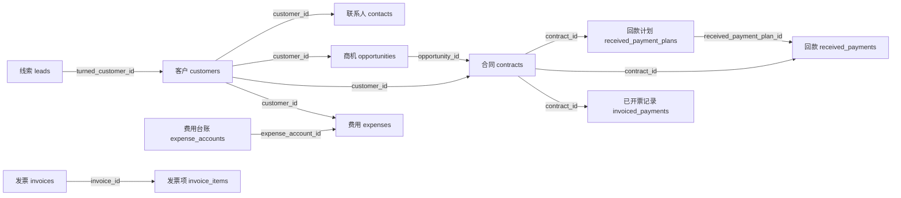
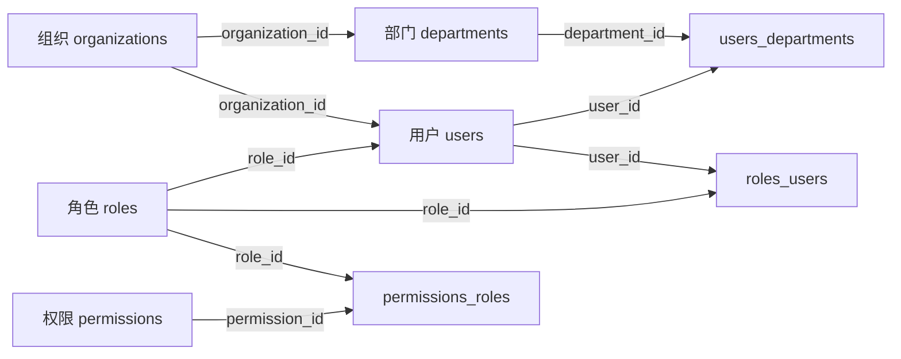

# CRM核心业务关系图

## 1. 说明

- 这份文档聚焦 `vcooline_ikcrm_production` 的核心业务对象关系，方便理解 CRM 主流程。
- 图中关系主要根据字段命名和业务语义推断，并不等同于数据库中真实存在的外键约束。
- 目前主业务库显式外键只有 3 条，因此阅读时应把它视为“业务关系图”，而不是严格的物理外键图。

## 2. 销售到回款主链路

### 2.1 主链路解读

1. `leads` 保存潜在线索，通过 `turned_customer_id` 记录转客户结果。
2. `customers` 是核心客户主数据，`contacts` 作为客户联系人从属于客户。
3. `opportunities` 由客户沉淀出的销售机会，`contracts` 则是成交后正式签约对象。
4. `received_payment_plans` 和 `received_payments` 分别对应计划回款与实际回款。
5. `invoices`/`invoice_items` 管理发票申请及条目，`invoiced_payments` 则反映合同维度的已开票记录。
6. `expense_accounts`/`expenses` 构成费用核算链路，与客户、部门、用户有交叉关联。

## 3. 组织与权限底座

### 3.1 底座解读

1. `organizations`、`departments`、`users` 是所有业务对象的统一归属维度。
2. `users.role_id` 提供用户默认角色，同时 `roles_users` 支持多角色映射。
3. `permissions_roles` 维护角色和权限的分配，是权限生效的关键枢纽。
4. 多数业务主表都带 `organization_id`、`user_id`、`department_id`，说明组织和数据权限设计是全局性的。

## 4. 核心表速查

| 表名 | 预估行数 | 预估容量 | 关键字段 |
| --- | ---: | ---: | --- |
| `organizations` | 1001 | 0.12 MB | `id` (`int(11)`), `name` (`varchar(255)`), `user_id` (`int(11)`), `contacts_count` (`int(11)`), `customers_count` (`int(11)`), `leads_count` (`int(11)`), `users_count` (`int(11)`), `activity_at` (`datetime`), `created_at` (`datetime`), `updated_at` (`datetime`) |
| `departments` | 379 | 0.11 MB | `id` (`int(11)`), `name` (`varchar(255)`), `organization_id` (`int(11)`), `parent_id` (`int(11)`), `path` (`varchar(255)`), `status` (`int(11)`), `created_at` (`datetime`), `updated_at` (`datetime`), `description` (`text`), `position` (`int(11)`) |
| `users` | 1390 | 0.84 MB | `id` (`int(11)`), `name` (`varchar(255)`), `organization_id` (`int(11)`), `role_id` (`int(11)`), `station_id` (`int(11)`), `superior_id` (`int(11)`), `user_type` (`tinyint(4)`), `status` (`int(11)`), `usable` (`tinyint(1)`), `created_at` (`datetime`) |
| `roles` | 3156 | 3.62 MB | `id` (`int(11)`), `name` (`varchar(255)`), `organization_id` (`int(11)`), `entity_grant_scope` (`int(11)`), `field_permission_grant_scope` (`int(11)`), `created_at` (`datetime`), `updated_at` (`datetime`), `description` (`text`), `settings` (`text`), `field_permission_setting` (`text`) |
| `permissions` | 268 | 0.05 MB | `id` (`int(11)`), `name` (`varchar(255)`), `subject` (`varchar(255)`), `action` (`varchar(255)`), `created_at` (`datetime`), `updated_at` (`datetime`) |
| `leads` | 12526 | 7.31 MB | `id` (`int(11)`), `name` (`varchar(255)`), `company_name` (`varchar(255)`), `source` (`varchar(255)`), `status` (`varchar(255)`), `organization_id` (`int(11)`), `user_id` (`int(11)`), `department_id` (`int(11)`), `turned_customer_id` (`int(11)`), `turned_at` (`datetime`) |
| `customers` | 29170 | 26.16 MB | `id` (`int(11)`), `name` (`varchar(255)`), `company_name` (`varchar(255)`), `category` (`varchar(255)`), `source` (`varchar(255)`), `status` (`varchar(255)`), `organization_id` (`int(11)`), `user_id` (`int(11)`), `department_id` (`int(11)`), `customer_common_setting_id` (`int(11)`) |
| `contacts` | 8107 | 2.56 MB | `id` (`int(11)`), `name` (`varchar(255)`), `customer_id` (`int(11)`), `organization_id` (`int(11)`), `user_id` (`int(11)`), `job` (`varchar(255)`), `category` (`varchar(255)`), `creator_id` (`int(11)`), `parent_id` (`int(11)`), `created_at` (`datetime`) |
| `opportunities` | 57351 | 28.64 MB | `id` (`int(11)`), `title` (`varchar(255)`), `customer_id` (`int(11)`), `stage` (`varchar(255)`), `expect_amount` (`decimal(24,6)`), `organization_id` (`int(11)`), `user_id` (`int(11)`), `department_id` (`int(11)`), `approve_status` (`tinyint(4)`), `source` (`varchar(255)`) |
| `contracts` | 17312 | 17.12 MB | `id` (`int(11)`), `title` (`varchar(255)`), `customer_id` (`int(11)`), `opportunity_id` (`int(11)`), `status` (`varchar(255)`), `total_amount` (`decimal(24,6)`), `organization_id` (`int(11)`), `user_id` (`int(11)`), `department_id` (`int(11)`), `approve_status` (`tinyint(4)`) |
| `received_payment_plans` | 25819 | 9.06 MB | `id` (`int(11)`), `contract_id` (`int(11)`), `receive_stage` (`int(11)`), `receive_date` (`date`), `amount` (`decimal(24,6)`), `received_amount` (`decimal(24,6)`), `status` (`int(11)`), `organization_id` (`int(11)`), `user_id` (`int(11)`), `created_at` (`datetime`) |
| `received_payments` | 29046 | 11.58 MB | `id` (`int(11)`), `contract_id` (`int(11)`), `received_payment_plan_id` (`int(11)`), `amount` (`decimal(24,6)`), `payment_type` (`varchar(255)`), `receive_date` (`date`), `invoice_status` (`int(11)`), `approve_status` (`tinyint(4)`), `organization_id` (`int(11)`), `user_id` (`int(11)`) |
| `invoices` | 0 | 0.08 MB | `id` (`int(11)`), `organization_id` (`int(11)`), `user_id` (`int(11)`), `invoice_type` (`int(11)`), `amount` (`decimal(12,3)`), `company_name` (`varchar(255)`), `check_status` (`int(11)`), `created_at` (`datetime`), `updated_at` (`datetime`), `company_address` (`varchar(255)`) |
| `invoiced_payments` | 28787 | 11.06 MB | `id` (`int(11)`), `contract_id` (`int(11)`), `user_id` (`int(11)`), `invoice_types` (`varchar(255)`), `amount` (`decimal(24,6)`), `invoiced_date` (`date`), `invoice_no` (`varchar(255)`), `organization_id` (`int(11)`), `created_at` (`datetime`), `updated_at` (`datetime`) |
| `invoice_items` | 0 | 0.02 MB | `id` (`int(11)`), `invoice_id` (`int(11)`), `itemable_id` (`int(11)`), `itemable_type` (`varchar(255)`) |
| `expense_accounts` | 4309 | 1.94 MB | `id` (`int(11)`), `organization_id` (`int(11)`), `department_id` (`int(11)`), `user_id` (`int(11)`), `sn` (`varchar(255)`), `amount` (`decimal(24,6)`), `approve_status` (`tinyint(4)`), `creator_id` (`int(11)`), `created_at` (`datetime`), `updated_at` (`datetime`) |
| `expenses` | 5510 | 3.52 MB | `id` (`int(11)`), `expense_account_id` (`int(11)`), `customer_id` (`int(11)`), `organization_id` (`int(11)`), `user_id` (`int(11)`), `sn` (`varchar(255)`), `category` (`varchar(255)`), `amount` (`decimal(24,6)`), `expense_status` (`int(11)`), `creator_id` (`int(11)`) |
| `orders` | 0 | 0.09 MB | `id` (`int(11)`), `organization_id` (`int(11)`), `amount` (`int(11)`), `currency` (`varchar(255)`), `order_number` (`varchar(255)`), `status` (`int(11)`), `orderable_id` (`int(11)`), `orderable_type` (`varchar(255)`), `created_at` (`datetime`), `updated_at` (`datetime`) |
| `payments` | 0 | 0.11 MB | `id` (`int(11)`), `organization_id` (`int(11)`), `order_id` (`int(11)`), `amount` (`int(11)`), `status` (`int(11)`), `channel` (`varchar(255)`), `transaction_number` (`varchar(255)`), `created_at` (`datetime`), `updated_at` (`datetime`), `currency` (`varchar(255)`) |

## 5. 关键关系矩阵

| 关系组 | 来源表 | 关系字段 | 目标表 | 关系类型 | 说明 |
| --- | --- | --- | --- | --- | --- |
| 组织权限 | `departments` | `organization_id` | `organizations` | 从属 | 部门属于组织。 |
| 组织权限 | `users` | `organization_id` | `organizations` | 归属 | 用户归属组织。 |
| 组织权限 | `users` | `role_id` | `roles` | 默认角色 | 用户默认角色。 |
| 组织权限 | `users_departments` | `user_id` | `users` | 映射 | 用户和部门的多对多映射。 |
| 组织权限 | `users_departments` | `department_id` | `departments` | 映射 | 用户和部门的多对多映射。 |
| 组织权限 | `roles_users` | `role_id` | `roles` | 映射 | 角色用户映射。 |
| 组织权限 | `roles_users` | `user_id` | `users` | 映射 | 角色用户映射。 |
| 组织权限 | `permissions_roles` | `permission_id` | `permissions` | 映射 | 角色权限映射。 |
| 组织权限 | `permissions_roles` | `role_id` | `roles` | 映射 | 角色权限映射。 |
| 销售链路 | `leads` | `organization_id` | `organizations` | 归属 | 线索归属组织。 |
| 销售链路 | `leads` | `user_id` | `users` | 负责人 | 线索负责人。 |
| 销售链路 | `leads` | `department_id` | `departments` | 归属 | 线索归属部门。 |
| 销售链路 | `leads` | `turned_customer_id` | `customers` | 转化 | 线索转客户后的目标客户。 |
| 销售链路 | `contacts` | `customer_id` | `customers` | 从属 | 联系人挂靠客户。 |
| 销售链路 | `customers` | `organization_id` | `organizations` | 归属 | 客户归属组织。 |
| 销售链路 | `customers` | `user_id` | `users` | 负责人 | 客户负责人。 |
| 销售链路 | `customers` | `department_id` | `departments` | 归属 | 客户归属部门。 |
| 销售链路 | `opportunities` | `customer_id` | `customers` | 来源客户 | 商机挂靠客户。 |
| 销售链路 | `opportunities` | `organization_id` | `organizations` | 归属 | 商机归属组织。 |
| 销售链路 | `opportunities` | `user_id` | `users` | 负责人 | 商机负责人。 |
| 销售链路 | `opportunities` | `department_id` | `departments` | 归属 | 商机归属部门。 |
| 销售链路 | `contracts` | `customer_id` | `customers` | 签约客户 | 合同对应客户。 |
| 销售链路 | `contracts` | `opportunity_id` | `opportunities` | 来源商机 | 合同通常由商机推进而来。 |
| 销售链路 | `contracts` | `organization_id` | `organizations` | 归属 | 合同归属组织。 |
| 销售链路 | `contracts` | `user_id` | `users` | 负责人 | 合同负责人。 |
| 销售链路 | `contracts` | `department_id` | `departments` | 归属 | 合同归属部门。 |
| 财务闭环 | `received_payment_plans` | `contract_id` | `contracts` | 计划归属 | 回款计划属于合同。 |
| 财务闭环 | `received_payments` | `contract_id` | `contracts` | 实际回款 | 实际回款归属于合同。 |
| 财务闭环 | `received_payments` | `received_payment_plan_id` | `received_payment_plans` | 落计划 | 实际回款可对应一条回款计划。 |
| 财务闭环 | `received_payments` | `organization_id` | `organizations` | 归属 | 回款记录归属组织。 |
| 财务闭环 | `received_payments` | `user_id` | `users` | 负责人 | 回款记录负责人。 |
| 财务闭环 | `invoiced_payments` | `contract_id` | `contracts` | 开票记录 | 合同维度的已开票记录。 |
| 财务闭环 | `invoice_items` | `invoice_id` | `invoices` | 明细归属 | 发票项目明细归属于发票主表。 |
| 财务闭环 | `invoices` | `organization_id` | `organizations` | 归属 | 发票申请归属组织。 |
| 财务闭环 | `invoices` | `user_id` | `users` | 申请人/负责人 | 发票申请用户。 |
| 财务闭环 | `expense_accounts` | `organization_id` | `organizations` | 归属 | 费用台账归属组织。 |
| 财务闭环 | `expense_accounts` | `department_id` | `departments` | 归属 | 费用台账归属部门。 |
| 财务闭环 | `expense_accounts` | `user_id` | `users` | 负责人 | 费用台账负责人。 |
| 财务闭环 | `expenses` | `expense_account_id` | `expense_accounts` | 费用归集 | 费用记录归入费用台账。 |
| 财务闭环 | `expenses` | `customer_id` | `customers` | 关联客户 | 费用可归属到客户。 |
| 财务闭环 | `expenses` | `organization_id` | `organizations` | 归属 | 费用记录归属组织。 |
| 财务闭环 | `expenses` | `user_id` | `users` | 负责人 | 费用记录负责人。 |
| 财务闭环 | `payments` | `order_id` | `orders` | 支付对应订单 | 支付记录关联平台订单。 |
| 财务闭环 | `payments` | `organization_id` | `organizations` | 归属 | 支付记录归属组织。 |
| 财务闭环 | `orders` | `organization_id` | `organizations` | 归属 | 订单归属组织。 |

## 6. 常见结构模式

### 6.1 主表 + 资产扩展表

- `lead_assets`、`customer_assets`、`opportunity_assets`、`contract_assets`、`received_payment_assets`、`expense_assets` 的结构非常相似。
- 这些表通常通过 `entity_id` + `custom_field_id` 关联业务对象和自定义字段，说明系统采用了统一的动态字段扩展模型。

### 6.2 主表 + 审批表

- `customer_multistep_approves`、`opportunity_multistep_approves`、`contract_multistep_approves`、`expense_account_multistep_approves` 都体现了分步审批机制。
- 对应主表里普遍存在 `approve_status`、`step`、`pending_step`、`submit_applying_at`、`finish_approve_at` 等字段。

### 6.3 主表 + 通知映射表

- `customer_notify_user_maps`、`opportunity_notify_user_maps`、`contract_notify_user_maps`、`received_payment_notify_user_maps` 说明提醒/抄送是独立建模的。
- 这种设计便于一条业务记录挂多个通知用户，也减少了主表字段膨胀。

### 6.4 地址与多态结构

- `lead_addresses`、`customer_addresses` 等地址表使用 `addressable_id` + `addressable_type`，属于多态关联设计。
- `orders.orderable_id/orderable_type`、`invoice_items.itemable_id/itemable_type`、`payments.object_id` 也体现出平台层对多业务对象复用一套交易模型。

## 7. 阅读这套库的建议顺序

1. 先读 `organizations`、`departments`、`users`、`roles`、`permissions`，理解数据归属和权限边界。
2. 再读 `leads`、`customers`、`contacts`、`opportunities`、`contracts`，掌握销售转化主链路。
3. 最后读 `received_payments`、`invoices`、`expenses`、`orders`、`payments`，理解财务与平台交易层的差异。

