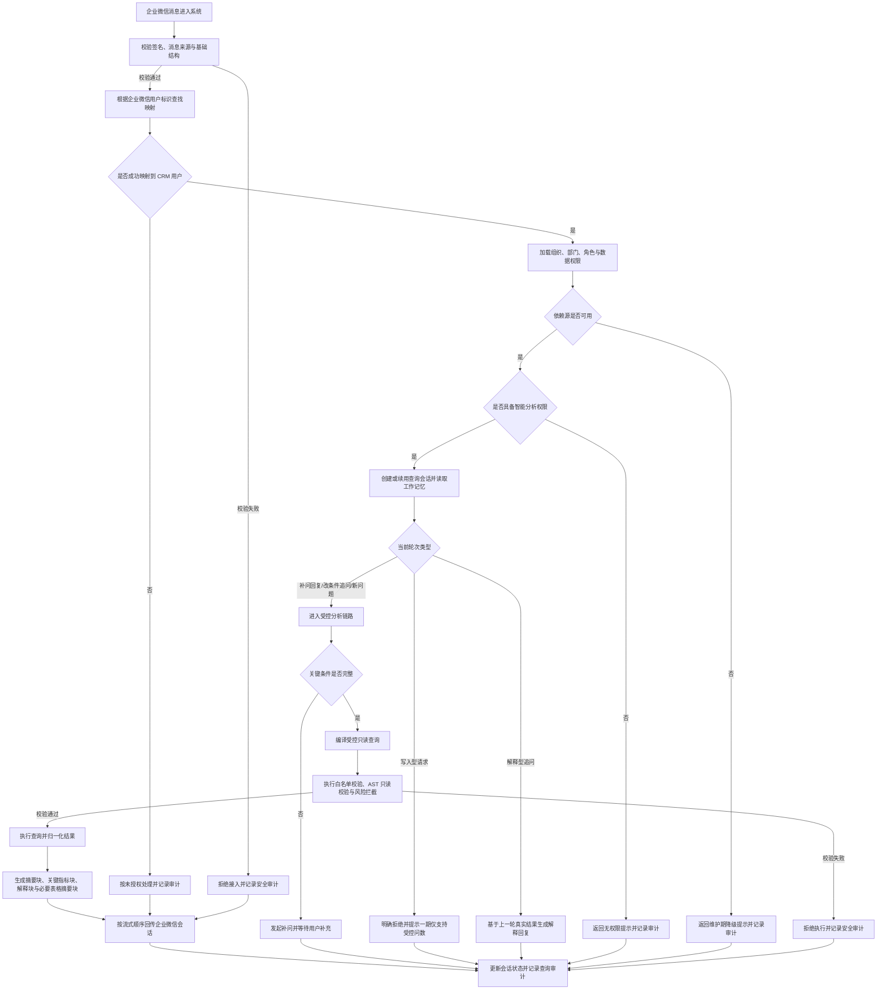

# 企业微信机器人接入说明

## 1. 文档目的

本文档用于整理本项目中企业微信机器人的接入资料、一期范围口径和实现约束，避免后续开发只看到零散链接或历史设想，导致范围理解偏差。

本文档是“企业微信接入参考说明”，不是一期功能主规格。涉及功能边界、接口契约、数据白名单、页面行为和验收标准时，仍以 `specs/001-crm-intelligent-analytics/` 目录下文档为准。

## 2. 参考资料

- 企业微信官方文档：https://developer.work.weixin.qq.com/document/path/101463
- Node SDK：`@wecom/aibot-node-sdk`
- SDK 使用：https://www.npmjs.com/package/@wecom/aibot-node-sdk

## 3. 本项目中的定位

在 CRM 智能分析系统一期中，企业微信机器人是移动办公场景下的核心问数入口之一。

它的职责不是替代整个 CRM，也不是开放一个“什么都能做”的聊天助手，而是承载以下能力：

- 让已授权用户在企业微信会话中直接输入自然语言问题
- 复用 CRM 现有用户、角色、组织、部门和数据权限
- 让用户在企业微信里与“懂 CRM 的 AI 助手”持续对话，而不是每轮都像调用一次独立接口
- 在条件不足时发起补问
- 将分析结果以分段、流式、可读的方式返回给企业微信会话
- 对查询、补问、拦截、异常和导出行为进行审计留痕

## 4. 一期已确定范围

### 4.1 支持的核心能力

- 自然语言问数
- 连续追问与会话承接
- 基于上一轮结果的解释型追问
- 权限范围内的商机、合同、客户相关分析
- 查询处理中提示、补问提示、拒答提示
- 企业微信侧分段流式返回
- 会话保活、超时回收、并发隔离
- 维护期降级提示与恢复后重新进入正常链路
- 后续经批准业务场景下的受控主动通知，仍统一通过同一机器人入口推送

### 4.2 一期明确不做

以下能力属于历史设想或后续候选，不属于当前一期交付范围：

- 通过机器人直接录入新客户
- 通过机器人直接创建新商机
- 通过机器人直接写入商机跟进记录
- 通过机器人直接创建待办提醒
- 通过机器人直接修改商机阶段、合同、回款等核心业务数据
- 将企业微信机器人扩展为通用办公助手或审批助手

如果后续确实需要恢复这些写入型能力，必须单独补充新规格，重新定义写入权限、确认流程、审计要求和数据回滚策略，不能直接沿用一期问数方案。

## 5. 一期接入约定

### 5.1 技术约定

- 后端统一由 `wecom` 模块承接企业微信消息接入。
- 机器人接入优先复用 `@wecom/aibot-node-sdk`，避免重复造轮子。
- 企业微信机器人当前不再提供 transport 模式切换；开发环境与生产环境统一按 SDK 方式接入企业微信，测试环境默认继续使用 mock 以避免自动化测试连接真实企业微信。
- 企业微信接入凭证通过环境变量注入，来源资料位于 `配置/企业微信/ID和密钥.md`，但明文值不得写入代码或文档。
- 当前项目约定使用：
  - `WECOM_BOT_ID`
  - `WECOM_BOT_SECRET`
  - `WECOM_BOT_DELIVERY_MAX_RETRIES`
  - `WECOM_BOT_DELIVERY_RETRY_DELAY_MS`
  - `WECOM_WEB_LOGIN_APP_ID`
  - `WECOM_WEB_LOGIN_SECRET`
  - `WECOM_DIRECTORY_AGENT_ID`
  - `WECOM_DIRECTORY_SECRET`
- 当前项目继续复用同一个企业微信 corpId，但 Web 登录与官方通讯录同步必须使用两套不同的应用凭证。
- 若后续启用经批准的受控主动通知，用户可见消息必须继续通过企业微信机器人推送；企业微信应用不作为用户聊天或提醒入口。

### 5.2 身份映射约定

企业微信用户不能直接作为业务权限主体使用，必须先映射到 CRM 用户。

一期优先复用以下现有表完成身份识别：

- `wx_user_maps`
- `wx_users`
- `wx_organization_maps`
- `wx_departments`
- `wx_user_department_maps`

处理原则如下：

- 先根据企业微信消息中的用户标识找到 `wx_user_maps`
- 再映射到 CRM `users.id`
- 再加载其组织、部门、角色、负责人范围
- 任意一级映射缺失、失效或状态异常时，直接按未授权处理
- 生产环境目录同步的正式目标是刷新 CRM 原生 `wx_users`、`wx_user_maps`，而不是长期依赖应用侧镜像兜底识别。

### 5.3 企业微信目录同步现行条件

- 当前系统运行在开发环境时，可以使用模拟数据或手动触发同步入口做联调。
- 当前系统部署到生产环境时，一旦发现企业微信组织架构未同步，必须立即执行目录同步。
- 目录同步应优先使用系统内置的一键同步脚本或受控内部入口，而不是临时手工拼接企业微信官方通讯录 API 请求。
- 当前生产环境只同步“联软科技集团”授权范围，不同步 ROOT 下全部组织架构。
- 一键同步入口默认应覆盖：
  - 部门增量同步
  - 用户增量同步
  - 关键成员详情补齐
- 执行前至少校验：
  - 企业微信 `corpid`
  - 具备通讯录读取权限的应用 Secret
  - 应用存储库可用性
  - 当前是否已有同步任务在运行
- 执行完成后必须查看同步摘要，包括资源类型、成功条数、失败条数和最新游标。

## 6. 机器人消息处理主链路

一期建议按以下顺序实现机器人链路：

1. 接收企业微信消息
2. 校验签名、消息来源和基础结构
3. 做 `messageId` 级幂等判断，避免重复回调重复执行
4. 根据企业微信用户标识映射到 CRM 用户
5. 加载角色、组织、部门和数据权限范围
6. 判断当前是否处于身份源、会话存储或 CRM 数据源维护期降级
7. 创建或续用查询会话，并读取结构化工作记忆
8. 由 AI 会话编排层判断当前轮次属于新问题、补问回复、解释型追问还是改条件追问
9. 若需要实时查询，则进入受控分析链路；若只需解释，则直接基于上一轮真实结果生成回复
10. 按企业微信展示特点拆成处理中提示、摘要块、关键指标块、解释块或表格摘要块返回
11. 记录审计事件、结果下发记录和会话状态

### 6.1 主流程图

## 7. 会话与流式返回要求

企业微信入口是多人共享、移动场景优先的入口，因此必须重点处理会话稳定性。

### 7.1 会话要求

- 同一用户的连续追问必须承接上下文
- 不同用户之间的会话上下文必须严格隔离
- 同一群聊中的不同发送者也必须分别隔离，不允许只按群聊会话共享上下文
- 同一用户短时间内多次提问时，系统要能识别请求顺序
- 会话需要有心跳、超时、失活回收和断开原因记录
- 会话至少要保存最近消息、结构化工作记忆和长会话摘要

### 7.2 流式返回要求

- 长查询必须先返回“处理中”提示
- 正式结果按块返回，而不是长时间无响应后一次性输出
- 当结果较长时，优先返回摘要、关键指标、主要结论和必要表格片段
- 若执行失败、超时或被拦截，必须立即停止后续输出并说明原因
- 解释型追问应优先基于上一轮真实结果生成自然语言说明，而不是无条件重新执行查询

## 8. 分阶段落地建议

### 8.1 第一阶段：正式接入上线

- 正式报文归一化
- `messageId` 幂等去重
- 同会话串行、不同会话并发
- 真实结果块分发与重试记录
- 企业微信入口审计

### 8.2 第二阶段：AI 会话编排

- 识别新问题、补问回复、解释型追问和改条件追问
- 维护结构化工作记忆
- 基于上一轮真实结果直接解释
- AI 只能通过受控工具触发分析链路

### 8.3 第三阶段：体验增强与维护期降级

- 长会话摘要压缩
- 追问继承与条件覆盖更自然
- 身份源 / 数据源 / 会话存储维护期降级
- 恢复后记录恢复事件并重新进入正常链路

## 9. 一期问法示例

### 8.1 支持的问法方向

- “本月各销售负责人新增商机金额排名”
- “最近 30 天我部门商机阶段分布和重点客户明细”
- “近三个月各区域商机转合同率对比”
- “本季度重点客户贡献占比”
- “最近 90 天各区域新增商机金额趋势和赢单率”

### 8.2 需要补问的典型问法

- “看一下商机转化怎么样”
- “我这边业绩怎么样”
- “重点客户最近表现如何”

这类问题通常缺少以下条件中的一个或多个：

- 时间范围
- 分析对象
- 比较口径
- 统计粒度

因此系统应先补问，不应自行猜测默认值。

### 8.3 一期应拒绝的问法

- “给我导出全部客户手机号和负责人联系方式”
- “把山东农信新增成客户”
- “帮我把这个商机改成已成交”
- “把最近所有合同明细全量发我”

## 10. 维护期降级口径

- 当身份映射源不可用时，应提示“当前无法确认你的 CRM 身份，请稍后重试”。
- 当 CRM 数据源不可用时，应提示“当前无法查询实时 CRM 数据，请稍后再试”。
- 当会话存储不可用时，应提示“当前无法稳定维护会话状态，请稍后重试”。
- 维护期场景不能误报为无权限、无数据或普通失败。
- 维护期场景不允许回退样例业务结果。

## 11. 与当前主规格的对应关系

企业微信相关实现时，应重点对照以下文档：

- `specs/001-crm-intelligent-analytics/spec.md`
  关注企业微信入口、补问、拒答、流式输出、会话隔离和审计要求
- `specs/001-crm-intelligent-analytics/plan.md`
  关注 `wecom`、`sessions`、`analysis`、`audit` 模块职责
- `specs/001-crm-intelligent-analytics/data-model.md`
  关注 QuerySession、AnalysisRequest、AuditEvent 和企业微信身份映射模型
- `specs/001-crm-intelligent-analytics/contracts/openapi.yaml`
  关注企业微信消息接收、会话查询、心跳上报接口
- `specs/001-crm-intelligent-analytics/quickstart.md`
  关注企业微信联调、追问、并发与异常验证场景

## 12. 开发注意事项

- 企业微信机器人只是入口，不允许绕开后端统一权限校验和受控查询链路。
- 机器人返回内容必须面向移动端阅读体验，优先短摘要、关键指标和明确结论。
- 任何企业微信侧返回的数据都必须与 Web 侧结果保持同口径。
- 不允许在企业微信消息处理中直接拼接自由 SQL。
- 不允许把企业微信用户标识当作最终权限身份，必须先映射到 CRM 用户。
- 不允许把维护期降级误写成“无权限”或“无数据”。
- 不允许在文档、日志、截图、示例代码中泄露 `配置/` 目录里的真实密钥。

## 13. 后续扩展建议

如果二期考虑继续扩展企业微信机器人能力，建议按以下顺序推进：

1. 先把一期问数链路稳定上线
2. 再评估是否增加智能提醒推送；若增加，仍应保持“聊天与提醒同入口”，统一通过机器人推送
3. 再评估是否增加受控写入型能力
4. 每增加一种能力，都单独定义权限、确认、审计和失败回滚机制

当前阶段，企业微信机器人应坚持“受控问数入口”定位，不要过早扩展为“大而全”的聊天办公平台。
