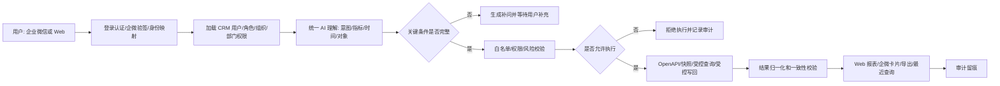
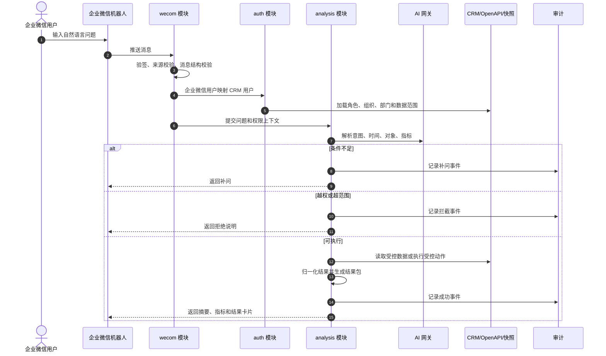
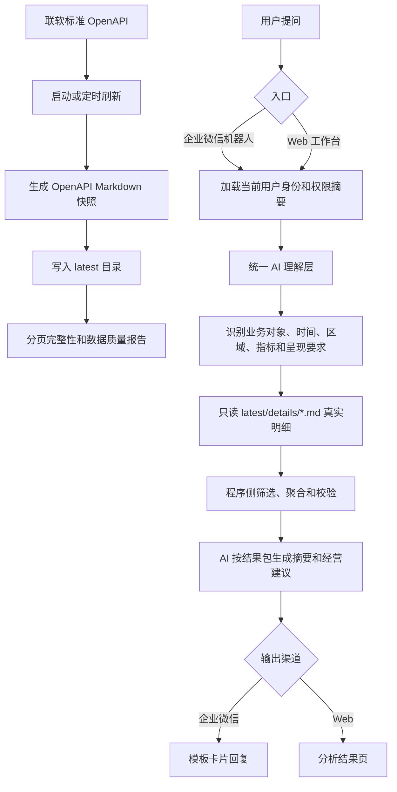
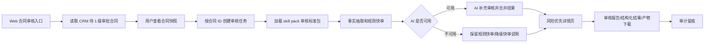
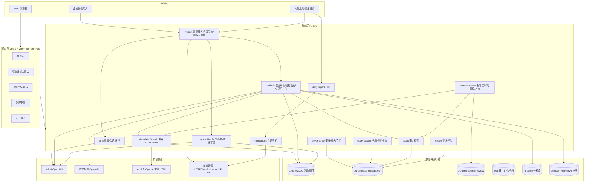
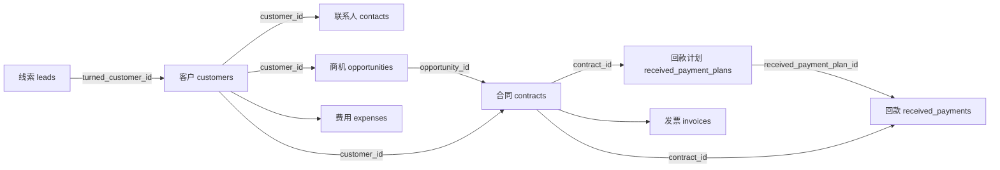
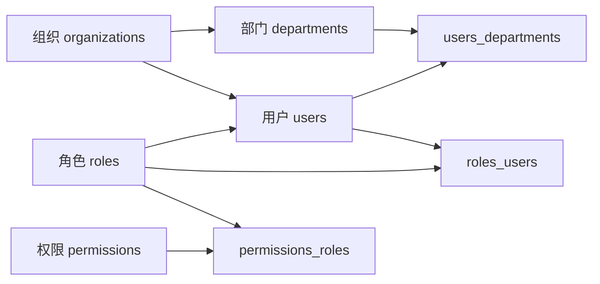

# CRM 智能分析系统项目交付资料梳理

## 1. 需求说明与业务流程

### 1.1 项目定位

本项目为 `CRM 智能分析系统`，统一承载以下能力：

- 企业微信 AI 问数
- Web 智能分析工作台
- 智能合同审核
- 治理审计后台
- 销售日报、主动通知、受控写回等企业微信协同能力

系统面向公司管理层、销售管理人员、运营分析人员、商务人员、系统管理员、数据管理员和已授权业务人员，目标是把自然语言问数、受控 CRM 执行、结构化经营分析、合同风险识别、查询资产复用、导出限制、AI 配置治理和全链路审计收敛到同一套应用。

### 1.2 一期核心需求

| 模块 | 需求说明 |
| --- | --- |
| 双入口自然语言问数 | 用户可通过企业微信机器人或 Web 工作台输入自然语言问题，围绕商机、合同、客户、组织、部门、负责人、排行和趋势进行经营分析。 |
| 结构化结果展示 | 分析结果需包含摘要、关键指标、图表、表格、筛选条件、时间范围、数据更新时间、权限范围和可继续追问入口。 |
| 查询资产复用 | 支持常用查询、我的模板、其它模板、自由问数保存为模板、最近查询和最近查询重跑。 |
| 补问与拒答 | 对缺少时间范围、对象范围、指标口径、越权、敏感字段、风险导出或不支持主题的请求，先补问或拒绝执行。 |
| 权限和审计 | 所有查询、补问、模板执行、历史重跑、导出、拦截、合同审核和企业微信入口都必须继承当前 CRM 权限并写入审计。 |
| 智能合同审核 | 用户在 Web 工作台查看 CRM 待 1 级审批合同，核对合同快照后发起审核，系统输出风险优先详情、审核依据和产物。 |
| 企业微信受控业务动作 | 支持受控新增客户、受控新增商机、唯一商机命中后的跟进写回、日报提醒、团队汇总和主动通知底座。 |
| AI 配置治理 | 通过治理后台维护 OpenAI 兼容 HTTP Profile，支持密钥加密、健康检查、激活、回滚和上下文策略。 |

### 1.3 业务边界

本期包含：

- 企业微信机器人问数
- Web 智能分析工作台
- Web 智能合同审核
- 自然语言补问
- 结构化结果展示
- 常用查询、最近查询和查询模板治理
- 结果追问复用
- 权限控制、受限导出和审计追踪
- 受控新增客户、受控新增商机和跟进写回
- 销售日报编排和受控主动通知底座

本期不包含：

- 任意 CRM 数据写回
- 删除、自由改状态、非白名单对象写回
- 跨 CRM 之外的数据源自由拼接
- 面向外部客户开放访问
- 无限原始明细导出
- 用户自定义报表设计器
- 绕过审核标准包直接在线修改合同审核规则

### 1.4 总体业务流程



### 1.5 企业微信问数主流程



### 1.6 当前智能分析正式主链补充

当前资料中还明确了一条已收敛的智能分析正式主链：



该链路要求：

- OpenAPI 只用于启动刷新、定时刷新或手动刷新 Markdown 快照。
- 问答阶段只读本地 Markdown 明细，不实时请求 OpenAPI。
- SQLite 只读库、MySQL 分析库、受控 SQL 和历史 OpenAPI 单对象兜底暂不进入正式主链。
- 核心资源分页未拉齐时，正式分析必须阻断并提示刷新快照，不能基于截断数据继续分析。

### 1.7 合同审核流程



## 2. 系统架构图、接口文档、数据库表结构、部署文档

### 2.1 系统架构图



### 2.2 技术栈

| 层级 | 技术 |
| --- | --- |
| 前端 | Vue 3、Vite、Element Plus、Pinia、Vue Router、ECharts |
| 后端 | NestJS、TypeScript、mysql2、Zod、node-sql-parser、sharp、sql.js |
| AI 接入 | OpenAI 兼容 HTTP，支持 Responses / Chat Completions 协议形态 |
| 企业微信 | 企业微信机器人 SDK、HTTP API、WebSocket、扫码登录、通讯录同步 |
| 数据 | CRM MySQL、应用运行态 JSON、SQL 审计文件、AI-agent 分析库、OpenAPI Markdown 快照 |
| 部署 | Node.js 20 LTS、pnpm 8.15.9、Nginx、systemd 或 pm2 |

### 2.3 主要接口文档

完整接口契约见：

- `specs/001-crm-intelligent-analytics/contracts/openapi.yaml`

核心接口分组如下：

| 分组 | 接口 |
| --- | --- |
| 认证与会话 | `POST /api/v1/auth/login`、`GET /api/v1/auth/session`、`POST /api/v1/auth/logout`、`GET /api/v1/auth/wecom/initiate`、`GET /api/v1/auth/wecom/callback`、`POST /api/v1/auth/wecom/exchange` |
| 企业微信机器人 | `POST /api/v1/wecom/messages`、`GET /api/v1/wecom/sessions/{sessionId}`、`POST /api/v1/wecom/sessions/{sessionId}/heartbeat` |
| 智能分析 | `GET /api/v1/analysis/capabilities`、`POST /api/v1/analysis/queries`、`GET /api/v1/analysis/queries/{queryId}` |
| 查询模板与最近查询 | `GET /api/v1/analysis/templates`、`GET /api/v1/analysis/templates/facets`、`POST /api/v1/analysis/templates/{templateId}/execute`、`GET /api/v1/analysis/histories`、`POST /api/v1/analysis/histories/{historyId}/rerun` |
| 查询结果导出 | `POST /api/v1/analysis/queries/{queryId}/exports` |
| CRM 受控写入 | `POST /api/v1/crm/customers`、`POST /api/v1/crm/opportunities` |
| 商机查询 | `GET /api/v2/opportunities/by_name` |
| 合同审核 | `GET /api/v1/contract-reviews/contracts/pending-approval`、`GET /api/v1/contract-reviews/contracts/{contractId}`、`POST /api/v1/contract-reviews/contracts/{contractId}/tasks`、`GET /api/v1/contract-reviews/tasks`、`POST /api/v1/contract-reviews/tasks`、`GET /api/v1/contract-reviews/tasks/{taskId}`、`GET /api/v1/contract-reviews/tasks/{taskId}/artifacts/{artifactId}/download` |
| 权限和治理 | `GET /api/v1/governance/permissions/overview`、`GET /api/v1/governance/role-permissions`、`PUT /api/v1/governance/role-permissions/{roleId}`、`GET /api/v1/governance/application-super-admin-policy`、`PUT /api/v1/governance/application-super-admin-policy`、`POST /api/v1/governance/access-preview`、`GET /api/v1/governance/identity-mappings` |
| 查询模板治理 | `GET /api/v1/governance/query-templates`、`POST /api/v1/governance/query-templates`、`PUT /api/v1/governance/query-templates/{templateId}`、`POST /api/v1/governance/query-templates/{templateId}/validate`、`POST /api/v1/governance/query-templates/{templateId}/preview` |
| 语义资产治理 | `GET /api/v1/governance/semantic-knowledge`、`POST /api/v1/governance/semantic-knowledge`、`PUT /api/v1/governance/semantic-knowledge/{assetId}`、`POST /api/v1/governance/semantic-knowledge/{assetId}/status`、`POST /api/v1/governance/semantic-knowledge/publish`、`POST /api/v1/governance/semantic-knowledge/rollback` |
| 审计 | `GET /api/v1/audit-events`、`GET /api/v1/audit-events/sql/summary`、`GET /api/v1/audit-events/sql`、`GET /api/v1/audit-events/sql/{sqlAuditId}`、`POST /api/v1/audit-events/sql/{sqlAuditId}/reveal` |
| 日报 | `POST /api/v1/daily-reports/fragments`、`GET /api/v1/daily-reports`、`GET /api/v1/daily-reports/{reportId}`、`POST /api/v1/daily-reports/{reportId}/confirm`、`GET /api/v1/daily-reports/audit`、`GET /api/v1/daily-reports/summary-batches`、`POST /api/v1/daily-reports/cron/reminders`、`POST /api/v1/daily-reports/cron/close`、`POST /api/v1/daily-reports/cron/summaries` |

### 2.4 数据库表结构

#### 2.4.1 数据库总览

| 数据库 | 表数量 | 字段数量 | 索引数量 | 外键数量 | 预计容量 | 定位 |
| --- | ---: | ---: | ---: | ---: | ---: | --- |
| `ikcrm_cms_production` | 29 | 572 | 67 | 0 | 1.05 MB | CRM 外围渠道、CMS、代理、套餐和试用入口 |
| `vcooline_ikcrm_production` | 297 | 3316 | 1000 | 3 | 4.46 GB | CRM 主业务库，覆盖销售、合同、财务、权限、生态集成 |

逐表字段、索引、外键明细见：

- `docs/db/ikcrm_cms_production.md`
- `docs/db/vcooline_ikcrm_production.md`
- `docs/数据库梳理/CRM数据库结构分析.md`
- `docs/数据库梳理/CRM数据库业务模块梳理.md`
- `docs/数据库梳理/CRM核心业务关系图.md`

#### 2.4.2 CRM 核心业务链路



#### 2.4.3 组织与权限底座



#### 2.4.4 重点表速查

| 表名 | 预估行数 | 预估容量 | 核心用途 |
| --- | ---: | ---: | --- |
| `organizations` | 1001 | 0.12 MB | 组织归属 |
| `departments` | 379 | 0.11 MB | 部门层级和权限范围 |
| `users` | 1390 | 0.84 MB | CRM 用户 |
| `roles` | 3156 | 3.62 MB | 角色和权限范围 |
| `permissions` | 268 | 0.05 MB | 权限点 |
| `leads` | 12526 | 7.31 MB | 线索 |
| `customers` | 29170 | 26.16 MB | 客户主数据 |
| `contacts` | 8107 | 2.56 MB | 联系人 |
| `opportunities` | 57351 | 28.64 MB | 商机 |
| `contracts` | 17312 | 17.12 MB | 合同 |
| `received_payment_plans` | 25819 | 9.06 MB | 回款计划 |
| `received_payments` | 29046 | 11.58 MB | 实际回款 |
| `invoiced_payments` | 28787 | 11.06 MB | 已开票记录 |
| `expenses` | 5510 | 3.52 MB | 费用 |
| `revisit_logs` | 144799 | 77.67 MB | 跟进记录 |

#### 2.4.5 一期分析白名单重点表

| 业务域 | 表 |
| --- | --- |
| 商机分析 | `opportunities` |
| 合同转化 | `contracts` |
| 客户关系 | `customers` |
| 用户与组织 | `users`、`departments`、`organizations` |
| 权限映射 | `roles`、`permissions`、`roles_users`、`permissions_roles`、`users_departments`、`ownerships` |
| 企业微信身份映射 | `wx_user_maps`、`wx_users`、`wx_organization_maps`、`wx_departments`、`wx_user_department_maps` |

默认禁止直接纳入问数白名单的大表或风险表包括：

- `customer_assets`
- `opportunity_assets`
- `contract_assets`
- `operation_logs`
- `token_logs`
- `notifications`
- `login_logs`
- `custom_fields`

#### 2.4.6 应用自有存储

当前实现通过 `.runtime/app-storage.json` 承接治理、会话、审计、日报、通知和合同审核元数据。

同时仓库中保留应用库迁移脚本，作为正式应用库存储结构参考：

- `backend/src/database/app-storage/migrations/001_initial_schema.sql`
- `backend/src/database/app-storage/migrations/002_contract_review_schema.sql`
- `backend/src/database/app-storage/migrations/003_query_template_library_fields.sql`

AI-agent 分析库结构参考：

- `backend/src/database/analysis-warehouse/schema.sql`

### 2.5 部署文档

#### 2.5.1 推荐生产部署

生产部署文档：

- `docs/architecture/生产部署指南.md`
- `docs/architecture/deploy-examples/backend.production.env.example`
- `docs/architecture/deploy-examples/crm-intelligent-analytics.service`
- `docs/architecture/deploy-examples/crm-intelligent-analytics.nginx.conf`
- `docs/architecture/deploy-examples/install-production-host.sh`
- `docs/architecture/deploy-examples/release-production.sh`
- `docs/architecture/deploy-examples/生产部署参数清单.md`

推荐拓扑：

```text
公网用户 / 企业微信
        |
        v
   [ Nginx : 80/443 ]
      |          |
      |          +--> frontend/dist 静态资源
      |
      +--> 127.0.0.1:3001
               |
               v
     [ Node.js / NestJS 后端 ]
               |
               +--> CRM Open API
               +--> 联软标准 OpenAPI
               +--> CRM MySQL
               +--> AI 网关
               +--> 企业微信 HTTP / WebSocket
               +--> .runtime/app-storage.json
               +--> .runtime/contract-review/
```

推荐目录：

```text
/srv/crm-intelligent-analytics/
├── current/
├── releases/
├── shared/
│   ├── .runtime/
│   │   ├── app-storage.json
│   │   ├── sql-audit-records.jsonl
│   │   ├── sql-audit-archive/
│   │   └── contract-review/
│   ├── logs/
│   └── backend.env
└── backups/
```

#### 2.5.2 当前 Linux 公用服务器部署口径

当前另有一份面向公用 Linux 服务器的部署手册：

- `docs/architecture/Linux部署启动维护手册.md`

该手册约定：

| 项目 | 调试阶段 | 上产部署 |
| --- | --- | --- |
| 代码目录 | `/home/liulonghai/AI-agent` | `/home/liulonghai/AI-agent` |
| 后端端口 | `3001` | `3001`，仅供本机 Nginx 转发 |
| 前端端口 | `5173` | 不使用前端 dev |
| 预览端口 | `4173`，可选 | 不使用 |
| 对外入口 | `http://服务器IP:5173` | `http://服务器IP:18080` |
| Nginx | 不建议长期使用 | 独立 Nginx 配置监听 `18080` |
| 配置文件 | `shared/backend.env` | `shared/backend.env` |
| 运行态 | `shared/.runtime` | `shared/.runtime` |
| 日志 | `shared/logs` | `shared/logs` |

#### 2.5.3 构建与启动

构建：

```bash
pnpm install --frozen-lockfile
pnpm build
```

构建产物：

- 后端：`backend/dist/`
- 前端：`frontend/dist/`

后端启动：

```bash
cd backend
pnpm start
```

生产建议由 `systemd` 托管：

```ini
[Service]
WorkingDirectory=/srv/crm-intelligent-analytics/current/backend
Environment=NODE_ENV=production
EnvironmentFile=/srv/crm-intelligent-analytics/shared/backend.env
ExecStart=/usr/bin/node /srv/crm-intelligent-analytics/current/backend/dist/src/main.js
Restart=always
RestartSec=5
```

## 3. 当前服务器、中间件、数据库资源清单

### 3.1 服务器资源

| 项目 | 推荐生产口径 | 当前资料中出现的口径 |
| --- | --- | --- |
| 操作系统 | Rocky Linux 9.5 | Linux 公用服务器，用户目录 `/home/liulonghai/AI-agent` |
| 标准配置 | 8 核 / 16 GB / 300 GB SSD | 需运维补实际值 |
| 起步配置 | 4 核 / 8 GB / 80 GB SSD | 需运维补实际值 |
| 应用用户 | `crmapp` | `liulonghai` |
| 发布根目录 | `/srv/crm-intelligent-analytics` | `/home/liulonghai/AI-agent` |
| 配置文件 | `/srv/crm-intelligent-analytics/shared/backend.env` | `/home/liulonghai/AI-agent/shared/backend.env` |
| 运行态目录 | `/srv/crm-intelligent-analytics/shared/.runtime` | `/home/liulonghai/AI-agent/shared/.runtime` |
| 日志目录 | `/srv/crm-intelligent-analytics/shared/logs` | `/home/liulonghai/AI-agent/shared/logs` |

### 3.2 端口与网络

| 端口/地址 | 用途 | 说明 |
| --- | --- | --- |
| `80/443` | 推荐生产 Web 入口 | 由 Nginx 承载前端并反向代理 API |
| `18080` | 当前公用服务器上产入口 | Linux 手册建议先用该端口，避免影响 80/443 既有服务 |
| `3001` | 后端 NestJS 服务 | 不建议公网开放，只供本机 Nginx 或内网负载均衡回源 |
| `5173` | 前端 Vite dev | 仅调试阶段使用 |
| `4173` | 前端 preview | 可选，仅验证构建产物 |
| `3306` | MySQL / MariaDB | CRM 只读库、写回库、AI-agent 分析库 |
| 企业微信 WebSocket | 机器人长连接 | 默认 `wss://openws.work.weixin.qq.com` |

生产服务器需出站访问：

- CRM Open API
- 联软标准 OpenAPI
- CRM MySQL
- AI 网关
- 企业微信 HTTP API
- 企业微信 WebSocket
- DNS
- NTP 或企业内部时间同步服务
- 企业内部软件源或公共软件源

### 3.3 中间件与运行时

| 资源 | 建议版本/形态 | 用途 |
| --- | --- | --- |
| Node.js | 20 LTS | 后端运行和前后端构建 |
| pnpm | 8.15.9 | 与仓库 `packageManager` 保持一致 |
| Nginx | 稳定版 | 前端静态资源、API 反向代理、上传限制、缓存控制 |
| systemd | 系统自带 | 后端进程托管和自动重启 |
| Git | 稳定版 | 拉取代码和切换版本 |
| MySQL / MariaDB | 8.x 或兼容版本 | CRM 数据源、写回库、AI-agent 分析库 |

### 3.4 数据库资源

| 数据库资源 | 配置变量 | 用途 | 状态 |
| --- | --- | --- | --- |
| CRM 只读库 | `CRM_READONLY_DB_*` | 受控查询、补查、目录同步兜底 | 需从受控配置补真实地址 |
| CRM 写回库 | `CRM_WRITEBACK_DB_*` | 企业微信目录同步、受控写回兜底 | 可独立配置；未配置时可能回退 |
| CRM Open API | `CRM_OPEN_API_*` | 登录、认证、官方 API 优先调用 | 需从受控配置补真实地址 |
| 联软标准 OpenAPI | `CRM_STANDARD_OPEN_API_*` | 六类对象查询、权限诊断、快照刷新和智能分析适配 | 需从受控配置补真实地址 |
| 应用状态 | `.runtime/app-storage.json` | 治理、审计、会话、日报、通知、合同审核元数据 | 当前实现已使用 |
| SQL 审计文件 | `SQL_AUDIT_FILE_STORE_PATH`、`SQL_AUDIT_ARCHIVE_DIR` | SQL 审计记录和归档 | 生产建议放共享运行态 |
| AI-agent 分析库 | `ANALYSIS_WAREHOUSE_DB_*` | ODS/DWD/语义层和受控 Text-to-SQL | 建议独立库 `crm_agent_analysis` |
| SQLite 快照导入 | `LIANRUAN_CRM_SQLITE_SNAPSHOT_*` | 只读副本或批次快照导入 | 默认未启用，不能直连生产 SQLite |
| OpenAPI Markdown 快照 | `CRM_OPENAPI_MARKDOWN_SNAPSHOT_*` | 分析问答只读快照材料 | 当前正式主链依赖该类快照 |

### 3.5 外部服务资源

| 资源 | 配置变量 | 用途 |
| --- | --- | --- |
| AI 网关 | `ANALYSIS_AI_BASE_URL`、`ANALYSIS_AI_MODEL`、`OPENAI_API_KEY`、`AI_PROFILE_MASTER_KEY` | 自然语言理解、报告生成、企业微信回复、合同审核 AI 补充 |
| 企业微信机器人 | `WECOM_BOT_ID`、`WECOM_BOT_SECRET`、`WECOM_BOT_SIGNATURE`、`WECOM_BOT_WS_URL` | 机器人消息接入、问数、回复、会话型异步结果 |
| 企业微信 Web 登录 | `WECOM_WEB_LOGIN_APP_ID`、`WECOM_WEB_LOGIN_AGENT_ID`、`WECOM_WEB_LOGIN_SECRET`、`WECOM_WEB_LOGIN_CALLBACK_URL` | Web 扫码登录 |
| 企业微信通讯录同步 | `WECOM_DIRECTORY_CORP_ID`、`WECOM_DIRECTORY_AGENT_ID`、`WECOM_DIRECTORY_SECRET`、`WECOM_DIRECTORY_ROOT_DEPARTMENT_NAME` | 部门和成员同步，支撑企微与 CRM 身份映射 |
| 企业微信主动通知 | `WECOM_NOTIFY_CORP_ID`、`WECOM_NOTIFY_AGENT_ID`、`WECOM_NOTIFY_SECRET`、`WECOM_NOTIFY_REAL_MESSAGE_ENABLED`、`WECOM_NOTIFY_TEST_USER_ID` | 日报催报、团队汇总和主动通知 |

### 3.6 文件与运行态资源

| 路径/文件 | 用途 | 注意事项 |
| --- | --- | --- |
| `.runtime/app-storage.json` | 本地应用状态 | 涉及会话、治理、审计等运行态数据，需备份 |
| `.runtime/contract-review/` | 合同原文和审核产物 | 涉及合同敏感信息，需访问隔离 |
| `.runtime/sql-audit-records.jsonl` | SQL 审计文件 | 需归档和权限控制 |
| `.runtime/sql-audit-archive/` | SQL 审计归档 | 只允许受控运维访问 |
| `.runtime/ai-profile-master.key` | 本地开发 AI Profile 加密主密钥兜底 | 生产必须改用显式 `AI_PROFILE_MASTER_KEY` |
| `.runtime/wecom-bot-listener.lock` | 企业微信机器人监听锁 | 异常退出后需确认进程归属再清理 |
| `.runtime/mariadb-data` | 当前本地存在的 MariaDB 数据目录 | 属于本机联调资源，不等同生产资源 |
| `.runtime/mariadb-portable` | 当前本地存在的便携 MariaDB | 属于本机联调资源，不等同生产资源 |
| `backend/analysis-snapshot` | 当前后端快照目录 | 与 OpenAPI Markdown 快照链路相关 |

### 3.7 部署参数待补清单

上线或正式交付前，仍需由运维/实施补齐实际值：

| 类别 | 待补内容 |
| --- | --- |
| 服务器 | 实际 IP、CPU、内存、磁盘、是否负载均衡、正式系统用户 |
| 域名证书 | 正式域名、HTTPS 证书路径、私钥路径、是否由上游网关卸载 HTTPS |
| CRM Open API | Base URL、corpId、登录路径、写回账号、身份查询接口 |
| 联软标准 OpenAPI | Base URL、appKey、appSecret、绑定用户、权限范围 |
| 数据库 | 只读库、写回库、分析库 Host、Port、库名、账号；密码只进入密码库或环境文件 |
| AI 网关 | Base URL、模型名、协议类型、结构化输出模式、密钥、代理要求 |
| 企业微信 | 机器人、Web 登录、目录同步、主动通知各自的 corpId、agentId、secret、回调地址和可见范围 |
| 日报调度 | 22:00 催报、23:59 收口、08:00 汇总、21:55/07:50 目录同步调度 |
| 合同审核 | 存储目录、最大文件大小、标准包路径、标准包编码、扩展查看/下载角色 |
| 灰度开关 | 日报、AI 直查、企微 AI 理解、结构化草稿、候选重排、日报洞察等开关 |

## 4. 关键文档索引

| 文档 | 用途 |
| --- | --- |
| `README.md` | 项目入口、模块速览、架构图、接口入口和运行配置说明 |
| `specs/001-crm-intelligent-analytics/spec.md` | 一期功能边界、用户故事、验收口径 |
| `specs/001-crm-intelligent-analytics/plan.md` | 实施计划、核心链路、技术上下文 |
| `specs/001-crm-intelligent-analytics/data-model.md` | 核心实体、状态流转和校验规则 |
| `specs/001-crm-intelligent-analytics/contracts/openapi.yaml` | 主接口契约 |
| `specs/001-crm-intelligent-analytics/quickstart.md` | 本地启动和验收场景 |
| `docs/architecture/当前智能分析业务流程.md` | 当前智能分析正式主链 |
| `docs/architecture/生产部署指南.md` | 推荐生产部署、回滚和排障 |
| `docs/architecture/Linux部署启动维护手册.md` | 当前 Linux 公用服务器部署启动维护 |
| `docs/architecture/deploy-examples/生产部署参数清单.md` | 上线参数采集清单 |
| `docs/数据库梳理/CRM数据库结构分析.md` | CRM 数据库总览 |
| `docs/数据库梳理/CRM数据库业务模块梳理.md` | 数据库业务模块地图 |
| `docs/数据库梳理/CRM核心业务关系图.md` | CRM 核心业务关系 |
| `docs/db/vcooline_ikcrm_production.md` | CRM 主业务库逐表字段明细 |
| `docs/db/ikcrm_cms_production.md` | CRM 外围库逐表字段明细 |
